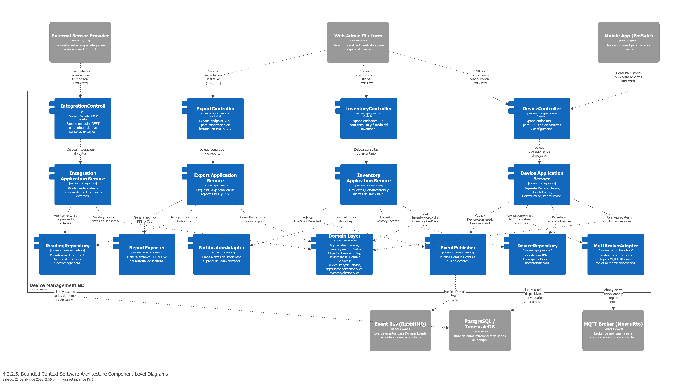
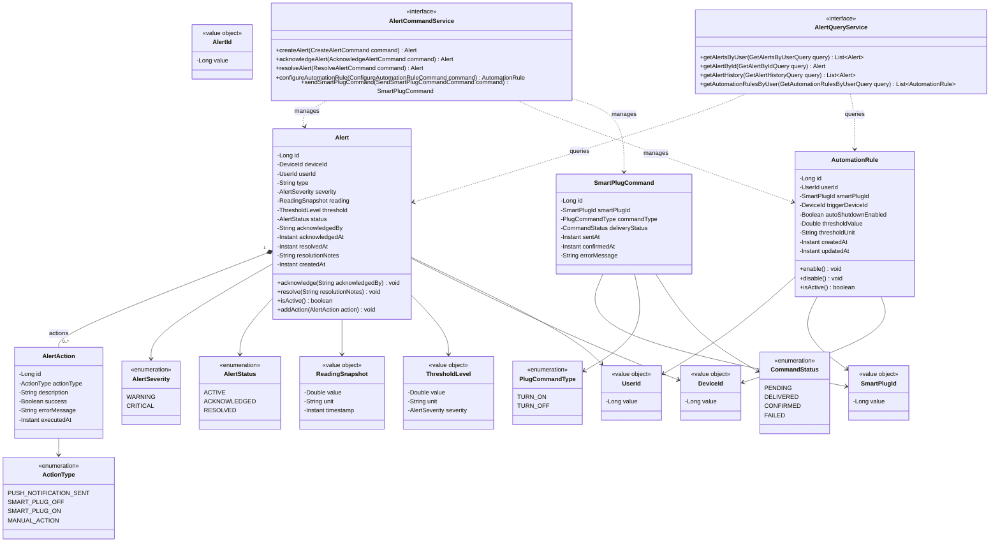
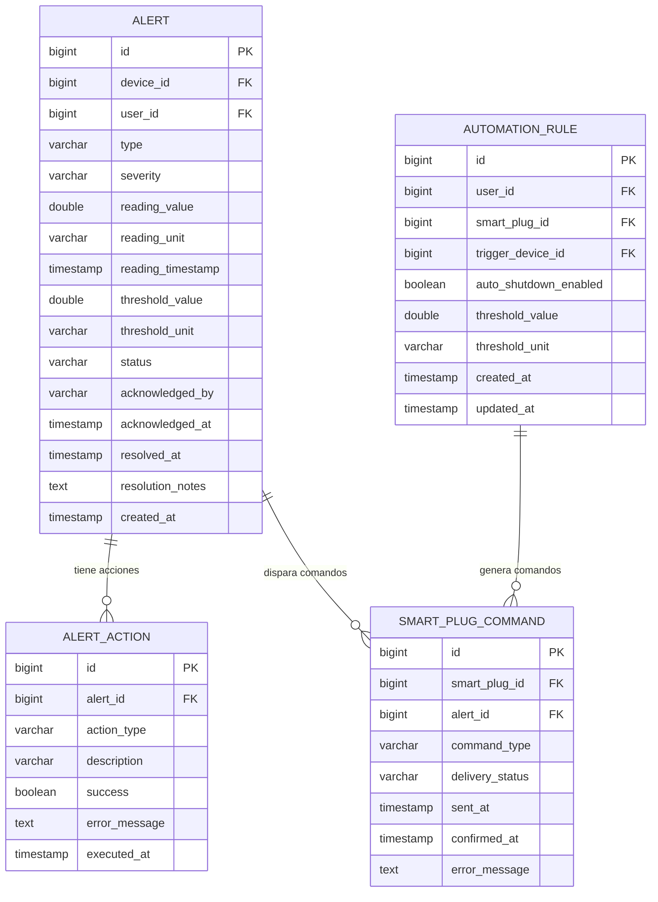

    
    <h1 style="font-size: 24px;">Universidad Peruana de Ciencias Aplicadas</h1>
    <h2 style="font-size: 24px;">Ingeniería de Software</h2>
    
Ciclo: 7

    
Periodo: 2026-10

    
1ASI0572 | Desarrollo de Soluciones IoT

    
NRC: 6766

    
Docente: Leon Baca, Marco Antonio

    <h2 style="font-size: 24px;">Informe de Trabajo Final</h2>
    
Startup: [Por definir]

    
Producto: [Por definir]

    <table style="width: 50%; margin: 0 auto; text-align: center;">
        <tr>
            <th>Nombre</th>
            <th>Código</th>
        </tr>
        <tr>
            <td>Sosa Soto, Oskar Rodrigo</td>
            <td>U202212214</td>
        </tr>
        <tr>
            <td>Lopez de la Cruz, Mauro Fabricio</td>
            <td>U202215695</td>
        </tr>
        <tr>
            <td>Guimaraes Escalante, Carlos Eduardo</td>
            <td>U202210364</td>
        </tr>
        <tr>
            <td>Oliva Lopez, Fabian Alejandro</td>
            <td>U202312013</td>
        </tr>
        <tr>
            <td>Lizano Coll Cardenas, Fernando Jesus</td>
            <td>U202214522</td>
        </tr>
    </table>
      
    
Abril de 2026

## Registro de versiones del informe

<table>
  <thead>
    <tr>
        <th>Versión</th>
        <th>Fecha</th>
        <th>Autor</th>
        <th>Descripción de modificación</th>
    </tr>
  </thead>
  <tbody>
    <tr>
      <td style="margin: 0 auto; text-align: center;"><strong>AV1</strong></td>
      <td style="margin: 0 auto; text-align: center;">25/04/2026</td>
      <td>
        <ul>
          <li>Sosa Soto, Oskar Rodrigo</li>
          <li>Lopez de la Cruz, Mauro Fabricio</li>
          <li>Guimaraes Escalante, Carlos Eduardo</li>
          <li>Oliva Lopez, Fabian Alejandro</li>
          <li>Lizano Coll Cardenas, Fernando Jesus</li>
        </ul>
      </td>
      <td>
        Adición de las secciones:
        <ul>
          <li>Carátula</li>
          <li>Registro de Versiones del Informe</li>
          <li>Project Report Collaboration Insights </li>
          <li>Contenido</li>
          <li>Student Outcome</li>
        </ul>
        Se han incluído los siguientes capítulos:
        <ul>
          <li>Capítulo I: Introducción</li>
          <li>Capítulo II: Requirements Elicitation & Analysis</li>
          <li>Capítulo III: Requirements Specification</li>
          <li>Capítulo IV: Solution Software Design</li>
          <li>Avance de Conclusiones, Bibliografía y Anexos</li>
        </ul>
      </td>
    </tr>
  </tbody>
</table>

## Project Report Collaboration Insights

Enlace de la organización para el reporte del proyecto: https://github.com/Desarrollo-de-soluciones-IOT-UPC/Informe

**TB1**

Para el desarrollo del informe correspondiente a todas las entregas, se estableció la implementación de secciones de la siguiente manera para cada integrante del equipo:
<table>
  <thead>
    <tr>
      <th>Integrante</th>
      <th>Tareas Asignadas</th>
    </tr>
  </thead>
  <tbody>
    <tr>
      <td>Sosa Soto, Oskar Rodrigo</td>
      <td>[A completar luego]</td>
    </tr>
    <tr>
      <td>Lopez de la Cruz, Mauro Fabricio</td>
      <td>[A completar luego]</td>
    </tr>
    <tr>
      <td>Guimaraes Escalante, Carlos Eduardo</td>
      <td>[A completar luego]</td>
    </tr>
    <tr>
      <td>Oliva Lopez, Fabian Alejandro</td>
      <td>[A completar luego]</td>
    </tr>
    <tr>
      <td>Lizano Coll Cardenas, Fernando Jesus</td>
      <td>[A completar luego]</td>
    </tr>
  </tbody>
</table>

El proceso de colaboración en el informe se realizó mediante commits constantes al repositorio de la organización.

Se presenta el resumen de commits:
[IMAGEN DE LOS COMMITS]

## Contenido
- [Student Outcome](#student-outcome)

- [Capítulo I: Introducción](#capítulo-i-introducción)

- [1.1. Startup Profile](#11-startup-profile)
  - [1.1.1. Descripción de la Startup](#111-descripción-de-la-startup)
  - [1.1.2. Perfiles de integrantes del equipo](#112-perfiles-de-integrantes-del-equipo)
- [1.2. Solution Profile](#12-solution-profile)

  - [1.2.1 Antecedentes y problemática](#121-antecedentes-y-problemática)
  - [1.2.2 Lean UX Process.](#122-lean-ux-process)
    - [1.2.2.1. Lean UX Problem Statements.](#1221-lean-ux-problem-statements)
    - [1.2.2.2. Lean UX Assumptions.](#1222-lean-ux-assumptions)
    - [1.2.2.3. Lean UX Hypothesis Statements.](#1223-lean-ux-hypothesis-statements)
    - [1.2.2.4. Lean UX Canvas.](#1224-lean-ux-canvas)

- [1.3. Segmentos objetivo](#13-segmentos-objetivo)

- [Capítulo II: Requirements Elicitation & Analysis](#capítulo-ii-requirements-elicitation--analysis)

- [2.1. Competidores](#21-competidores)

  - [2.1.1. Análisis competitivo]()
  - [2.1.2. Estrategias y tácticas frente a competidores](#211-análisis-competitivo)

- [2.2. Entrevistas](#22-entrevistas)

  - [2.2.1. Diseño de entrevistas](#221-diseño-de-entrevistas)
  - [2.2.2. Registro de entrevistas](#222-registro-de-entrevistas)
  - [2.2.3. Análisis de entrevistas](#223-análisis-de-entrevistas)

- [2.3. Needfinding](#23-needfinding)

  - [2.3.1. User Personas](#231-user-personas)
  - [2.3.2. User Task Matrix](#232-user-task-matrix)
  - [2.3.3. User Journey Mapping](#233-user-journey-mapping)
  - [2.3.4. Empathy Mapping](#234-empathy-mapping)

- [2.4. Big Picture Event Storming](#24-big-picture-event-storming)
- [2.5. Ubiquitous Language](#25-ubiquitous-language)

- [Capítulo III: Requirements Specification](#capítulo-iii-requirements-specification)

- [3.1. User Stories](#31-user-stories)

- [3.2. Impact Mapping](#32-impact-mapping)

- [3.3. Product Backlog](#33-product-backlog)

- [Capítulo IV: Solution Software Design](#capítulo-iv-solution-software-design)

- [4.1. Strategic-Level Domain-Driven Design.](#41-strategic-level-domain-driven-design)
  - [4.1.1. Design-Level EventStorming.](#411-design-level-eventstorming)
    - [4.1.1.1 Candidate Context Discovery.](#4111-candidate-context-discovery)
    - [4.1.1.2 Domain Message Flows Modeling.](#4112-domain-message-flows-modeling)
    - [4.1.1.3 Bounded Context Canvases.](#4113-bounded-context-canvases)
  - [4.1.2. Context Mapping.](#412-context-mapping)
  - [4.1.3. Software Architecture.](#413-software-architecture)
    - [4.1.3.1. Software Architecture System Landscape Diagram.](#4131-software-architecture-system-landscape-diagram)
    - [4.1.3.2. Software Architecture Context Level Diagrams](#4132-software-architecture-context-level-diagrams)
    - [4.1.3.3. Software Architecture Container Level Diagrams.](#4133-software-architecture-container-level-diagrams)
    - [4.1.3.4. Software Architecture Deployment Diagrams.](#4134-software-architecture-deployment-diagrams)
- [4.2. Tactical-Level Domain-Driven Design.](#42-tactical-level-domain-driven-design)
  - [4.2.X. Bounded Context: <Bounded Context Name>](#42x-bounded-context-bounded-context-name)
    - [4.2.X.1. Domain Layer.](#42x1-domain-layer)
    - [4.2.X.2. Interface Layer](#42x2-interface-layer)
    - [4.2.X.3. Application Layer.](#42x3-application-layer)
    - [4.2.X.4. Infrastructure Layer.](#42x4-infrastructure-layer)
    - [4.2.X.5. Bounded Context Software Architecture Component Level Diagrams.](#42x5-bounded-context-software-architecture-component-level-diagrams)
    - [4.2.X.6. Bounded Context Software Architecture Code Level Diagrams.](#42x6-bounded-context-software-architecture-code-level-diagrams)
      - [4.2.X.6.1. Bounded Context Domain Layer Class Diagrams.](#42x61-bounded-context-domain-layer-class-diagrams)
      - [4.2.X.6.2. Bounded Context Database Design Diagram.](#42x62-bounded-context-database-design-diagram)

## Student Outcome

El curso contribuye al cumplimiento del Student Outcome ABET: 
**ABET – EAC - Student Outcome 5**

**Criterio:**  La capacidad de funcionar efectivamente en un equipo cuyos miembros juntos proporcionan liderazgo, crean un entorno de colaboración e inclusivo, establecen objetivos, planifican tareas y cumplen objetivos.

En el siguiente cuadro se describe las acciones realizadas y enunciados de conclusiones por parte del grupo, que permiten sustentar el haber alcanzado el logro del ABET – EAC - Student Outcome 5. 

<table>
  <thead>
    <tr>
      <th style="padding: 10px;">Criterio específico</th>
      <th style="padding: 10px;">Acciones realizadas</th>
      <th style="padding: 10px;">Conclusiones</th>
    </tr>
  </thead>
  <tbody>
    <tr>
      <td style="padding: 10px; vertical-align: top;">
        Trabaja en equipo para proporcionar liderazgo en forma conjunta
      </td>
      <td style="padding: 10px; vertical-align: top;">
        Sosa Soto, Oskar Rodrigo 
        <strong>AV1</strong>  
        Lopez de la Cruz, Mauro Fabricio 
        <strong>AV1</strong>  
        Guimaraes Escalante, Carlos Eduardo 
        <strong>AV1</strong>  
        Oliva Lopez, Fabian Alejandro 
        <strong>AV1</strong>  
        Lizano Coll Cardenas, Fernando Jesus 
        <strong>AV1</strong>
      </td>
      <td style="padding: 10px; vertical-align: top;">
      </td>
    </tr>
    <tr>
      <td style="padding: 10px; vertical-align: top;">
        Crea un entorno colaborativo e inclusivo, establece metas, planifica tareas y cumple objetivos.
      </td>
      <td style="padding: 10px; vertical-align: top;">
        Sosa Soto, Oskar Rodrigo 
        <strong>AV1</strong>  
        Lopez de la Cruz, Mauro Fabricio 
        <strong>AV1</strong>  
        Guimaraes Escalante, Carlos Eduardo 
        <strong>AV1</strong>  
        Oliva Lopez, Fabian Alejandro 
        <strong>AV1</strong>  
        Lizano Coll Cardenas, Fernando Jesus 
        <strong>AV1</strong>
      </td>
      <td style="padding: 10px; vertical-align: top;">
      </td>
    </tr>
  </tbody>
</table>

# Capítulo I: Introducción

## 1.1. Startup Profile

### 1.1.1. Descripción de la Startup

### 1.1.2. Perfiles de integrantes del equipo

| Descripción del integrante                                                                                                                                                                                                                                                                                                                                                                                                                                                                                                                                                                                                                                         |                                   Perfil del integrante del equipo                                   |
| :----------------------------------------------------------------------------------------------------------------------------------------------------------------------------------------------------------------------------------------------------------------------------------------------------------------------------------------------------------------------------------------------------------------------------------------------------------------------------------------------------------------------------------------------------------------------------------------------------------------------------------------------------------------- | :--------------------------------------------------------------------------------------------------: |
| [Descripcion 1] |      [Imagen]  |
| [Descripcion 2] |      [Imagen]  |
| [Descripcion 3] |      [Imagen]  |
| [Descripcion 4] |      [Imagen]  |
| [Descripcion 5] |      [Imagen]  |

## 1.2. Solution Profile

### 1.2.1. Antecedenetes y problemática

### 1.2.2. Lean UX Proces

#### 1.2.2.1. Lean UX Problem Statements.

#### 1.2.2.2. Lean UX Assumptions

#### 1.2.2.3. Lean UX Hypothesis Statements

#### 1.2.2.4. Lean UX Canvas

## 1.3. Segmentos Objetivos

# Capítulo II: Requirements Elicitation & Analysis

## 2.1. Competidores

### 2.1.1. Análisis competitivo

### 2.1.2. Estrategias y tácticas frente a competidores

## 2.2. Entrevistas

### 2.2.1. Diseño de entrevistas

### 2.2.2. Registro de entrevistas

### 2.2.3. Análisis de entrevistas

## 2.3. Needfinding

### 2.3.1. User Personas

### 2.3.2. User Task Matrix

### 2.3.4. Empathy Mapping

### 2.4. Big Picture Event Storming

### 2.5. Ubiquitous Language

# Capitulo III: Requirements Specification

## 3.1. User Stories

## 3.2. Impact Mapping

## 3.3. Product Backlog

# Capítulo IV: Solution Software Design

## 4.1. Strategic-Level Domain-Driven Design

### 4.1.1. Design-Level EventStorming

#### 4.1.1.1. Candidate Context Discovery

#### 4.1.1.2. Domain Message Flows Modeling

#### 4.1.1.3. Bounded Context Canvases

### 4.1.2. Context Mapping

### 4.1.3. Software Architecture

#### 4.1.3.1. Software Architecture System Landscape Diagram

#### 4.1.3.2. Software Architecture Context Level Diagrams

#### 4.1.3.3. Software Architecture Container Level Diagrams

#### 4.1.3.4. Software Architecture Deployment Diagrams

## 4.2. Tactical-Level Domain-Driven Design

### 4.2.X. Bounded Context: [Bounded Context Name]

### 4.2.2. Bounded Context: Device Management

#### 4.2.2.1. Domain Layer

| Archivo / Carpeta | Propósito | Tipo de recurso |
|------------------|----------|-----------------|
| `model/aggregates/Device.java` | Agregado raíz del bounded context. Encapsula identidad, tipo, estado y configuración del sensor IoT. | Aggregate |
| `model/aggregates/InventoryRecord.java` | Agregado secundario. Gestiona el stock de dispositivos disponibles y dispara alertas de bajo inventario. | Aggregate |
| `model/entities/LifecycleEvent.java` | Entidad que registra cada evento del ciclo de vida de un dispositivo (registro, instalación, retiro, etc.). | Entity |
| `model/valueobjects/DeviceId.java` | Identificador único del dispositivo. | Value Object |
| `model/valueobjects/DeviceConfig.java` | Agrupa los parámetros de configuración del dispositivo: frecuencia de muestreo, umbral de alerta y coordenadas. | Value Object |
| `model/valueobjects/DeviceStatus.java` | Registra los estados del dispositivo: AVAILABLE, INSTALLED, MAINTENANCE, RETIRED. | Value Object |
| `model/valueobjects/DeviceType.java` | Registra el tipo de dispositivo IoT: SENSOR_IOT, ADAPTER_IOT. | Value Object |
| `model/valueobjects/GeoCoordinates.java` | Encapsula la ubicación geográfica (latitud y longitud) del dispositivo. | Value Object |
| `model/valueobjects/LifecycleEventType.java` | Categoriza los tipos de evento del ciclo de vida: REGISTERED, INSTALLED, CONFIG_UPDATED, MAINTENANCE, RETIRED. | Value Object |
| `model/commands/RegisterDeviceCommand.java` | Record para registrar un nuevo dispositivo IoT. | Command |
| `model/commands/UpdateDeviceConfigCommand.java` | Record para actualizar la configuración de un dispositivo. | Command |
| `model/commands/DeleteDeviceCommand.java` | Record para eliminar un dispositivo del sistema. | Command |
| `model/commands/RetireDeviceCommand.java` | Record para confirmar el retiro y desvinculación de un dispositivo. | Command |
| `model/queries/GetDeviceListQuery.java` | Record para consultar la lista paginada de dispositivos con filtros opcionales. | Query |
| `model/queries/GetDeviceHistoryQuery.java` | Record para consultar el historial cronológico de lecturas de un dispositivo. | Query |
| `model/queries/GetInventoryQuery.java` | Record para consultar el inventario de dispositivos con filtros por estado. | Query |
| `services/DeviceCommandService.java` | Expone operaciones CUD sobre dispositivos. | Command Service |
| `services/DeviceQueryService.java` | Expone operaciones de lectura sobre dispositivos. | Query Service |
| `services/InventoryQueryService.java` | Expone operaciones de lectura sobre el inventario de dispositivos. | Query Service |
| `services/DeviceLifecycleService.java` | Orquesta las transiciones de estado del dispositivo, validando reglas de negocio. | Domain Service |
| `services/MqttDisconnectionService.java` | Coordina el cierre de conexiones MQTT y bloqueo de topics al retirar dispositivos. | Domain Service |
| `services/InventoryAlertService.java` | Evalúa el stock disponible y genera alertas cuando cae por debajo del umbral configurado. | Domain Service |

#### 4.2.2.2. Interface Layer

| Carpeta / Archivo | Propósito | Tipo de recurso |
|------------------|----------|-----------------|
| `acl/DeviceManagementContextFacade.java` | Interface para exponer capacidades del bounded context a otros bounded contexts. | ACL Facade |
| `rest/controllers/DeviceController.java` | Interface para exponer capacidades de gestión de dispositivos mediante endpoints REST. | REST Controller |
| `rest/controllers/InventoryController.java` | Interface para exponer capacidades de consulta y filtrado del inventario mediante endpoints REST. | REST Controller |
| `rest/controllers/ExportController.java` | Interface para exponer el endpoint de exportación de historial en PDF o CSV mediante REST. | REST Controller |
| `rest/controllers/IntegrationController.java` | Interface para exponer el endpoint de integración de sensores de proveedores externos mediante REST. | REST Controller |
| `rest/assemblers/RegisterDeviceCommandFromResourceAssembler.java` | Convierte un RegisterDeviceResource en un RegisterDeviceCommand. | Resource → Command Assembler |
| `rest/assemblers/UpdateDeviceConfigCommandFromResourceAssembler.java` | Convierte un UpdateDeviceConfigResource en un UpdateDeviceConfigCommand. | Resource → Command Assembler |
| `rest/assemblers/DeviceFromEntityAssembler.java` | Convierte un Device en un DeviceResource. | Entity → Resource Assembler |
| `rest/assemblers/InventoryRecordFromEntityAssembler.java` | Convierte un InventoryRecord en un InventoryRecordResource. | Entity → Resource Assembler |
| `rest/assemblers/GetDeviceHistoryQueryFromResourceAssembler.java` | Convierte un DeviceHistoryResource en un GetDeviceHistoryQuery. | Resource → Query Assembler |

#### 4.2.2.3. Application Layer

| Archivo / Carpeta | Propósito | Tipo de recurso |
|------------------|----------|-----------------|
| `internal/commandservices/DeviceCommandServiceImpl.java` | Implementación concreta de DeviceCommandService. Orquesta RegisterDevice, UpdateConfig, DeleteDevice y RetireDevice. | Command Service Impl |
| `internal/queryservices/DeviceQueryServiceImpl.java` | Implementación concreta de DeviceQueryService. Orquesta consultas de dispositivos e historial de lecturas. | Query Service Impl |
| `internal/queryservices/InventoryQueryServiceImpl.java` | Implementación concreta de InventoryQueryService. Orquesta consultas de inventario y evaluación de stock bajo. | Query Service Impl |
| `internal/acl/DeviceManagementContextFacadeImpl.java` | Implementación concreta de la interface expuesta a otros bounded contexts para acceder a la lógica de dispositivos. | ACL Facade |
| `internal/outboundservices/acl/ExternalAlertingService.java` | Adaptador para publicar Domain Events hacia el bounded context de Alerting. | ACL Service |
| `internal/outboundservices/acl/ExternalAnalyticsService.java` | Adaptador para enviar datos de lecturas al bounded context de Analytics. | ACL Service |

#### 4.2.2.4. Infrastructure Layer

| Archivo / Carpeta | Propósito | Tipo de recurso |
|------------------|----------|-----------------|
| `persistence/jpa/repositories/DeviceRepository.java` | Implementación JPA de DeviceRepository (agregado). Persiste y recupera Devices e InventoryRecords. | Repository Impl |
| `persistence/jpa/repositories/LifecycleEventRepository.java` | Implementación JPA para el historial de eventos del ciclo de vida de cada dispositivo. | Repository Impl |
| `persistence/timescale/repositories/ReadingRepository.java` | Implementación TimescaleDB para series de tiempo de lecturas electromagnéticas. | Repository Impl |
| `messaging/mqtt/MqttBrokerAdapter.java` | Gestiona conexiones y topics MQTT con los sensores IoT. Cierra y bloquea topics al retirar dispositivos. | Messaging Adapter |
| `messaging/events/EventPublisherAdapter.java` | Publica Domain Events (DeviceRegistered, DeviceRetired, LowStockDetected) hacia el bus de eventos (RabbitMQ). | Event Publisher |
| `export/ReportExporterAdapter.java` | Genera archivos PDF y CSV del historial de lecturas mediante iText y Apache POI. | Export Adapter |
| `notifications/NotificationAdapter.java` | Envía notificaciones push de stock bajo al panel del administrador mediante FCM. | Notification Adapter |
| `persistence/jpa/mapping/DeviceMapper.java` | Mapea entre el Aggregate Device y su entidad JPA correspondiente. | ORM Mapper |
| `persistence/jpa/mapping/InventoryRecordMapper.java` | Mapea entre el Aggregate InventoryRecord y su entidad JPA correspondiente. | ORM Mapper |

### 4.2.2.5. Bounded Context Software Architecture Component Level Diagrams

### 4.2.2.6. Bounded Context Software Architecture Code Level Diagrams

#### 4.2.2.6.1. Bounded Context Domain Layer Class Diagrams

Se presenta el diagrama de clases del contexto de gestión de dispositivos, teniendo como clases principales a Device e InventoryRecord, además de contar con un enum DeviceStatus que ayuda a gestionar el ciclo de vida del dispositivo a través de sus estados: Available, Installed, Maintenance y Retired.

#### 4.2.2.6.2. Bounded Context Database Design Diagram

La base de datos persiste los dispositivos IoT junto con su configuración y estado actual, registrando cada cambio a través del historial de eventos del ciclo de vida. Además, se persisten las lecturas electromagnéticas capturadas por cada dispositivo y los registros de inventario necesarios para controlar el stock y planificar nuevas instalaciones.

### 4.2.4. Bounded Context: Alert & Automation

Este Bounded Context gestiona la generación de alertas ante niveles altos de radiación electromagnética detectados por los sensores IoT, la ejecución de acciones automáticas o configurables como notificaciones push y el control de adaptadores inteligentes (smart plugs) para cortar o permitir el paso de corriente a dispositivos conectados. Además, administra el historial de alertas y permite al usuario y al administrador dar seguimiento, reconocer y resolver eventos de riesgo.
 
Historias relacionadas: US02, US04, US05, US07, US39, US40, TS02, TS29.
 
#### 4.2.4.1. Domain Layer
 
| Archivo / Carpeta | Propósito | Tipo de recurso |
|:---|:---|:---|
| `model/aggregates/Alert.java` | Agregado raíz que representa una alerta generada cuando una lectura de sensor supera el umbral de seguridad configurado. Contiene el ciclo de vida completo: creación, reconocimiento y resolución. | Aggregate |
| `model/entities/AlertAction.java` | Entidad que registra cada acción ejecutada en respuesta a una alerta (notificación push enviada, dispositivo apagado vía adaptador inteligente, acción manual del usuario). | Entity |
| `model/entities/AutomationRule.java` | Entidad que representa una regla de automatización configurada por el usuario, como activar o desactivar el apagado automático de un adaptador inteligente ante alerta de radiación elevada. | Entity |
| `model/entities/SmartPlugCommand.java` | Entidad que registra un comando enviado a un adaptador inteligente (encender/apagar), incluyendo el estado de entrega y respuesta del dispositivo. | Entity |
| `model/valueobjects/AlertId.java` | Identificador único de la alerta. | Value Object |
| `model/valueobjects/DeviceId.java` | Identificador del sensor IoT que originó la lectura. | Value Object |
| `model/valueobjects/SmartPlugId.java` | Identificador del adaptador inteligente asociado. | Value Object |
| `model/valueobjects/ThresholdLevel.java` | Value object que encapsula el valor del umbral, la unidad de medida (μSv/h, °C, kPa) y el nivel de severidad (warning, critical). | Value Object |
| `model/valueobjects/ReadingSnapshot.java` | Snapshot de la lectura del sensor al momento de dispararse la alerta (valor, unidad, timestamp). | Value Object |
| `model/valueobjects/UserId.java` | Identificador del usuario propietario del entorno monitoreado. | Value Object |
| `model/commands/CreateAlertCommand.java` | Record para crear una nueva alerta a partir de una lectura que superó el umbral. | Command |
| `model/commands/AcknowledgeAlertCommand.java` | Record para marcar una alerta como reconocida por un usuario o administrador. | Command |
| `model/commands/ResolveAlertCommand.java` | Record para marcar una alerta como resuelta, incluyendo notas de resolución. | Command |
| `model/commands/ConfigureAutomationRuleCommand.java` | Record para crear o actualizar una regla de automatización (activar/desactivar apagado automático de un adaptador inteligente). | Command |
| `model/commands/SendSmartPlugCommandCommand.java` | Record para enviar un comando de encendido o apagado a un adaptador inteligente. | Command |
| `model/queries/GetAlertsByUserQuery.java` | Record para consultar todas las alertas de un usuario, con filtros opcionales por fecha, nivel y estado. | Query |
| `model/queries/GetAlertByIdQuery.java` | Record para consultar el detalle de una alerta específica, incluyendo las acciones ejecutadas. | Query |
| `model/queries/GetAlertHistoryQuery.java` | Record para consultar el historial de alertas con filtros por rango de fecha, zona, nivel de gravedad y estado. | Query |
| `model/queries/GetAutomationRulesByUserQuery.java` | Record para consultar las reglas de automatización configuradas por un usuario. | Query |
| `services/AlertCommandService.java` | Interfaz que expone operaciones de escritura: crear alertas, reconocer, resolver, configurar reglas de automatización y enviar comandos a adaptadores inteligentes. | Command Service |
| `services/AlertQueryService.java` | Interfaz que expone operaciones de lectura: consultar alertas, historial, detalle y reglas de automatización. | Query Service |
 
#### 4.2.4.2. Interface Layer
 
| Archivo / Carpeta | Propósito | Tipo de recurso |
|:---|:---|:---|
| `rest/controllers/AlertController.java` | Controlador REST que expone los endpoints para gestión de alertas: listar, filtrar por estado/fecha/nivel, obtener detalle, reconocer y resolver. | REST Controller |
| `rest/controllers/AutomationController.java` | Controlador REST que expone los endpoints para configurar reglas de automatización y enviar comandos manuales a adaptadores inteligentes. | REST Controller |
| `rest/resources/CreateAlertResource.java` | Resource de entrada con los datos necesarios para registrar una nueva alerta (deviceId, reading, threshold, unit, type). | Resource (Input) |
| `rest/resources/AcknowledgeAlertResource.java` | Resource de entrada para reconocer una alerta (acknowledgedBy). | Resource (Input) |
| `rest/resources/ResolveAlertResource.java` | Resource de entrada para resolver una alerta (notes de resolución). | Resource (Input) |
| `rest/resources/AlertResource.java` | Resource de salida que representa una alerta con su estado completo, datos del sensor, acciones ejecutadas y timestamps. | Resource (Output) |
| `rest/resources/AlertHistoryResource.java` | Resource de salida que representa un registro del historial de alertas con fecha, nivel, dispositivo y acción tomada. | Resource (Output) |
| `rest/resources/ConfigureAutomationRuleResource.java` | Resource de entrada para activar o desactivar el apagado automático de un adaptador inteligente. | Resource (Input) |
| `rest/resources/AutomationRuleResource.java` | Resource de salida que representa una regla de automatización configurada. | Resource (Output) |
| `rest/resources/SmartPlugCommandResource.java` | Resource de entrada para enviar manualmente un comando a un adaptador inteligente (ON/OFF). | Resource (Input) |
| `rest/assemblers/CreateAlertCommandFromResourceAssembler.java` | Convierte un `CreateAlertResource` en un `CreateAlertCommand`. | Resource → Command Assembler |
| `rest/assemblers/AlertResourceFromEntityAssembler.java` | Convierte un `Alert` (aggregate) en `AlertResource`. | Entity → Resource Assembler |
| `rest/assemblers/AlertHistoryResourceFromEntityAssembler.java` | Convierte un `Alert` en `AlertHistoryResource` para la vista de historial. | Entity → Resource Assembler |
| `rest/assemblers/AutomationRuleResourceFromEntityAssembler.java` | Convierte un `AutomationRule` en `AutomationRuleResource`. | Entity → Resource Assembler |
 
#### 4.2.4.3. Application Layer
 
| Archivo / Carpeta | Propósito | Tipo de recurso |
|:---|:---|:---|
| `internal/commandservices/AlertCommandServiceImpl.java` | Implementación concreta de `AlertCommandService`. Orquesta la creación de alertas, el reconocimiento, la resolución y la ejecución de acciones automáticas (notificaciones y comandos a adaptadores inteligentes). | Command Service Impl |
| `internal/queryservices/AlertQueryServiceImpl.java` | Implementación concreta de `AlertQueryService`. Ejecuta consultas de alertas, historial con filtros y reglas de automatización. | Query Service Impl |
| `internal/outboundservices/acl/DeviceContextService.java` | Servicio ACL que consulta información del sensor IoT desde el Bounded Context de Device Management (nombre, ubicación, estado). | ACL Service |
| `internal/outboundservices/acl/NotificationService.java` | Servicio ACL que se comunica con el servicio de notificaciones push para enviar alertas al usuario cuando se detecta sobreexposición. | ACL Service |
| `internal/outboundservices/acl/SmartPlugGatewayService.java` | Servicio ACL que se comunica con el broker MQTT para enviar comandos de encendido/apagado a los adaptadores inteligentes. | ACL Service |
 
#### 4.2.4.4. Infrastructure Layer
 
| Archivo / Carpeta | Propósito | Tipo de recurso |
|:---|:---|:---|
| `persistence/jpa/repositories/AlertRepository.java` | Repositorio JPA para el agregado `Alert`. Incluye queries personalizadas para filtrar por userId, rango de fechas, nivel de severidad y estado (acknowledged, resolved). | Repository Impl |
| `persistence/jpa/repositories/AlertActionRepository.java` | Repositorio JPA para la entidad `AlertAction`. | Repository Impl |
| `persistence/jpa/repositories/AutomationRuleRepository.java` | Repositorio JPA para la entidad `AutomationRule`. Incluye query para buscar reglas activas por userId y smartPlugId. | Repository Impl |
| `persistence/jpa/repositories/SmartPlugCommandRepository.java` | Repositorio JPA para la entidad `SmartPlugCommand`. Registra el historial de comandos enviados a adaptadores inteligentes. | Repository Impl |
| `messaging/mqtt/AlertMqttListener.java` | Listener MQTT que recibe las lecturas de los sensores IoT en tiempo real, evalúa si superan el umbral configurado y dispara la creación de alertas. | MQTT Listener |
| `messaging/mqtt/SmartPlugMqttPublisher.java` | Publisher MQTT que envía comandos de encendido/apagado a los adaptadores inteligentes a través del broker. | MQTT Publisher |

#### 4.2.4.5. Bounded Context Software Architecture Component Level Diagrams

#### 4.2.4.6. Bounded Context Software Architecture Code Level Diagrams
 
##### 4.2.4.6.1. Bounded Context Domain Layer Class Diagrams
 
El diagrama de clases del Bounded Context Alert & Automation muestra el agregado `Alert` como raíz, junto con las entidades `AlertAction`, `AutomationRule` y `SmartPlugCommand`. Se incluyen los value objects que encapsulan identificadores y datos de lectura, así como los enums que controlan el ciclo de vida de las alertas y los estados de los comandos.
 

 
##### 4.2.4.6.2. Bounded Context Database Design Diagram
 
El diseño de base de datos del Bounded Context Alert & Automation persiste las alertas generadas por lecturas de sensores que superan umbrales, las acciones ejecutadas en respuesta, las reglas de automatización configuradas por cada usuario y el historial de comandos enviados a los adaptadores inteligentes.
 

 
---

#### 4.2.X.1. Domain Layer

#### 4.2.X.2. Interface Layer

#### 4.2.X.3. Application Layer

#### 4.2.X.4. Infrastructure Layer

#### 4.2.X.5. Bounded Context Software Architecture Component Level Diagrams

#### 4.2.X.6. Bounded Context Software Architecture Code Level Diagrams

##### 4.2.X.6.1. Bounded Context Domain Layer Class Diagrams

##### 4.2.X.6.2. Bounded Context Database Design Diagram

### 4.2.X. Bounded Context: [Bounded Context Name]

#### 4.2.X.1. Domain Layer

#### 4.2.X.2. Interface Layer

#### 4.2.X.3. Application Layer

#### 4.2.X.4. Infrastructure Layer

#### 4.2.X.5. Bounded Context Software Architecture Component Level Diagrams

#### 4.2.X.6. Bounded Context Software Architecture Code Level Diagrams

##### 4.2.X.6.1. Bounded Context Domain Layer Class Diagrams

##### 4.2.X.6.2. Bounded Context Database Design Diagram

### 4.2.3. Bounded Context: Radiation Monitoring & Analytics

Este Bounded Context se encarga de gestionar el procesamiento y análisis de datos recolectados por sensores IoT de EmSafe. Su función es transformar datos crudos en métricas, tendencias y perfiles de exposición personalizados mediante dashboards y reportes históricos (diarios, mensuales y anuales). Al optimizar la gestión de datos, permite identificar picos de radiación y facilita la toma de decisiones informadas para el bienestar del usuario.

#### 4.2.3.1. Domain Layer

#### 4.2.3.2. Interface Layer

#### 4.2.3.3. Application Layer

#### 4.2.3.4. Infrastructure Layer

#### 4.2.3.5. Bounded Context Software Architecture Component Level Diagrams

#### 4.2.3.6. Bounded Context Software Architecture Code Level Diagrams

##### 4.2.3.6.1. Bounded Context Domain Layer Class Diagrams

##### 4.2.3.6.2. Bounded Context Database Design Diagram

# Bibliografía

# Anexo
