<div style="text-align: center; font-family: Arial, sans-serif; margin: 0; padding: 50px;">
    
    <h1 style="font-size: 24px;">Universidad Peruana de Ciencias Aplicadas</h1>
    <h2 style="font-size: 24px;">Facultad de Ingeneria</h2>
    <p style="margin: 10px 0; border-bottom: none;"><strong>Curso:</strong> 1ASI0572 - Desarrollo de Soluciones IoT</p>
    <p style="margin: 10px 0; border-bottom: none;"><strong>NRC:</strong> 6766</p>
    <p style="margin: 10px 0; border-bottom: none;"><strong>Nombre del profesor:</strong> Marco Antonio León Baca</p>
    <h2 style="font-size: 24px;">Informe de Trabajo Final</h2>
    <p style="margin: 10px 0; border-bottom: none;"><strong>Nombre del grupo:</strong> Gauss</p>
    <p style="margin: 10px 0; border-bottom: none; margin-bottom: 40px; "><strong>Nombre del producto:</strong> EMsafe</p>
    <h4 style="font-size: 18px; margin-bottom: 20px;"><strong>Integrantes</strong></h4>
    <table style="width: 50%; margin: 0 auto; text-align: center;">
        <tr>
            <th>Código</th>
            <th>Apellidos y Nombres</th>
        </tr>
        <tr>
            <td>U202212214</td>
            <td>Sosa Soto, Oskar Rodrigo</td>
        </tr>
        <tr>
            <td>U202215695</td>
            <td>Lopez de la Cruz, Mauro Fabricio</td>
        </tr>
        <tr>
            <td>U202210364</td>
            <td>Guimaraes Escalante, Carlos Eduardo</td>
        </tr>
        <tr>
            <td>U202312013</td>
            <td>Oliva Lopez, Fabian Alejandro</td>
        </tr>
        <tr>
            <td>U202214522</td>
            <td>Lizano Coll Cardenas, Fernando Jesus</td>
        </tr>
    </table>
    </br></br>
    <p style="margin: 10px 0; border-bottom: none;"><strong>Lima - Abril 2025</strong></p>
</div>

<div style="page-break-before: always;">

## Registro de versiones del informe

<table>
  <thead>
    <tr>
        <th>Versión</th>
        <th>Fecha</th>
        <th>Autor</th>
        <th>Descripción de modificación</th>
    </tr>
  </thead>
  <tbody>
    <tr>
      <td style="margin: 0 auto; text-align: center;"><strong>AV1</strong></td>
      <td style="margin: 0 auto; text-align: center;">25/04/2026</td>
      <td>
        <ul>
          <li>Sosa Soto, Oskar Rodrigo</li>
          <li>Lopez de la Cruz, Mauro Fabricio</li>
          <li>Guimaraes Escalante, Carlos Eduardo</li>
          <li>Oliva Lopez, Fabian Alejandro</li>
          <li>Lizano Coll Cardenas, Fernando Jesus</li>
        </ul>
      </td>
      <td>
        Adición de las secciones:
        <ul>
          <li>Carátula</li>
          <li>Registro de Versiones del Informe</li>
          <li>Project Report Collaboration Insights </li>
          <li>Contenido</li>
          <li>Student Outcome</li>
        </ul>
        Se han incluído los siguientes capítulos:
        <ul>
          <li>Capítulo I: Introducción</li>
          <li>Capítulo II: Requirements Elicitation & Analysis</li>
          <li>Capítulo III: Requirements Specification</li>
          <li>Capítulo IV: Solution Software Design</li>
          <li>Avance de Conclusiones, Bibliografía y Anexos</li>
        </ul>
      </td>
    </tr>
  </tbody>
</table>

## Project Report Collaboration Insights

Enlace de la organización para el reporte del proyecto: https://github.com/Desarrollo-de-soluciones-IOT-UPC/Informe

**AV1**

Para el desarrollo del informe correspondiente a todas las entregas, se estableció la implementación de secciones de la siguiente manera para cada integrante del equipo:
<table>
  <thead>
    <tr>
      <th>Integrante</th>
      <th>Tareas Asignadas</th>
    </tr>
  </thead>
  <tbody>
    <tr>
      <td>Sosa Soto, Oskar Rodrigo</td>
      <td>
      - Bounded Context "Radiation Monitoring & Analytics" <br>
      - Diseño de las cuatro capas arquitectónicas (Domain Layer, Interface Layer, Application Layer, Infrastructure Layer) con tablas detalladas especificando componentes, propósitos y tipos de recursos. <br>
      - Documentación de los agregados raíz, entidades, value objects, commands y queries del dominio. <br>
      - Definición de controladores REST, assemblers y facades para la interfaz. <br>
      - Implementación de servicios de aplicación, ACL (Anti-Corruption Layer) y adaptadores. <br>
      - Especificación de repositorios JPA, servicios de persistencia e infraestructura. <br>
      - Integración de diagramas de arquitectura a nivel de componentes y código.
</td>
    </tr>
    <tr>
      <td>Lopez de la Cruz, Mauro Fabricio</td>
      <td> 
      - Bounded Context: Alert & Automation - Admin & Operations Management (WEB) <br>
      - Todo el capítulo 1 <br>
      - User stories <br>
      - Product backlog <br>
      - Context Mapping <br>
      - Software Architecture
      </td>
    </tr>
    <tr>
      <td>Guimaraes Escalante, Carlos Eduardo</td>
      <td>
      - Entrevistas: Diseño de entrevistas, Registro de entrevistas, Análisis de entrevistas <br>
      - Needfinding: User Personas, User Task Matrix, User Journey Mapping, Empathy Mapping <br>
      - Strategic-Level Domain-Driven Design: Candidate Context Discovery, Domain Message Flows Modeling, Bounded Context Canvases <br>
      - Creacion de User y Technical Stories <br>
      - Correcciones del documento
      </td>
    </tr>
    <tr>
      <td>Oliva Lopez, Fabian Alejandro</td>
      <td>
      - 2.1 Competidores <br>
      - 2.1.1. Análisis competitivo <br>
      - 2.1.2. Estrategias y tácticas frente a competidores <br>
      - 2.2.2. Registro de entrevistas <br>
      - 3.1. User Stories <br>
      - 4.2.2. Bounded Context: Device Management
</td>
    </tr>
    <tr>
      <td>Lizano Coll Cardenas, Fernando Jesus</td>
      <td>
      - Bounded Context "Radiation Monitoring & Analytics" <br>
      - Diseño de las cuatro capas arquitectónicas (Domain  Layer, Interface Layer, Application Layer, Infrastructure Layer) con tablas detalladas especificando componentes, propósitos y tipos de recursos. <br>
      - Documentación de los agregados raíz, entidades, value objects, commands y queries del dominio. <br>
      - Definición de controladores REST, assemblers y facades para la interfaz. <br>
      - Implementación de servicios de aplicación, ACL (Anti-Corruption Layer) y adaptadores. <br>
      - Especificación de repositorios JPA, servicios de persistencia e infraestructura. <br>
      - Integración de diagramas de arquitectura a nivel de componentes y código.
      </td>
    </tr>
  </tbody>
</table>

El proceso de colaboración en el informe se realizó mediante commits constantes al repositorio de la organización.

Se presenta el resumen de commits:<br>
<strong>AV1</strong>
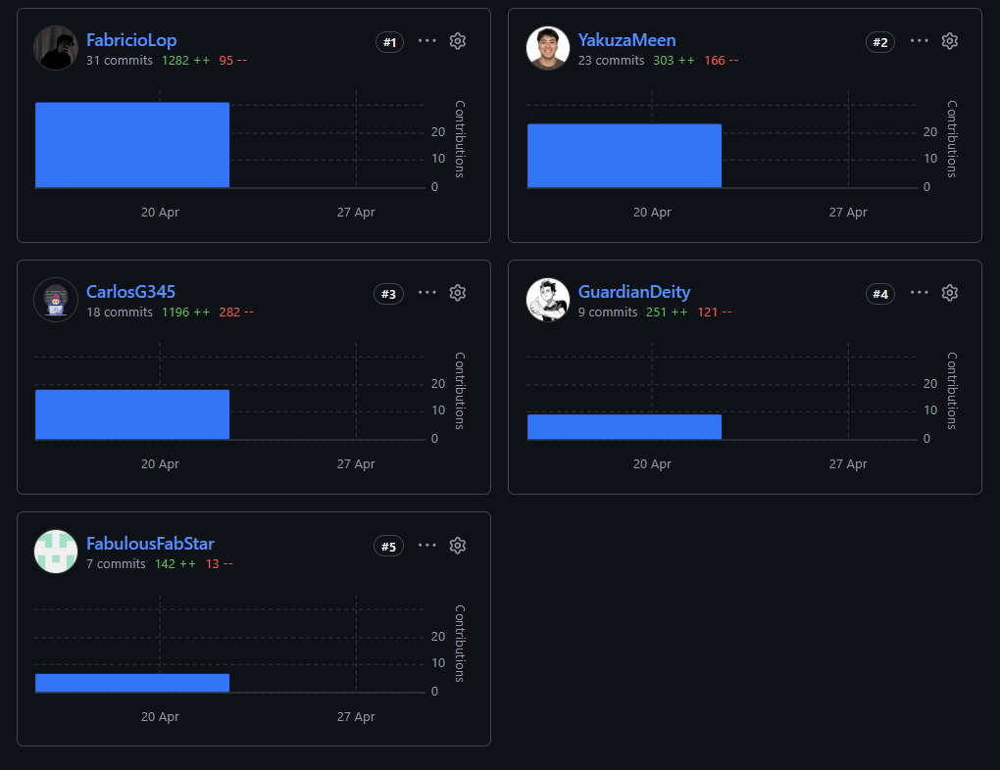

## Contenido
- [Student Outcome](#student-outcome)

- [Capítulo I: Introducción](#capítulo-i-introducción)

- [1.1. Startup Profile](#11-startup-profile)
  - [1.1.1. Descripción de la Startup](#111-descripción-de-la-startup)
  - [1.1.2. Perfiles de integrantes del equipo](#112-perfiles-de-integrantes-del-equipo)
- [1.2. Solution Profile](#12-solution-profile)

  - [1.2.1 Antecedentes y problemática](#121-antecedentes-y-problemática)
  - [1.2.2 Lean UX Process.](#122-lean-ux-process)
    - [1.2.2.1. Lean UX Problem Statements.](#1221-lean-ux-problem-statements)
    - [1.2.2.2. Lean UX Assumptions.](#1222-lean-ux-assumptions)
    - [1.2.2.3. Lean UX Hypothesis Statements.](#1223-lean-ux-hypothesis-statements)
    - [1.2.2.4. Lean UX Canvas.](#1224-lean-ux-canvas)

- [1.3. Segmentos objetivo](#13-segmentos-objetivo)

- [Capítulo II: Requirements Elicitation & Analysis](#capítulo-ii-requirements-elicitation--analysis)

- [2.1. Competidores](#21-competidores)
  - [2.1.1. Análisis competitivo]()
  - [2.1.2. Estrategias y tácticas frente a competidores](#211-análisis-competitivo)

- [2.2. Entrevistas](#22-entrevistas)

  - [2.2.1. Diseño de entrevistas](#221-diseño-de-entrevistas)
  - [2.2.2. Registro de entrevistas](#222-registro-de-entrevistas)
  - [2.2.3. Análisis de entrevistas](#223-análisis-de-entrevistas)

- [2.3. Needfinding](#23-needfinding)

  - [2.3.1. User Personas](#231-user-personas)
  - [2.3.2. User Task Matrix](#232-user-task-matrix)
  - [2.3.3. User Journey Mapping](#233-user-journey-mapping)
  - [2.3.4. Empathy Mapping](#234-empathy-mapping)

- [2.4. Big Picture Event Storming](#24-big-picture-event-storming)
- [2.5. Ubiquitous Language](#25-ubiquitous-language)

- [Capítulo III: Requirements Specification](#capítulo-iii-requirements-specification)

- [3.1. User Stories](#31-user-stories)

- [3.2. Impact Mapping](#32-impact-mapping)

- [3.3. Product Backlog](#33-product-backlog)

- [Capítulo IV: Solution Software Design](#capítulo-iv-solution-software-design)

- [4.1. Strategic-Level Domain-Driven Design.](#41-strategic-level-domain-driven-design)
  - [4.1.1. Design-Level EventStorming.](#411-design-level-eventstorming)
    - [4.1.1.1 Candidate Context Discovery.](#4111-candidate-context-discovery)
    - [4.1.1.2 Domain Message Flows Modeling.](#4112-domain-message-flows-modeling)
    - [4.1.1.3 Bounded Context Canvases.](#4113-bounded-context-canvases)
  - [4.1.2. Context Mapping.](#412-context-mapping)
  - [4.1.3. Software Architecture.](#413-software-architecture)
    - [4.1.3.1. Software Architecture System Landscape Diagram.](#4131-software-architecture-system-landscape-diagram)
    - [4.1.3.2. Software Architecture Context Level Diagrams](#4132-software-architecture-context-level-diagrams)
    - [4.1.3.3. Software Architecture Container Level Diagrams.](#4133-software-architecture-container-level-diagrams)
    - [4.1.3.4. Software Architecture Deployment Diagrams.](#4134-software-architecture-deployment-diagrams)
- [4.2. Tactical-Level Domain-Driven Design.](#42-tactical-level-domain-driven-design)
  - [4.2.X. Bounded Context: <Bounded Context Name>](#42x-bounded-context-bounded-context-name)
    - [4.2.X.1. Domain Layer.](#42x1-domain-layer)
    - [4.2.X.2. Interface Layer](#42x2-interface-layer)
    - [4.2.X.3. Application Layer.](#42x3-application-layer)
    - [4.2.X.4. Infrastructure Layer.](#42x4-infrastructure-layer)
    - [4.2.X.5. Bounded Context Software Architecture Component Level Diagrams.](#42x5-bounded-context-software-architecture-component-level-diagrams)
    - [4.2.X.6. Bounded Context Software Architecture Code Level Diagrams.](#42x6-bounded-context-software-architecture-code-level-diagrams)
      - [4.2.X.6.1. Bounded Context Domain Layer Class Diagrams.](#42x61-bounded-context-domain-layer-class-diagrams)
      - [4.2.X.6.2. Bounded Context Database Design Diagram.](#42x62-bounded-context-database-design-diagram)
- [Capítulo V: Solution UI/UX Design](#capítulo-v-solution-uiux-design)
- [5.1. Style Guidelines.](#51-style-guidelines)
  - [5.1.1. General Style Guidelines.](#511-general-style-guidelines)
  - [5.1.2. Web, Mobile and IoT Style Guidelines.](#512-web-mobile-and-iot-style-guidelines)
- [5.2. Information Architecture.](#52-information-architecture)
  - [5.2.1. Organization Systems.](#521-organization-systems)
  - [5.2.2. Labeling Systems.](#522-labeling-systems)
  - [5.2.3. SEO Tags and Meta Tags.](#523-seo-tags-and-meta-tags)
  - [5.2.4. Searching Systems.](#524-searching-systems)
  - [5.2.5. Navigation Systems.](#525-navigation-systems)
- [5.3. Landing Page UI Design.](#53-landing-page-ui-design)
  - [5.3.1. Landing Page Wireframe.](#531-landing-page-wireframe)
  - [5.3.2. Landing Page Mock-up.](#532-landing-page-mock-up)
- [5.4. Applications UX/UI Design.](#54-applications-uxui-design)
  - [5.4.1. Applications Wireframes.](#541-applications-wireframes)
  - [5.4.2. Applications Wireflow Diagrams.](#542-applications-wireflow-diagrams)
  - [5.4.3. Applications Mock-ups.](#543-applications-mock-ups)
  - [5.4.4. Applications User Flow Diagrams.](#544-applications-user-flow-diagrams)
  - [5.5. Applications Prototyping.](#55-applications-prototyping)
  - [5.6. IoT Device Design.](#56-iot-device-design)
- [Conclusiones](#conclusiones)
  - [Conclusiones y recomendaciones](#conclusiones-y-recomendaciones)

<div style="page-break-before: always;">

## Student Outcome

El curso contribuye al cumplimiento del Student Outcome ABET:</br>
**ABET – EAC - Student Outcome 5**

**Criterio:**  La capacidad de funcionar efectivamente en un equipo cuyos miembros juntos proporcionan liderazgo, crean un entorno de colaboración e inclusivo, establecen objetivos, planifican tareas y cumplen objetivos.

En el siguiente cuadro se describe las acciones realizadas y enunciados de conclusiones por parte del grupo, que permiten sustentar el haber alcanzado el logro del ABET – EAC - Student Outcome 5. 

<table>
  <thead>
    <tr>
      <th style="padding: 10px;">Criterio específico</th>
      <th style="padding: 10px;">Acciones realizadas</th>
      <th style="padding: 10px;">Conclusiones</th>
    </tr>
  </thead>
  <tbody>
    <tr>
      <td style="padding: 10px; vertical-align: top;">
        Trabaja en equipo para proporcionar liderazgo en forma conjunta
      </td>
      <td style="padding: 10px; vertical-align: top;">
        Sosa Soto, Oskar Rodrigo<br>
        <strong>AV1</strong><br>
        Participé activamente en el desarrollo del proyecto asumiendo responsabilidades dentro del equipo, especialmente en la definición de funcionalidades mobile y el diseño del Bounded Context. Contribuí en la elaboración, priorización del backlog y desarrollo de artefactos como diagramas de arquitectura y base de datos. Además, apoyé en la toma de decisiones técnicas relacionadas al análisis de datos de radiación y su visualización, aportando ideas y soluciones alineadas con los objetivos del proyecto. Esto permitió un trabajo más organizado y colaborativo entre los integrantes del equipo.<br><br>
        Lopez de la Cruz, Mauro Fabricio<br>
        <strong>AV1</strong><br>
        Durante el desarrollo de nuestras soluciones de software, he promovido un liderazgo distribuido trabajando de forma articulada con mis compañeros (Romina, Carlos, Camila y Ernesto). En lugar de centralizar la toma de decisiones, facilitamos espacios de discusión técnica donde cada integrante aportó desde su especialidad. Al definir la arquitectura de nuestros sistemas, estructurar los Bounded Contexts o evaluar migraciones críticas de backend hacia tecnologías como FastAPI, las directrices se establecieron mediante consenso. Esto aseguró que todo el equipo comprendiera, respaldara y se hiciera dueño de la dirección técnica adoptada, logrando un frente unido y cohesionado para superar los desafíos del proyecto.<br><br>
        Guimaraes Escalante, Carlos Eduardo<br>
        <strong>AV1</strong><br>
        A lo largo del desarrollo del proyecto, pude evidenciar la importancia de trabajar en equipo y cómo el liderazgo no recae en una sola persona, sino que puede ser compartido entre todos los integrantes. En distintos momentos, cada miembro asumió la iniciativa según sus fortalezas, lo que permitió avanzar de manera más eficiente y equilibrada. Personalmente, considero que esta experiencia fortaleció mi capacidad de comunicación, coordinación y adaptación dentro de un grupo, contribuyendo no solo al logro de los objetivos, sino también a un ambiente de trabajo colaborativo y respetuoso.<br><br>
        Oliva Lopez, Fabian Alejandro<br>
        <strong>AV1</strong><br>
        Liderazgo Técnico en la fase de investigación de mercado y definición de producto. Ejecución del análisis competitivo y diseño de estrategias frente a competidores. Supervisión del registro de entrevistas para asegurar la extracción de insights accionables. Definición de la arquitectura técnica mediante el establecimiento del Bounded Context: Device Management.<br><br>
        Lizano Coll Cardenas, Fernando Jesus<br>
        <strong>AV1</strong><br>
        Lideré el diseño completo del Bounded Context IAM (Identity & Access Management), tomando decisiones de arquitectura sobre las capas Domain, Interface, Application e Infrastructure. Propuse y coordiné con el equipo la estructura de relaciones entre bounded contexts en el Context Mapping, asumiendo responsabilidad sobre mi parte del entregable de manera autónoma.
      </td>
      <td style="padding: 10px; vertical-align: top;">
          La dirección compartida y la sólida base técnica permitieron unificar la visión del producto con las capacidades del sistema. El liderazgo en el análisis estratégico aseguró que el equipo tomara decisiones informadas para diferenciar la solución en el mercado.
      </td>
    </tr>
    <tr>
      <td style="padding: 10px; vertical-align: top;">
        Crea un entorno colaborativo e inclusivo, establece metas, planifica tareas y cumple objetivos.
      </td>
      <td style="padding: 10px; vertical-align: top;">
        Sosa Soto, Oskar Rodrigo<br>
        <strong>AV1</strong><br>
        Durante el desarrollo del proyecto, contribuí a mantener una comunicación constante y respetuosa con el equipo, facilitando la coordinación de tareas y el cumplimiento de los objetivos establecidos. Participé en la planificación de actividades relacionadas a mi módulo, asegurando la entrega oportuna, diagramas y diseño de base de datos. Asimismo, estuve dispuesto a apoyar a mis compañeros y adaptar mi trabajo según las necesidades del equipo, lo que permitió avanzar de manera ordenada y cumplir con los entregables dentro del plazo establecido.<br><br>
        Lopez de la Cruz, Mauro Fabricio<br>
        <strong>AV1</strong><br>
        Fomenté un espacio de trabajo donde la comunicación abierta y la seguridad técnica fueron la base para planificar nuestros ciclos de desarrollo. Nos enfocamos en desglosar los requerimientos de la solución en historias de usuario claras y tareas medibles desde el Product Backlog, asignándolas estratégicamente según las fortalezas de cada miembro entre el frontend, el backend y el control de calidad. Gracias a este entorno estructurado, al apoyo mutuo frente a los bloqueos técnicos y al seguimiento constante de nuestro progreso, logramos integrar nuestro código de manera continua y cumplir con éxito los objetivos y plazos de entrega propuestos para nuestros despliegues.</strong><br><br>
        Guimaraes Escalante, Carlos Eduardo<br>
        <strong>AV1</strong><br>
        Durante el desarrollo del proyecto, pude contribuir a la creación de un entorno colaborativo e inclusivo, donde todos los integrantes del equipo tuvieron la oportunidad de participar y aportar sus ideas. Se establecieron metas claras desde el inicio, lo que facilitó la planificación de tareas y la distribución equitativa de responsabilidades. Personalmente, considero que mantener una comunicación constante y respetuosa fue clave para cumplir con los objetivos propuestos, ya que permitió coordinar mejor el trabajo y adaptarnos ante cualquier dificultad que surgiera en el proceso.<br><br>
        Oliva Lopez, Fabian Alejandro<br>
        <strong>AV1</strong><br>
        Facilitación de sesiones de trabajo para la creación y refinamiento de User Stories, asegurando la participación de todos los roles del equipo. Coordinación de la planificación de tareas dentro del contexto de gestión de dispositivos. Integración de los hallazgos de las entrevistas de usuario en el flujo de desarrollo para mantener el cumplimiento de los objetivos del sprint.<br><br>
        Lizano Coll Cardenas, Fernando Jesus<br>
        <strong>AV1</strong><br>
        Planifiqué y completé las secciones asignadas del informe: Impact Mapping y el Bounded Context IAM (secciones 4.2.1.1 a 4.2.1.6), cumpliendo con los criterios establecidos por el equipo. Elaboré los diagramas de clases del dominio, el diseño de base de datos y el Component Level Diagram, asegurando coherencia con el resto de bounded contexts desarrollados por mis compañeros.
      </td>
      <td style="padding: 10px; vertical-align: top;">
          El fomento de la comunicación abierta y la organización estructurada de las tareas técnicas facilitaron un flujo de trabajo cohesivo. Esto permitió que el equipo alcanzara las metas del sprint de manera eficiente, manteniendo siempre el enfoque en las necesidades validadas del usuario.
      </td>
    </tr>
  </tbody>
</table>

# Capítulo I: Introducción

## 1.1. Startup Profile

### 1.1.1. Descripción de la Startup

Gauss es una startup tecnológica enfocada en el monitoreo y evaluación de la contaminación electromagnética generada por dispositivos tecnológicos y maquinaria industrial presentes en entornos cotidianos y laborales. Su producto principal, **EmSafe**, es una solución compuesta por dos pilares: una **aplicación móvil** dirigida a usuarios finales y una **plataforma web de administración** gestionada por el equipo de la startup.

A través de una red de **sensores IoT** especializados en la detección de campos electromagnéticos no ionizantes, el sistema captura mediciones continuas de radiación emitida por fuentes como routers, teléfonos móviles, electrodomésticos, maquinaria industrial y estaciones de telecomunicaciones. Estos sensores transmiten los datos mediante protocolos inalámbricos (WiFi) hacia una infraestructura en la nube, donde son procesados, almacenados y analizados en tiempo real.

La **aplicación móvil EmSafe** permite a los usuarios finales —tanto personas preocupadas por su salud como miembros de empresas y organizaciones— visualizar los niveles de radiación en su entorno, recibir alertas automáticas cuando se superan umbrales de seguridad basados en estándares internacionales, consultar reportes históricos y acceder a recomendaciones personalizadas para reducir su exposición.

La **plataforma web administrativa** está diseñada para que el equipo de Gauss gestione la red de sensores, supervise los datos recolectados, administre los usuarios, configure los parámetros de alerta y genere reportes analíticos. Además, mediante una **API REST**, se facilita la integración con sistemas externos, permitiendo la recepción y distribución de datos en tiempo real para una comunicación eficiente entre sensores, servidor, administradores y usuarios.

El propósito de Gauss es proteger la salud de las personas y promover espacios seguros, proporcionando información clara, oportuna y basada en evidencia que permita tomar decisiones informadas frente a la exposición electromagnética.

**Misión:** <br> Monitorear y evaluar en tiempo real la contaminación electromagnética del entorno mediante EmSafe, una solución basada en tecnología IoT, análisis en la nube y visualización inteligente de datos a través de una aplicación móvil accesible, con el objetivo de proteger la salud de las personas, promover espacios seguros en hogares y entornos laborales, y facilitar decisiones informadas mediante alertas automáticas y recomendaciones personalizadas.

**Visión:** <br> Posicionar a EmSafe como la plataforma líder en Latinoamérica en la detección y gestión de radiación electromagnética no ionizante, estableciendo un nuevo estándar de bienestar y prevención tecnológica para hogares, empresas y organizaciones que operan en entornos con alta exposición electromagnética.

### 1.1.2. Perfiles de integrantes del equipo

| Descripción del integrante                                                                                                                                                                                                                                                                                                                                                                                                                                                                                                                                                                                                               |         Perfil del integrante del equipo         |
|:-----------------------------------------------------------------------------------------------------------------------------------------------------------------------------------------------------------------------------------------------------------------------------------------------------------------------------------------------------------------------------------------------------------------------------------------------------------------------------------------------------------------------------------------------------------------------------------------------------------------------------------------|:------------------------------------------------:|
| Soy Carlos Eduardo Guimaraes Escalante, estudiante de la carrera de Ingeniería de Software, estoy cursando el séptimo ciclo de mi carrera y tengo 19 años. Soy una persona responsable y puntual, por lo que me gusta terminar y presentar los trabajos en los tiempos establecidos. Siempre me ha gustado la innovación y la creación de nuevas ideas. Estoy capacitado en algunos temas de edición de videos, y me considero bueno en programación. Voy a aportar al grupo de manera proactiva e intentaré aportar ideas que ayuden a mejorar el trabajo, siempre intentando mantener un ambiente positivo dentro del área de trabajo. |      |
| Soy Fabricio, estudiante de 7mo ciclo de Ingeniería de Software y actual QA Trainee. Me destaco por ser un profesional proactivo, responsable y enfocado en el trabajo colaborativo para asegurar el éxito de cada proyecto. Mi objetivo a largo plazo es consolidarme como Arquitecto de Software y especialista en DevSecOps. Para ello, me apoyo en mi base técnica desarrollando con .NET, Spring Boot y Angular, integrando despliegues y soluciones en plataformas cloud como AWS y Azure.                                                                                                                                         |      |
| Soy Fabian Alejandro Oliva Lopez, estudiante de la carrera de Ingeriería de Software actualmente estoy en el septimo ciclo y me considero una persona activa en los proyectos, impulsando al equipo a realizar buenos trabajos, mi objetivo es brindar apoyo y realizar lo mejor de mi, para así fomentar un ambiente colaborativo y de respeto.                                                                                                                                                                                                                                                                                         |      |
| Soy Fernando Lizano, estudiante de séptimo ciclo de Ingeniería de Software en la UPC. Soy una persona adaptable y orientada a resultados, con la capacidad de desenvolverme tanto en frontend, backend como en desarrollo móvil, lo que me permite aportar valor en distintas etapas del proyecto. Me caracterizo por buscar siempre la excelencia en cada entregable y por mantenerme comprometido con los objetivos del equipo, contribuyendo en lo que sea necesario para que el trabajo alcance el estándar que nos hemos propuesto. |  |
| Soy Oskar Rodrigo Sosa Soto, estudiante de la carrera de Ingeniería de Software, actualmente cursando el séptimo ciclo. Tengo 21 años y me caracterizo por ser una persona responsable, organizada y puntual, comprometida con cumplir los objetivos y entregar los trabajos dentro de los plazos establecidos. Cuento con conocimientos en programación y habilidades en edición de video generado por IA, lo que me permite aportar tanto en el desarrollo técnico como en la presentación de los proyectos. Dentro del equipo, busco contribuir de manera proactiva, proponiendo ideas que ayuden a mejorar el trabajo y fomentando un ambiente colaborativo y positivo que impulse el logro de resultados de calidad. |  |

## 1.2. Solution Profile

Esta sección se divide en dos apartados. El primero, Antecedentes y Problemática, presenta la definición del problema junto con una descripción de los aspectos clave que la solución debe abordar, además de establecer los objetivos y restricciones que determinan el alcance del proyecto. El segundo apartado, Lean UX Process, muestra los resultados obtenidos tras aplicar este enfoque metodológico en el contexto del problema planteado.

### 1.2.1. Antecedenetes y problemática

En la última década, la proliferación masiva de tecnologías inalámbricas y la automatización industrial han transformado radicalmente los entornos domésticos y laborales, incrementando exponencialmente la densidad de campos electromagnéticos no ionizantes. A pesar de que esta infraestructura es el pilar de la conectividad moderna, la falta de visibilidad sobre los niveles de radiación acumulada ha generado una creciente preocupación en torno a la salud pública y la seguridad ocupacional. 

Históricamente, la medición de estos niveles ha sido un proceso técnico, costoso y esporádico, dejando a individuos y organizaciones sin herramientas para una gestión proactiva de su entorno. En este contexto, surge la necesidad de transitar hacia un modelo de monitoreo continuo y accesible que permita transformar datos complejos en información accionable. A continuación, se detalla el análisis de la problemática bajo el enfoque del framework **5W2H**, estableciendo las bases que justifican el desarrollo de la solución **EmSafe**.

**What - ¿Cuál es el problema?**

La exposición constante y creciente a la contaminación electromagnética generada por dispositivos tecnológicos —routers, teléfonos móviles, electrodomésticos, maquinaria industrial y estaciones de telecomunicaciones— representa un riesgo potencial para la salud de las personas en entornos domésticos y laborales. Actualmente, no existe una herramienta accesible, confiable y en tiempo real que permita tanto a personas individuales como a empresas y organizaciones medir, monitorear y evaluar los niveles de radiación no ionizante a los que están expuestos, lo que impide la toma de decisiones informadas para reducir riesgos.

**When - ¿Cuándo sucede el problema?**

El problema ocurre de manera continua y permanente, dado que los dispositivos emisores de radiación electromagnética funcionan las 24 horas del día, los 7 días de la semana. En entornos laborales industriales, el riesgo se intensifica durante las jornadas de trabajo donde la maquinaria de alto consumo electromagnético opera de forma sostenida. En hogares, la exposición se acumula progresivamente con la incorporación de más dispositivos conectados.

**Where - ¿Dónde surge el problema?**

Surge en dos contextos principales:

- **Entornos domésticos y comunitarios:** hogares, centros educativos, hospitales y zonas urbanas densamente pobladas, donde múltiples fuentes de radiación coexisten y generan una acumulación de emisiones que afecta la vida diaria.
- **Entornos laborales e industriales:** oficinas, plantas de manufactura, centros de datos y espacios donde se opera maquinaria de emisión electromagnética, exponiendo al personal técnico y administrativo durante jornadas prolongadas.

**Who - ¿Quiénes son afectados por el problema?**

- Personas y familias preocupadas por los efectos de la radiación electromagnética en su salud y la de su entorno.
- Personal técnico y administrativo de empresas y organizaciones que operan maquinaria o equipos con alta emisión electromagnética.
- Responsables de seguridad y salud ocupacional en entornos industriales y corporativos.
- Personas con sensibilidad electromagnética (electrosensibles) que pueden experimentar síntomas físicos ante la exposición.

**Why - ¿Cuál es la causa del problema?**

La causa principal es la creciente proliferación de dispositivos electrónicos inalámbricos, maquinaria industrial y fuentes emisoras de radiación electromagnética, que funcionan de manera continua sin que los usuarios ni las organizaciones tengan conciencia de los niveles de exposición a los que están sometidos. A esto se suma la ausencia de herramientas simples, accesibles y automatizadas para medir y controlar dichos niveles en tiempo real.

**How - ¿Cómo se manifiesta el problema?**

- Exposición constante a radiación no ionizante sin información precisa sobre los niveles presentes en el entorno.
- Posibles efectos adversos en la salud como dolores de cabeza, fatiga, insomnio o estrés, tanto en hogares como en espacios laborales.
- Falta de control y toma de decisiones informadas por parte de individuos, familias y organizaciones, al desconocer los riesgos o cómo reducirlos.
- Ausencia de sistemas accesibles y en tiempo real que permitan conocer, visualizar y actuar ante niveles elevados de contaminación electromagnética.
- Implementación de planes preventivos en empresas sin datos precisos ni monitoreo continuo que los respalde.

**How Much - ¿Cuál es la magnitud del problema?**

- Se pronostica que el número de dispositivos IoT en todo el mundo casi se duplicará, pasando de 15.9 mil millones en 2023 a más de 32.1 mil millones en 2030 (Sujay, 2024), incrementando la densidad de emisiones electromagnéticas.
- Las zonas urbanas e industriales concentran altos niveles de radiación debido a la densidad de redes WiFi, antenas, dispositivos conectados y maquinaria especializada.
- A nivel global, miles de personas reportan síntomas relacionados con la exposición a campos electromagnéticos, y aunque no existe consenso médico absoluto, hay evidencias suficientes para recomendar medidas preventivas (Parrales, 2021, p. 28).
- En entornos laborales industriales, la exposición prolongada del personal a campos electromagnéticos de alta intensidad ha llevado a organizaciones a buscar soluciones de monitoreo, pero la oferta actual es costosa, fragmentada y poco accesible.

**Enunciado de problema:**

La contaminación electromagnética generada por dispositivos tecnológicos y maquinaria industrial en entornos urbanos, domésticos y laborales está en aumento, lo que genera preocupaciones sobre sus posibles efectos negativos en la salud (Parrales, 2021, p. 3). A pesar de la proliferación de fuentes emisoras, no existe una herramienta accesible, integrada y en tiempo real que permita a usuarios individuales, empresas y organizaciones medir, evaluar y monitorear los niveles de radiación no ionizante. Esto dificulta la toma de decisiones informadas para minimizar la exposición y proteger tanto la salud personal como la de los colaboradores en entornos de trabajo.

**Puntos importantes que debe resolver la solución propuesta:**

- **Medición precisa y en tiempo real:** El sistema debe proporcionar datos precisos y actualizados sobre los niveles de contaminación electromagnética mediante sensores IoT, accesibles tanto desde la aplicación móvil como desde la plataforma web administrativa.
- **Visualización clara y accesible:** Los usuarios finales deben poder visualizar los datos de radiación de forma clara y comprensible a través de la aplicación móvil, facilitando la interpretación sin requerir conocimientos técnicos.
- **Alertas automáticas:** La solución debe generar alertas automáticas en la app móvil cuando los niveles de radiación excedan los umbrales de seguridad establecidos por estándares internacionales.
- **Recomendaciones personalizadas:** La aplicación debe ofrecer recomendaciones personalizadas para reducir la exposición en función de los datos recolectados y el perfil del usuario.
- **Administración centralizada:** La plataforma web debe permitir al equipo administrador gestionar sensores, usuarios, parámetros de alerta y generar reportes analíticos de manera centralizada.
- **Integración con otros sistemas:** Mediante una API REST, la plataforma debe permitir la integración con sistemas externos para la actualización de datos en tiempo real y la gestión automatizada de información.
- **Escalabilidad y accesibilidad:** La solución debe ser escalable para adaptarse desde usuarios individuales hasta grandes organizaciones con múltiples puntos de monitoreo.

**Objetivos:**

- Medir y evaluar en tiempo real la contaminación electromagnética en entornos domésticos y laborales mediante una red de sensores IoT.
- Proporcionar una aplicación móvil intuitiva que permita a los usuarios acceder a datos precisos y actualizados sobre los niveles de radiación no ionizante en su entorno.
- Desarrollar una plataforma web administrativa que facilite la gestión centralizada de sensores, usuarios y datos por parte del equipo operativo.
- Generar alertas automáticas cuando los niveles de radiación excedan los umbrales de seguridad establecidos por normativas internacionales.
- Ofrecer recomendaciones personalizadas a los usuarios para reducir su exposición a la contaminación electromagnética.
- Facilitar la integración con sistemas externos mediante una API REST para mejorar la comunicación y automatización de procesos.
- Promover la conciencia sobre los efectos de la contaminación electromagnética tanto en personas como en organizaciones, fomentando la creación de espacios más seguros.

**Restricciones que delimitan el alcance del proyecto:**

- **Ámbito geográfico limitado:** Inicialmente, la plataforma se centrará en áreas urbanas e industriales específicas antes de expandirse a otras regiones.
- **Tipos de dispositivos medidos:** La solución se enfocará en la medición de radiación de dispositivos comunes (teléfonos móviles, routers, electrodomésticos) y maquinaria industrial de uso frecuente. No se incluirán equipos altamente especializados en las primeras versiones.
- **Normativas internacionales:** La plataforma se basará en estándares internacionales para la medición y evaluación de radiación no ionizante, sin poder abarcar todas las normativas locales o regionales de cada país.
- **Dependencia de la infraestructura IoT:** El rendimiento del sistema dependerá de la red de sensores IoT desplegada, y su efectividad podría verse limitada por la disponibilidad y cobertura de estos sensores.
- **Plataformas de acceso:** La aplicación móvil será el canal principal para usuarios finales y la plataforma web estará destinada exclusivamente a la administración por parte del equipo de Gauss.
- **Fase inicial de funcionalidades:** Las alertas automáticas y las recomendaciones personalizadas estarán disponibles inicialmente para ciertos umbrales de radiación, con la posibilidad de expandir estas funcionalidades en versiones posteriores.

### 1.2.2. Lean UX Proces

En esta sección se implementa el Lean UX Process, abordando la visión del modelo de negocio que respaldará al producto de software. Se incluyen los Problem Statements, las Assumptions, los Hypothesis Statements y el Lean UX Canvas, organizados de acuerdo con la metodología Lean UX.

#### 1.2.2.1. Lean UX Problem Statements.

El estado actual en la gestión y monitoreo de la contaminación electromagnética en hogares, oficinas, plantas industriales y zonas urbanas se ha centrado principalmente en mediciones esporádicas, manuales y realizadas con equipos especializados de difícil acceso tanto para personas individuales como para la mayoría de organizaciones.

Lo que los productos y servicios existentes no logran abordar es la falta de una solución accesible, integrada y automatizada que combine tecnología IoT con una experiencia móvil intuitiva para ofrecer una supervisión continua y en tiempo real de los niveles de radiación no ionizante generada por dispositivos tecnológicos y maquinaria industrial. Las alternativas actuales son fragmentadas, estáticas, costosas y no permiten una visualización centralizada ni la capacidad de tomar decisiones informadas basadas en datos actualizados al instante (Sujay, 2024, p. 7).

Nuestro producto, **EmSafe**, abordará esta brecha mediante el desarrollo de un ecosistema compuesto por una **aplicación móvil** para usuarios finales y una **plataforma web administrativa** para el equipo de gestión. El sistema integrará una red de sensores IoT capaces de detectar y medir de manera continua los niveles de radiación no ionizante en diferentes entornos. Los datos se transmitirán en tiempo real a una infraestructura en la nube, donde serán procesados, almacenados y analizados. La app móvil presentará estos datos de forma visual y accesible, generando alertas automáticas, reportes personalizados y recomendaciones específicas para reducir la exposición. La plataforma web permitirá al equipo administrador gestionar toda la operación de forma centralizada.

Inicialmente, centraremos nuestra atención en dos segmentos: **personas comprometidas con el cuidado de su salud** que desean conocer y reducir su exposición electromagnética en el hogar, y **miembros de empresas y organizaciones que operan maquinaria de emisión electromagnética** y necesitan monitorear la exposición de su personal para cumplir con estándares de seguridad.

Sabremos que hemos tenido éxito cuando logremos:

- Aumentar significativamente la cantidad de usuarios que monitorean sus niveles de radiación de forma continua a través de la aplicación móvil.
- Reducir los niveles de exposición en espacios monitoreados gracias a la toma de decisiones basada en las recomendaciones personalizadas de la plataforma.
- Incrementar la conciencia sobre los riesgos de la contaminación electromagnética tanto en personas como en organizaciones.
- Recibir retroalimentación positiva sobre la facilidad de uso de la app, la claridad de la información y el valor práctico de las alertas y reportes generados.

#### 1.2.2.2. Lean UX Assumptions

En esta sección se detallan las suposiciones relacionadas con los resultados esperados del sistema de monitoreo en tiempo real de contaminación electromagnética. Se organizan en categorías que buscan garantizar que la solución cumpla tanto con los objetivos comerciales como con las expectativas de los dos segmentos objetivo.

**Business Outcomes**

- Creemos que al implementar nuestro ecosistema de monitoreo continuo de contaminación electromagnética (app móvil + plataforma web + sensores IoT), podremos aumentar en un 50% la cantidad de hogares y organizaciones que monitorean activamente sus niveles de radiación no ionizante.
- Creemos que al ofrecer alertas automáticas y recomendaciones personalizadas a través de la aplicación móvil, lograremos reducir en un 30% los niveles de exposición en los entornos monitoreados, mediante ajustes informados y decisiones preventivas.
- Creemos que al proporcionar reportes visuales, comprensibles y respaldados por estándares internacionales, incrementaremos en un 40% la conciencia sobre los riesgos asociados a la contaminación electromagnética tanto en usuarios individuales como en organizaciones.
- Creemos que al entregar una aplicación móvil accesible e intuitiva, obtendremos una satisfacción de usuario superior al 85% respecto a la facilidad de uso y claridad de la información.
- Creemos que al integrar dashboards de análisis en tiempo real y registros históricos en la plataforma administrativa, permitiremos a las organizaciones reducir en un 25% los comportamientos de riesgo relacionados con alta exposición electromagnética en sus espacios de trabajo.

**Business Outcomes Assumptions**

- Creemos que la falta de monitoreo continuo y accesible de la contaminación electromagnética es un problema que afecta la salud y el bienestar tanto de personas en sus hogares como de trabajadores en entornos industriales.
- Creemos que los usuarios individuales y las organizaciones estarán interesados en adoptar una solución de monitoreo que les permita conocer, gestionar y reducir su exposición a la radiación no ionizante, especialmente si es accesible desde el celular y fácil de usar.
- Creemos que al implementar una solución que integre sensores IoT con monitoreo en tiempo real, alertas automáticas y una app móvil, los usuarios podrán crear entornos más seguros alineados con las recomendaciones de organismos internacionales.
- Creemos que las personas y organizaciones valoran la automatización en la generación de reportes y alertas personalizadas, ya que permite tomar decisiones rápidas y fundamentadas sin necesidad de conocimientos técnicos especializados.
- Creemos que tanto usuarios particulares como empresas están interesados en soluciones que ofrezcan análisis visuales e históricos sobre su exposición electromagnética para prevenir riesgos a largo plazo.

**User Outcomes**

- Creemos que al ofrecer una app móvil que muestre en tiempo real los niveles de contaminación electromagnética, los usuarios podrán tomar decisiones más rápidas y acertadas para reducir su exposición en entornos cotidianos.
- Creemos que al proporcionar una interfaz móvil intuitiva y visual, cualquier persona podrá interpretar fácilmente los niveles de radiación en su entorno sin necesidad de conocimientos técnicos.
- Creemos que al permitir el acceso remoto a los datos de exposición electromagnética desde el celular, las organizaciones podrán gestionar de forma centralizada la seguridad ambiental de múltiples espacios sin necesidad de realizar mediciones físicas constantes.
- Creemos que al ofrecer reportes históricos y análisis de tendencias, los usuarios podrán identificar patrones de exposición elevados o recurrentes, facilitando acciones preventivas más efectivas.
- Creemos que al incluir recomendaciones personalizadas basadas en los niveles detectados y en estándares internacionales, los usuarios podrán aplicar cambios prácticos para crear entornos más saludables y seguros.

**User Outcomes Assumptions**

- Creemos que las personas y organizaciones necesitan acceso inmediato, claro y continuo a los niveles de contaminación electromagnética para tomar decisiones informadas que protejan su salud y bienestar.
- Creemos que los usuarios desean una aplicación móvil simple y accesible que les permita recibir alertas automáticas sobre niveles elevados de radiación, sin tener que realizar mediciones manuales o interpretar datos técnicos complejos.
- Creemos que los usuarios se sienten frustrados con las soluciones actuales de monitoreo esporádico y técnico, que son inaccesibles, complejas y no permiten reaccionar de manera rápida ante situaciones de riesgo.
- Creemos que los usuarios valoran herramientas móviles que optimicen su tiempo y esfuerzo, evitando recurrir a personal especializado o costosos estudios para conocer el estado electromagnético de su entorno.
- Creemos que tanto familias como empresas necesitan un sistema confiable que les brinde tranquilidad, sabiendo que serán notificados oportunamente cuando existan niveles peligrosos de radiación en sus espacios.

**Features Assumptions**

- Creemos que una app móvil con un dashboard que muestre en tiempo real los niveles de contaminación electromagnética permitirá a los usuarios monitorear su entorno de forma inmediata y accesible.
- Creemos que implementar alertas automáticas basadas en umbrales de radiación (push notifications) permitirá a las personas y organizaciones reaccionar rápidamente ante niveles peligrosos sin revisar continuamente la aplicación.
- Creemos que la función de acceso remoto a datos de exposición desde el celular permitirá a los usuarios consultar el estado de sus espacios desde cualquier lugar, facilitando la gestión ambiental sin presencia física.
- Creemos que agregar un historial de mediciones y reportes personalizables permitirá a los usuarios visualizar tendencias, identificar patrones de riesgo y tomar decisiones informadas.
- Creemos que una plataforma web administrativa centralizada permitirá al equipo de gestión operar eficientemente la red de sensores, usuarios y datos sin depender de procesos manuales.
- Creemos que la integración de una interfaz intuitiva y simple en la app móvil permitirá que cualquier persona utilice el sistema de monitoreo de forma rápida y sin entrenamiento especializado, reduciendo las barreras de adopción.

#### 1.2.2.3. Lean UX Hypothesis Statements

En esta sección se busca validar el impacto de nuestro ecosistema (app móvil + plataforma web administrativa) para el monitoreo en tiempo real de contaminación electromagnética. Las hipótesis analizan cómo esta solución puede contribuir a mejorar la conciencia ambiental, facilitar la toma de decisiones preventivas, reducir riesgos para la salud y generar confianza entre nuestros dos segmentos objetivo.

**Hypothesis Statement #1**

Creemos que lograremos mejorar la conciencia y la acción en la reducción de la exposición a la contaminación electromagnética.
Si las personas comprometidas con su salud y las organizaciones que operan maquinaria electromagnética
obtienen acceso en tiempo real a los niveles de radiación electromagnética en su entorno
con una aplicación móvil conectada a sensores IoT que monitorea y analiza la contaminación electromagnética de forma continua.

**Hypothesis Statement #2**

Creemos que reduciremos la preocupación por los efectos en la salud debido a la exposición constante a la radiación electromagnética.
Si los usuarios
obtienen una aplicación móvil fácil de usar para monitorear los niveles de radiación en sus hogares y espacios de trabajo
con alertas automáticas mediante push notifications y recomendaciones personalizadas para reducir la exposición.

**Hypothesis Statement #3**

Creemos que mejoraremos la toma de decisiones respecto a la seguridad frente a la exposición electromagnética.
Si las organizaciones que operan maquinaria de emisión electromagnética
obtienen informes detallados y visualizaciones sobre los niveles de radiación en tiempo real
con una plataforma que proporciona datos precisos, procesados de forma continua y accesibles tanto desde la app móvil para su personal como desde la plataforma web para sus responsables de seguridad.

**Hypothesis Statement #4**

Creemos que aumentaremos la confianza de los usuarios en la medición y monitoreo de la contaminación electromagnética en sus entornos.
Si los usuarios individuales y las organizaciones
obtienen acceso a información precisa, clara y confiable sobre los niveles de radiación a través de la app móvil
con un sistema que utiliza estándares internacionales para el monitoreo y ofrece recomendaciones de reducción de exposición basadas en esos datos.

**Hypothesis Statement #5**

Creemos que mejoraremos la capacidad de los usuarios para gestionar la exposición a la contaminación electromagnética en su entorno cotidiano y laboral.
Si los usuarios
obtienen acceso a datos históricos y tendencias sobre la radiación electromagnética desde la aplicación móvil
con una plataforma que presenta análisis longitudinales y notificaciones de alerta cuando los niveles resultan preocupantes.

#### 1.2.2.4. Lean UX Canvas

A continuación, se presenta el Lean UX Canvas, una herramienta que sigue los principios de Lean UX y facilita la comprensión de los problemas del usuario, la definición de supuestos, la formulación de hipótesis y la planificación de experimentos para validar o refutar dichas hipótesis de manera ágil.


## 1.3. Segmentos Objetivos

La exposición continua a campos electromagnéticos no ionizantes provenientes de dispositivos tecnológicos como routers, teléfonos móviles, maquinaria industrial y estaciones de telecomunicaciones, puede tener efectos potenciales sobre la salud humana. Esta preocupación ha crecido especialmente en ambientes altamente tecnologizados y en espacios donde las personas pasan largas jornadas expuestas sin conocer los niveles de radiación a los que están sometidos.

Por otro lado, investigaciones destacan que en entornos laborales industriales y empresariales donde se utilizan equipos de alto consumo electromagnético, existe una preocupación latente por la exposición continua del personal técnico y administrativo, lo que ha llevado a ciertas organizaciones a implementar planes preventivos, aunque muchas veces sin información precisa ni monitoreo continuo.

Por todo lo mencionado, se establecen los dos segmentos objetivos que serán abordados a lo largo del proyecto:

**Segmento 1: Personas comprometidas con el cuidado de su salud**

**Segmento 2: Miembros de empresas y organizaciones que operan maquinaria de emisión electromagnética**

# Capítulo II: Requirements Elicitation & Analysis

## 2.1. Competidores

Con el propósito de analizar el entorno competitivo en el que se desarrollará la solución propuesta, se ha llevado a cabo una evaluación de distintas alternativas existentes relacionadas con la medición y estudio de la radiación electromagnética. Estas soluciones presentan enfoques variados, que abarcan desde la investigación científica hasta el uso de dispositivos de medición y herramientas de detección básica. Este análisis permite identificar sus principales características, limitaciones y oportunidades, aportando información clave para definir el posicionamiento estratégico y el valor diferencial de la propuesta planteada.

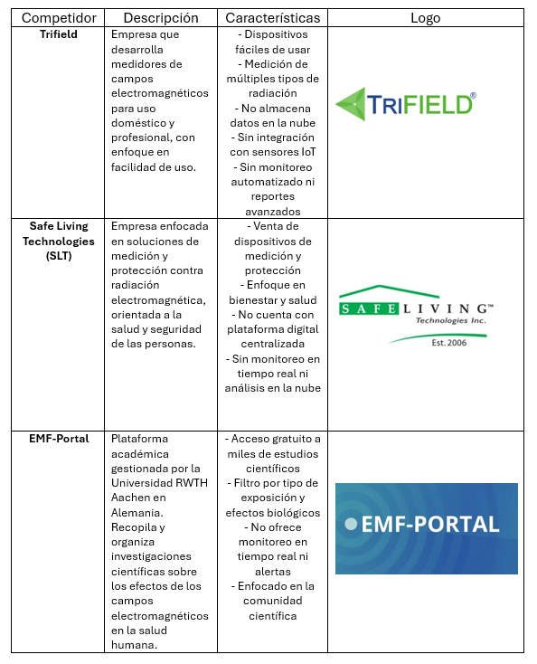

### 2.1.1. Análisis competitivo

En esta sección se presenta un análisis comparativo de la solución propuesta frente a otras alternativas existentes en el ámbito de la medición y gestión de la radiación electromagnética. A través de una matriz estructurada, se examinan distintos aspectos como el enfoque del producto, el mercado objetivo, las estrategias utilizadas y sus capacidades tecnológicas.

| **Nombre de los Startups** |  | **Gauss (EmSafe)** | **EMF-Portal** | **Safe Living Technologies** | **Trifield** |
|--------------------------|----------------------------------------------------|------------------------------|------------------------------|------------------------------|------------------------------|
| **Perfil** | Overview | Plataforma tecnológica basada en IoT que permite monitorear en tiempo real la radiación electromagnética mediante sensores, app móvil y plataforma web con análisis en la nube. | Plataforma académica que recopila y organiza estudios científicos sobre los efectos de la radiación electromagnética en la salud. | Empresa enfocada en la comercialización de productos de medición y protección contra radiación electromagnética. | Empresa que desarrolla dispositivos de medición EMF para uso doméstico y profesional. |
| | Ventaja competitiva / ¿Qué valor ofrece a los clientes? | Monitoreo en tiempo real, integración IoT, alertas automáticas, reportes históricos y recomendaciones personalizadas. | Amplia base de datos científica confiable y gratuita. | Soluciones físicas orientadas a la salud y protección EMF. | Dispositivos accesibles, simples y fáciles de usar. |
| **Perfil de Marketing** | Mercado objetivo | Personas, empresas e industrias preocupadas por la exposición electromagnética. | Investigadores, científicos y comunidad académica. | Usuarios preocupados por la salud y protección EMF. | Usuarios domésticos y técnicos básicos. |
| | Estrategias de marketing | Marketing digital, enfoque en salud y tecnología, modelo freemium/premium. | Difusión académica y publicaciones científicas. | Venta online y posicionamiento en salud y bienestar. | Comercialización online y distribución de dispositivos. |
| **Perfil del Producto** | Productos & Servicios | Aplicación móvil, plataforma web, sensores IoT y análisis en la nube. | Base de datos de estudios científicos. | Medidores EMF y productos de protección. | Dispositivos portátiles de medición EMF. |
| | Precios & Costos | Modelo freemium con suscripción premium. | Acceso gratuito. | Venta de productos físicos (hardware). | Venta de dispositivos (hardware). |
| | Canales de distribución (Web y/o Móvil) | Aplicación móvil, plataforma web e integración con sensores IoT. | Plataforma web. | Comercio electrónico (web). | Página web y distribuidores. |
| **Análisis SWOT** | Fortalezas | Solución integral (IoT + app + nube), monitoreo en tiempo real, alertas automáticas y análisis de datos. | Alta credibilidad científica. | Productos especializados en salud. | Simplicidad y facilidad de uso. |
| | Debilidades | Dependencia de sensores físicos y conectividad. | No ofrece monitoreo en tiempo real. | No cuenta con plataforma digital avanzada. | No permite almacenamiento ni análisis de datos. |
| | Oportunidades | Crecimiento del IoT y mayor preocupación por la salud tecnológica. | Incremento de investigaciones científicas. | Mayor demanda de protección EMF. | Expansión en el mercado doméstico. |
| | Amenazas | Nuevos competidores tecnológicos y regulaciones. | Limitada innovación tecnológica. | Competidores con soluciones digitales más completas. | Sustitución por soluciones más avanzadas basadas en IoT. |

### 2.1.2. Estrategias y tácticas frente a competidores

Nuestra estrategia se basa en la diferenciación tecnológica mediante el uso de sensores IoT, análisis en la nube y monitoreo en tiempo real de la radiación electromagnética, con el objetivo de ofrecer una solución integral que supere las limitaciones de las alternativas actuales. Así, nuestras tácticas clave son:

🟩 **Optimizar la experiencia del usuario en la plataforma**

Garantizar que la aplicación móvil y la plataforma web sean intuitivas, accesibles y fáciles de usar tanto para usuarios individuales como para organizaciones, facilitando la interpretación de datos, la visualización de niveles de radiación y la toma de decisiones informadas.

🟩 **Implementar monitoreo continuo con alertas inteligentes**

Aprovechar la integración de sensores IoT para ofrecer mediciones en tiempo real, complementadas con alertas automáticas cuando se superen los niveles seguros, lo que permite actuar de manera preventiva frente a la exposición electromagnética.

🟩 **Desarrollar alianzas estratégicas con organizaciones y empresas**

Establecer vínculos con empresas, instituciones educativas y entidades interesadas en la salud ocupacional y tecnológica, promoviendo el uso de la plataforma como una herramienta de monitoreo y prevención en entornos laborales y cotidianos.

🟩 **Fomentar la adopción mediante un modelo freemium**

Ofrecer acceso gratuito a funcionalidades básicas de la plataforma, incentivando a los usuarios a migrar hacia planes premium que incluyan reportes avanzados, análisis histórico y recomendaciones personalizadas, facilitando la captación y retención de clientes.

🟩 **Promover la concientización sobre la exposición electromagnética**

Desarrollar contenido educativo, campañas digitales y recursos informativos que permitan a los usuarios comprender los riesgos asociados a la radiación electromagnética y adoptar medidas preventivas, posicionando la solución como una herramienta clave para el bienestar y la seguridad.

## 2.2. Entrevistas

Una entrevista es un proceso de comunicación en el que una persona (entrevistador) realiza preguntas y otra persona (entrevistado) responde, con el objetivo de obtener información relevante sobre un tema específico. En este ámbito sería conocer la opinión y necesidades respecto a las preguntas que se le haría para llegar a comprender a nuestro público. 
Para esto, es muy importante la información de cada entrevista que se realizará y de esa forma nuestra StartUp pueda lograr el éxito. Finalmente, realizaremos un total de seis entrevistas: tres dirigidas al segmento de Hogares y ciudadanos conscientes de la salud y tres al segmento de Oficinas, pymes y/o instituciones educativas.

### 2.2.1. Diseño de entrevistas

A fin de obtener información valiosa sobre las necesidades, deseos y desafíos de nuestro público objetivo, hemos planteado una serie de preguntas.


#### Segmento 1: Personas comprometidas con el cuidado de su salud

##### Información personal:
1. ¿Cuál es su nombre?
2. ¿Cuál es su edad?
3. ¿En qué ciudad resides?
4. ¿Cuál es su ocupación profesional? ¿Se encuentra laborando actualmente?

##### Personalidad, aspecto emocional y habilidades del usuario:
5. ¿Podrías compartir una frase o dicho que refleje tu forma de ver la vida?
6. ¿Cuáles son algunas de tus fortalezas o debilidades personales?
7. ¿Qué medios digitales (TV, YouTube, redes sociales, etc.) sueles consumir?
8. ¿Te sientes cómodo/a usando aplicaciones móviles o dispositivos electrónicos en casa? ¿Has tenido dificultades para aprender a usarlos?
9. ¿Qué sistema operativo utilizas en tu celular? ¿iOS o Android?
10. ¿Qué navegador web usas con mayor frecuencia?

##### Evaluación del problema:
11. ¿Sabías que los aparatos electrónicos emiten radiación electromagnética constantemente dentro del hogar?
12.  ¿Has experimentado molestias como insomnio o dolores de cabeza que asocies con el uso prolongado de dispositivos electrónicos?
13. ¿Qué tanto te preocupa la exposición a campos electromagnéticos en tu entorno diario?
14. ¿Qué acciones tomas actualmente para reducir tu exposición a dispositivos electrónicos?
15. ¿Qué información te gustaría tener para sentirte más seguro respecto a este tipo de exposición?
16. ¿Usarías una aplicación que te alerte cuando los niveles de radiación en tu casa sean elevados?

---

#### Segmento 2: Miembros de empresas y organizaciones que operan maquinaria de emisión electromagnética

##### Información personal:
1. ¿Cuál es su nombre?
2. ¿Cuál es su edad?
3. ¿En qué ciudad resides?
4. ¿Cuál es su rol dentro de la organización? ¿Desde hace cuánto tiempo lo desempeñas?

##### Personalidad, aspecto emocional y habilidades del usuario:
5. ¿Qué lema o principio te guía en tu trabajo diario?
6. ¿Qué cualidades personales consideras importantes para gestionar un entorno laboral saludable?
7. ¿Qué plataformas digitales sueles usar para informarte o entretenerte?
8. ¿Qué nivel de familiaridad tienes con el uso de aplicaciones o herramientas tecnológicas en tu entorno laboral?
9. ¿Qué sistema operativo usas en tu celular y computadora?
10. ¿Te consideras alguien abierto a la implementación de nuevas tecnologías?

##### Evaluación del problema:
11. ¿Consideras que el ambiente tecnológico de tu organización podría estar afectando la salud de los trabajadores o estudiantes?
12. ¿Existen actualmente protocolos de monitoreo ambiental en tu institución (ruido, calidad del aire, etc.)?
13. ¿Has recibido quejas de fatiga, dolores de cabeza u otros síntomas relacionados con el entorno de trabajo?
14. ¿Qué tan importante crees que sería monitorear la exposición a radiación electromagnética en tu espacio laboral?
15. ¿Qué beneficios verías en contar con alertas automáticas o reportes sobre estos niveles?
16. ¿Estarías dispuesto a implementar sensores IoT en tu oficina para prevenir posibles riesgos invisibles?

### 2.2.2. Registro de entrevistas

#### Segmento 1: Personas comprometidas con el cuidado de su salud
    
> Entrevistado 01: Alejandra Gallo

- **Sexo:** Femenino
- **Edad:**  21
- **Distrito donde vive:** Santiago de Surco, Lima
- **Nivel socioeconómico:** Medio 

**Entrevista:**


- **Link:** <a href="https://upcedupe-my.sharepoint.com/:v:/g/personal/u202210364_upc_edu_pe/IQC4q9T3DaaATKxY7tvs9napAVF3cBqFSW8L3lboNkqM0Vc?nav=eyJyZWZlcnJhbEluZm8iOnsicmVmZXJyYWxBcHAiOiJTdHJlYW1XZWJBcHAiLCJyZWZlcnJhbFZpZXciOiJTaGFyZURpYWxvZy1MaW5rIiwicmVmZXJyYWxBcHBQbGF0Zm9ybSI6IldlYiIsInJlZmVycmFsTW9kZSI6InZpZXcifX0%3D&e=Ee88kr" target="_blank">https://upcedupe-my.sharepoint.com/:v:/g/personal/u202210364_upc_edu_pe/IQC4q9T3DaaATKxY7tvs9napAVF3cBqFSW8L3lboNkqM0Vc?nav=eyJyZWZlcnJhbEluZm8iOnsicmVmZXJyYWxBcHAiOiJTdHJlYW1XZWJBcHAiLCJyZWZlcnJhbFZpZXciOiJTaGFyZURpYWxvZy1MaW5rIiwicmVmZXJyYWxBcHBQbGF0Zm9ybSI6IldlYiIsInJlZmVycmFsTW9kZSI6InZpZXcifX0%3D&e=Ee88kr</a> 
- **Duración:** 0:00 - 6:05
- **Aplicaciones usadas:** TikTok, Youtube, Netflix
- **Tecnologías:**  Celular, Laptop, Consolas   
- **Entrevistador:** Mauro Fabricio Lopez de la Cruz

**Resumen:**  
Alejandra Gallo un estudiante de ciencia de la computacion de 21años expresa su preocupación por la exposición constante a las ondas electromagnéticas generadas por dispositivos electrónicos como celulares, routers y electrodomésticos. Señala que aunque muchos no lo notan, estos campos pueden tener efectos negativos en la salud a largo plazo, como alteraciones del sueño, dolores de cabeza o incluso riesgos más serios aún en estudio. Gallo destaca la importancia de tomar conciencia sobre este tema, promover investigaciones al respecto y adoptar hábitos que reduzcan la exposición diaria a estas ondas..

> Entrevistado 02: Miquel de la Piedra

- **Sexo:** Masculino
- **Edad:** 22
- **Distrito donde vive:** Santiago de Surco, Lima
- **Nivel socioeconómico:** Medio

**Entrevista:**


- **Link:** <a href="https://upcedupe-my.sharepoint.com/:v:/g/personal/u202210364_upc_edu_pe/IQC4q9T3DaaATKxY7tvs9napAVF3cBqFSW8L3lboNkqM0Vc?nav=eyJyZWZlcnJhbEluZm8iOnsicmVmZXJyYWxBcHAiOiJTdHJlYW1XZWJBcHAiLCJyZWZlcnJhbFZpZXciOiJTaGFyZURpYWxvZy1MaW5rIiwicmVmZXJyYWxBcHBQbGF0Zm9ybSI6IldlYiIsInJlZmVycmFsTW9kZSI6InZpZXcifX0%3D&e=Ee88kr" target="_blank">https://upcedupe-my.sharepoint.com/:v:/g/personal/u202210364_upc_edu_pe/IQC4q9T3DaaATKxY7tvs9napAVF3cBqFSW8L3lboNkqM0Vc?nav=eyJyZWZlcnJhbEluZm8iOnsicmVmZXJyYWxBcHAiOiJTdHJlYW1XZWJBcHAiLCJyZWZlcnJhbFZpZXciOiJTaGFyZURpYWxvZy1MaW5rIiwicmVmZXJyYWxBcHBQbGF0Zm9ybSI6IldlYiIsInJlZmVycmFsTW9kZSI6InZpZXcifX0%3D&e=Ee88kr</a>
- **Duración:** 6:05 - 13:04
- **Aplicaciones usadas:** TikTok, Instagram, WhatsApp y Chrome
- **Tecnologías:** Laptop, Celular y Computadora
- **Entrevistador:**  Carlos Eduardo Guimaraes Escalante

**Resumen:**  
Miquel es un joven de 21 años que estudia y actualmente realiza prácticas en Ingeniería de Software, lo que implica una exposición constante a dispositivos electrónicos como laptops, celulares y computadoras. A raíz de este uso prolongado, ha experimentado síntomas como insomnio y fatiga visual, los cuales logró mitigar parcialmente mediante el uso de lentes. Sin embargo, estos efectos siguen generándole cierta preocupación por su bienestar a largo plazo.

Además, Miquel reconoce que no tiene claridad sobre los niveles de radiación electromagnética a los que está expuesto diariamente, principalmente debido a la falta de fuentes de información confiables y accesibles sobre el tema. En este contexto, expresa interés en contar con una herramienta que le permita monitorear estos niveles en tiempo real y recibir alertas cuando sean elevados, de modo que pueda tomar medidas preventivas y proteger su salud.

> Entrevistado 03: Luis Barrantes

- **Sexo:** Masculino
- **Edad:** 21
- **Distrito donde vive:** Santiago de Surco, Lima
- **Nivel socioeconómico:** Alto

**Entrevista:**


- **Link:** <a href="https://upcedupe-my.sharepoint.com/:v:/g/personal/u202210364_upc_edu_pe/IQC4q9T3DaaATKxY7tvs9napAVF3cBqFSW8L3lboNkqM0Vc?nav=eyJyZWZlcnJhbEluZm8iOnsicmVmZXJyYWxBcHAiOiJTdHJlYW1XZWJBcHAiLCJyZWZlcnJhbFZpZXciOiJTaGFyZURpYWxvZy1MaW5rIiwicmVmZXJyYWxBcHBQbGF0Zm9ybSI6IldlYiIsInJlZmVycmFsTW9kZSI6InZpZXcifX0%3D&e=Ee88kr" target="_blank">https://upcedupe-my.sharepoint.com/:v:/g/personal/u202210364_upc_edu_pe/IQC4q9T3DaaATKxY7tvs9napAVF3cBqFSW8L3lboNkqM0Vc?nav=eyJyZWZlcnJhbEluZm8iOnsicmVmZXJyYWxBcHAiOiJTdHJlYW1XZWJBcHAiLCJyZWZlcnJhbFZpZXciOiJTaGFyZURpYWxvZy1MaW5rIiwicmVmZXJyYWxBcHBQbGF0Zm9ybSI6IldlYiIsInJlZmVycmFsTW9kZSI6InZpZXcifX0%3D&e=Ee88kr</a>
- **Duración:** 13:04 - 17:38
- **Aplicaciones usadas:** Brave, YouTube y TikTok
- **Tecnologías:** Celular y Laptop
- **Entrevistador:** Oskar Rodrigo Sosa Soto

**Resumen:**  
Luis Barrantes, un joven de 21 años residente de Surco, reconoce ser un usuario constante de tecnologías como su celular y plataformas digitales (YouTube, TikTok y Brave), lo cual lo mantiene en una exposición continua a dispositivos electrónicos. Aunque se siente cómodo con el uso de la tecnología, manifiesta una preocupación moderada por los efectos de la radiación electromagnética en su salud, vinculando el uso prolongado de dispositivos con malestares como el insomnio y dolores de cabeza leves

#### Segmento 2: Miembros de empresas y organizaciones que operan maquinaria de emisión electromagnética

    
> Entrevistado 01: Alejandro Oroncoy

- **Sexo:** Masculino   
- **Edad:** 20
- **Distrito donde vive:** San Borja, Lima
- **Nivel socioeconómico:** Medio Alto 

**Entrevista:**


- **Link:** <a href="https://upcedupe-my.sharepoint.com/:v:/g/personal/u202210364_upc_edu_pe/IQC4q9T3DaaATKxY7tvs9napAVF3cBqFSW8L3lboNkqM0Vc?nav=eyJyZWZlcnJhbEluZm8iOnsicmVmZXJyYWxBcHAiOiJTdHJlYW1XZWJBcHAiLCJyZWZlcnJhbFZpZXciOiJTaGFyZURpYWxvZy1MaW5rIiwicmVmZXJyYWxBcHBQbGF0Zm9ybSI6IldlYiIsInJlZmVycmFsTW9kZSI6InZpZXcifX0%3D&e=Ee88kr" target="_blank">https://upcedupe-my.sharepoint.com/:v:/g/personal/u202210364_upc_edu_pe/IQC4q9T3DaaATKxY7tvs9napAVF3cBqFSW8L3lboNkqM0Vc?nav=eyJyZWZlcnJhbEluZm8iOnsicmVmZXJyYWxBcHAiOiJTdHJlYW1XZWJBcHAiLCJyZWZlcnJhbFZpZXciOiJTaGFyZURpYWxvZy1MaW5rIiwicmVmZXJyYWxBcHBQbGF0Zm9ybSI6IldlYiIsInJlZmVycmFsTW9kZSI6InZpZXcifX0%3D&e=Ee88kr</a>
- **Duración:** 17:38 - 28:59
- **Aplicaciones usadas:** Zoom, Twitter, Instagram 
- **Tecnologías:**  Celular y Laptop
- **Entrevistador:**  Fabian Alejandro Oliva López

**Resumen:**  
Alejandro, un back end developer de su startup con más de 1 año de experiencia. Tiene como principal preocupación la exposición constante a campos electromagnéticos debido a que teme que en un futuro afecte la salud de sus compañeros de trabajo. El estaría dispuesto a implementar los sensores IOT para generar alertas automáticas y reportes para visualizar estos riesgos invisibles y reducir el riesgo de exposiciones a la salud de él y sus compañeros de trabajo.  


> Entrevistado 02: Gael Rivera

- **Sexo:**  Masculino
- **Edad:**  25
- **Distrito donde vive:** La Molina, Lima
- **Nivel socioeconómico:**  Medio Alto

**Entrevista:**


- **Link:** <a href="https://upcedupe-my.sharepoint.com/:v:/g/personal/u202210364_upc_edu_pe/IQC4q9T3DaaATKxY7tvs9napAVF3cBqFSW8L3lboNkqM0Vc?nav=eyJyZWZlcnJhbEluZm8iOnsicmVmZXJyYWxBcHAiOiJTdHJlYW1XZWJBcHAiLCJyZWZlcnJhbFZpZXciOiJTaGFyZURpYWxvZy1MaW5rIiwicmVmZXJyYWxBcHBQbGF0Zm9ybSI6IldlYiIsInJlZmVycmFsTW9kZSI6InZpZXcifX0%3D&e=Ee88kr" target="_blank">https://upcedupe-my.sharepoint.com/:v:/g/personal/u202210364_upc_edu_pe/IQC4q9T3DaaATKxY7tvs9napAVF3cBqFSW8L3lboNkqM0Vc?nav=eyJyZWZlcnJhbEluZm8iOnsicmVmZXJyYWxBcHAiOiJTdHJlYW1XZWJBcHAiLCJyZWZlcnJhbFZpZXciOiJTaGFyZURpYWxvZy1MaW5rIiwicmVmZXJyYWxBcHBQbGF0Zm9ybSI6IldlYiIsInJlZmVycmFsTW9kZSI6InZpZXcifX0%3D&e=Ee88kr</a>
- **Duración:** 28:59 - 35:10
- **Aplicaciones usadas:**  Zoom, Instagram, YouTube
- **Tecnologías:**  Celular y Laptop
- **Entrevistador:**  Fabian Alejandro Oliva López

**Resumen:**  
Gael, dueño de su proyecto con más de 3 años de experiencia, tiene como principal preocupación la exposición constante a campos electromagnéticos generados por los servidores y equipos de cómputo que utiliza en su operación diaria, ya que considera que, a largo plazo, podrían afectar su salud y la de las personas que trabajan en su entorno. Por ello, está interesado en adoptar soluciones IoT que le permitan supervisar estos niveles en tiempo real y tomar decisiones informadas para optimizar la distribución de sus equipos, mejorar las condiciones del espacio y prevenir posibles impactos en la salud.

> Entrevistado 03: Jose Miguel Riega

- **Sexo:** Masculino
- **Edad:** 22 
- **Distrito donde vive:** Chorrillos, Lima
- **Nivel socioeconómico:** Alto

**Entrevista:**


- **Link:** <a href="https://upcedupe-my.sharepoint.com/:v:/g/personal/u202210364_upc_edu_pe/IQC4q9T3DaaATKxY7tvs9napAVF3cBqFSW8L3lboNkqM0Vc?nav=eyJyZWZlcnJhbEluZm8iOnsicmVmZXJyYWxBcHAiOiJTdHJlYW1XZWJBcHAiLCJyZWZlcnJhbFZpZXciOiJTaGFyZURpYWxvZy1MaW5rIiwicmVmZXJyYWxBcHBQbGF0Zm9ybSI6IldlYiIsInJlZmVycmFsTW9kZSI6InZpZXcifX0%3D&e=Ee88kr" target="_blank">https://upcedupe-my.sharepoint.com/:v:/g/personal/u202210364_upc_edu_pe/IQC4q9T3DaaATKxY7tvs9napAVF3cBqFSW8L3lboNkqM0Vc?nav=eyJyZWZlcnJhbEluZm8iOnsicmVmZXJyYWxBcHAiOiJTdHJlYW1XZWJBcHAiLCJyZWZlcnJhbFZpZXciOiJTaGFyZURpYWxvZy1MaW5rIiwicmVmZXJyYWxBcHBQbGF0Zm9ybSI6IldlYiIsInJlZmVycmFsTW9kZSI6InZpZXcifX0%3D&e=Ee88kr</a>
- **Duración:** 35:10 - 42:13
- **Aplicaciones usadas:** TikTok e Instagram
- **Tecnologías:** Celular y Computadora
- **Entrevistador:** Fernando Jesus Lizano Coll Cardenas

**Resumen:**  
Jose Riega es un técnico de mantenimiento eléctrico de 22 años con un año de experiencia en una empresa de manufactura en Lima. Se describe como una persona responsable y abierta a aprender, quien considera que la comunicación oportuna sobre riesgos laborales es clave para un ambiente de trabajo saludable. En cuanto a sus hábitos digitales, utiliza principalmente TikTok, YouTube e Instagram, maneja Android y Windows, y se considera abierto a adoptar nuevas tecnologías si éstas simplifican su trabajo.

Respecto al problema, Jose admitió no haber reflexionado antes sobre los riesgos electromagnéticos en su entorno, a pesar de trabajar rodeado de maquinaria industrial todo el día. Mencionó que frecuentemente termina su turno con dolor de cabeza, síntoma compartido por varios compañeros, y que la empresa no comunica claramente los resultados de sus monitoreos de seguridad. Valoró positivamente la idea de un sistema de alertas automáticas sobre niveles electromagnéticos y se mostró completamente dispuesto a que se instalen sensores IoT en su área de trabajo.

### 2.2.3. Análisis de entrevistas

De acuerdo con las entrevistas registradas y sus respectivos resúmenes, hemos realizado el siguiente análisis, donde se resaltan los puntos en común de los entrevistados. 

#### Análisis del Segmento 1: Personas comprometidas con el cuidado de su salud

##### Características Objetivas:

- **Preocupación por la Radiación Electromagnética:** Todos los entrevistados manifestaron preocupación por los efectos de la exposición constante a campos electromagnéticos provenientes de dispositivos electrónicos, asociándolos con problemas como insomnio, fatiga visual y dolores de cabeza.  

- **Alta Exposición Tecnológica:** Los tres participantes presentan un uso intensivo de dispositivos electrónicos en su vida diaria, tanto por motivos académicos y laborales como por entretenimiento, lo que incrementa su nivel de exposición.  

- **Interés en Soluciones de Monitoreo:** Dos de los tres entrevistados expresaron interés en contar con herramientas que les permitan monitorear los niveles de radiación electromagnética en tiempo real y recibir información clara al respecto.  

- **Falta de Información Accesible:** La mayoría de los entrevistados indicó no contar con información suficiente, confiable o comprensible sobre los niveles de radiación y sus posibles efectos en la salud.  

- **Preferencia por Alertas Proactivas:** Los participantes valoran la posibilidad de recibir alertas automáticas cuando los niveles de radiación sean elevados, considerándolo un elemento clave para la prevención.  

##### Características Subjetivas:

- **Sensación de Incertidumbre:** Los entrevistados expresan preocupación e incertidumbre debido a la falta de conocimiento sobre su nivel real de exposición a radiación electromagnética.  

- **Interés por el Bienestar Personal:** Existe una clara intención de adoptar hábitos más saludables y prevenir posibles efectos negativos a largo plazo, especialmente en relación con el uso constante de tecnología.  

- **Confianza en Soluciones Tecnológicas:** Los participantes muestran una actitud positiva hacia el uso de herramientas digitales que les permitan monitorear y gestionar su exposición, siempre que estas sean accesibles y fáciles de usar.  

##### Conclusión:

Las personas comprometidas con el cuidado de su salud presentan una exposición constante a dispositivos electrónicos y una preocupación generalizada por los posibles efectos de la radiación electromagnética. A pesar de ello, enfrentan una falta de información clara y herramientas prácticas para gestionar este riesgo. Existe una clara disposición a adoptar soluciones tecnológicas que permitan monitorear los niveles de radiación en tiempo real y recibir alertas preventivas, lo que evidencia una oportunidad para desarrollar una herramienta accesible que contribuya a mejorar su bienestar y reducir la incertidumbre.

---

#### Análisis del Segmento 2: Miembros de empresas y organizaciones que operan maquinaria de emisión electromagnética

##### Características Objetivas:

- **Exposición en Entornos Laborales:** Todos los entrevistados trabajan en entornos donde existe exposición constante a campos electromagnéticos, ya sea por el uso de servidores, equipos de cómputo o maquinaria industrial.  

- **Uso de Métodos Limitados de Monitoreo:** La mayoría de los participantes indicó que actualmente no cuenta con sistemas adecuados o claros para monitorear los niveles de radiación electromagnética en sus entornos laborales.  

- **Interés en Soluciones IoT:** Los entrevistados muestran interés en implementar soluciones basadas en sensores IoT que permitan medir y visualizar los niveles de radiación en tiempo real.  

- **Necesidad de Reportes y Análisis:** Dos de los tres entrevistados consideran importante contar con reportes que les permitan identificar patrones de exposición y tomar decisiones informadas para mejorar las condiciones de trabajo.  

- **Aceptación de Alertas Automatizadas:** Los participantes valoran la implementación de alertas automáticas que les permitan actuar de manera preventiva frente a niveles elevados de radiación.  

##### Características Subjetivas:

- **Preocupación por la Salud Laboral:** Los entrevistados expresan preocupación por el impacto que la exposición prolongada podría tener en su salud y en la de sus compañeros de trabajo.  

- **Falta de Conciencia Inicial:** Uno de los participantes señala que no había considerado previamente este problema, lo que evidencia una falta de concientización general en algunos entornos laborales.  

- **Interés en la Prevención y Mejora Continua:** Existe una actitud proactiva hacia la adopción de soluciones que permitan reducir riesgos, mejorar la seguridad laboral y optimizar la gestión del entorno de trabajo.  

##### Conclusión:

Los miembros de empresas y organizaciones presentan una exposición constante a campos electromagnéticos en sus entornos laborales, junto con una limitada disponibilidad de herramientas para su monitoreo. A pesar de ello, muestran una alta disposición a adoptar soluciones tecnológicas, especialmente aquellas basadas en IoT, que permitan medir, analizar y prevenir riesgos mediante alertas y reportes. Esto representa una oportunidad clara para implementar sistemas que mejoren la seguridad laboral, faciliten la toma de decisiones y protejan la salud de los trabajadores.

## 2.3. Needfinding

### 2.3.1. User Personas

A través de un perfil detallado, esta sección explora las características demográficas, necesidades, deseos, comportamientos y problemas específicos de los usuarios de los segmentos objetivos predefinidos, facilitando el diseño de soluciones que se alineen mejor con sus expectativas y desafíos.

**Segmento 1:** Personas comprometidas con el cuidado de su salud

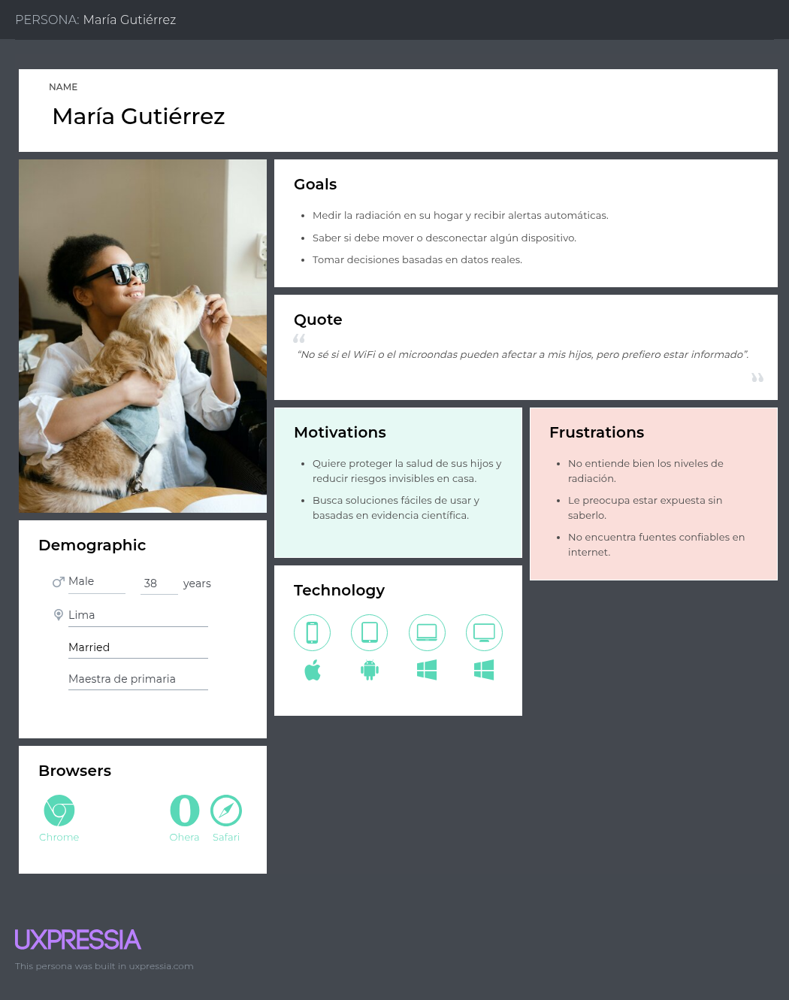 <br>

**Segmento 2:** Miembros de empresas y organizaciones que operan maquinaria de emisión electromagnética

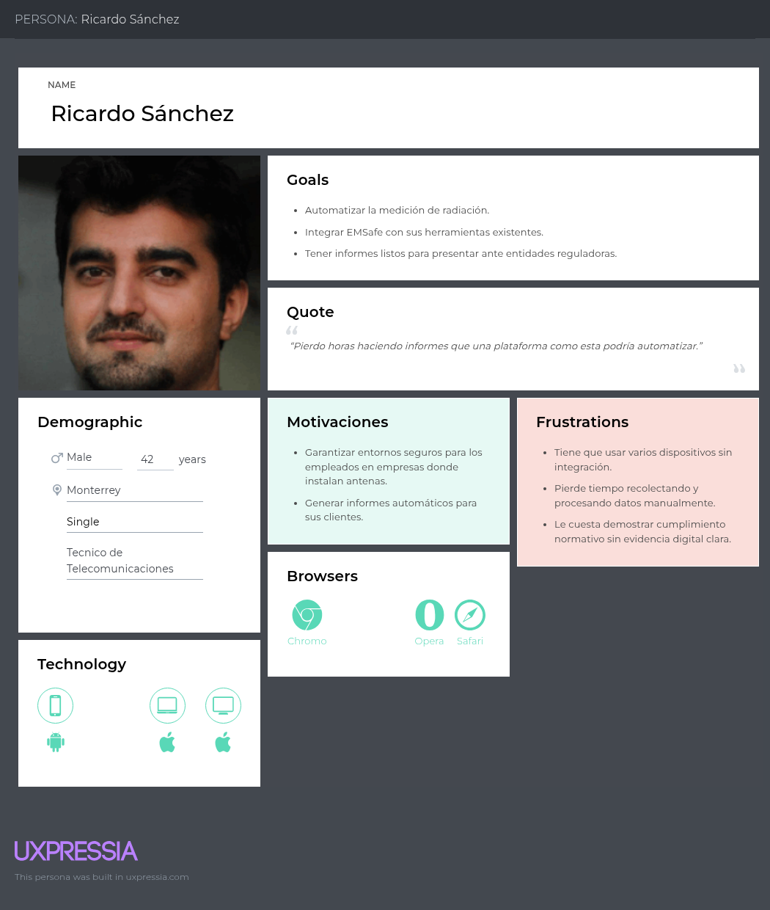

### 2.3.2. User Task Matrix

**Segmento 1:** Personas comprometidas con el cuidado de su salud
- Nombre: María Gutiérrez
- Edad: 37 años
- Profesión: Maestra de primaria
- Interés: Proteger la salud de su familia ante la exposición electromagnética

| Tarea                                                                 | Frecuencia | Importancia | Comentarios |
|-----------------------------------------------------------------------|------------|-------------|-------------|
| Verificar niveles de radiación en su casa                            | Diaria     | Alta        | Revisa exposición en zonas como dormitorio, sala y cocina. |
| Recibir alertas si hay sobreexposición                               | Eventual   | Alta        | Desea alertas claras, automáticas y fáciles de entender. |
| Acceder a recomendaciones para reducir exposición                    | Semanal    | Media       | Busca consejos simples como cambiar ubicación de dispositivos. |
| Configurar zonas seguras en la app                                   | Ocasional  | Media       | Le interesa definir áreas donde sus hijos juegan o duermen. |
| Consultar histórico de niveles de exposición                         | Mensual    | Media       | Quiere evaluar cambios a lo largo del tiempo para tomar decisiones. |
| Compartir inquietudes o consejos en redes o foros                    | Ocasional  | Baja        | Busca validar preocupaciones con otros padres o usuarios. |


**Segmento 2:** Miembros de empresas y organizaciones que operan maquinaria de emisión electromagnética

- Nombre: Ricardo Sánchez
- Edad: 42 años
- Profesión: Técnico en telecomunicaciones
- Interés: Garantizar entornos seguros en industrias y cumplir con normativas

| Tarea                                                                 | Frecuencia | Importancia | Comentarios |
|-----------------------------------------------------------------------|------------|-------------|-------------|
| Instalar sensores en entornos industriales                           | Recurrente | Alta        | Necesita facilidad de instalación y conectividad inmediata. |
| Ver dashboards de radiación en tiempo real                           | Diaria     | Alta        | Usa los datos para supervisar condiciones operativas. |
| Generar reportes PDF para auditorías o clientes                      | Semanal    | Alta        | Automatización y formatos exportables son clave. |
| Configurar umbrales personalizados de alerta                         | Ocasional  | Alta        | Desea adaptar alertas a normas de seguridad de su empresa. |
| Integrar datos con plataformas internas mediante API                 | Eventual   | Media       | Requiere endpoints bien documentados y estables. |
| Realizar mantenimientos o actualizaciones de sensores                | Mensual    | Media       | Importante para asegurar continuidad del monitoreo. |

El análisis del User Task Matrix evidencia dos perfiles de usuario con necesidades claramente diferenciadas, pero alineadas en torno a un mismo objetivo: el monitoreo y control efectivo de la exposición electromagnética.

Por un lado, el Segmento 1 prioriza la simplicidad, claridad y accesibilidad. Sus tareas más importantes están relacionadas con la verificación diaria de niveles de radiación y la recepción de alertas comprensibles, lo que refleja la necesidad de una solución intuitiva, automatizada y orientada a la toma de decisiones rápidas para proteger la salud familiar. Las funcionalidades complementarias, como recomendaciones y visualización histórica, aportan valor educativo y de prevención a mediano plazo.

Por otro lado, el Segmento 2 requiere una solución más robusta, técnica y escalable. Sus tareas críticas giran en torno al monitoreo en tiempo real, la generación de reportes y la configuración avanzada de alertas, lo que evidencia la necesidad de herramientas precisas, personalizables e integrables con otros sistemas. Además, aspectos como la instalación de sensores y el mantenimiento destacan la importancia de la confiabilidad y continuidad operativa.

En conjunto, ambos segmentos comparten la alta importancia de las alertas y el monitoreo constante, lo que sugiere que estos deben ser los pilares centrales del sistema. Sin embargo, la solución debe ser lo suficientemente flexible para adaptarse tanto a usuarios no técnicos como a profesionales especializados, diferenciando la experiencia de usuario según el contexto de uso.

### 2.3.4. Empathy Mapping

El Empathy Mapping es una herramienta que ayuda a comprender más profundamente las necesidades, deseos, preocupaciones y emociones de los usuarios. Al centrarse en lo que los usuarios piensan, sienten, dicen y hacen, el mapa permite a los diseñadores y equipos de producto conectar mejor con los usuarios y crear soluciones que realmente resuelvan sus problemas y satisfagan sus expectativas.

**Segmento 1: Personas comprometidas con el cuidado de su salud**

El mapa de empatía de María Gutiérrez muestra a una madre de familia preocupada por el bienestar de su hogar, que busca comprender y controlar la exposición a la radiación electromagnética. Necesita una solución clara, confiable y fácil de interpretar que le permita tomar decisiones informadas, reducir riesgos para sus hijos y sentirse segura dentro de su propio entorno.

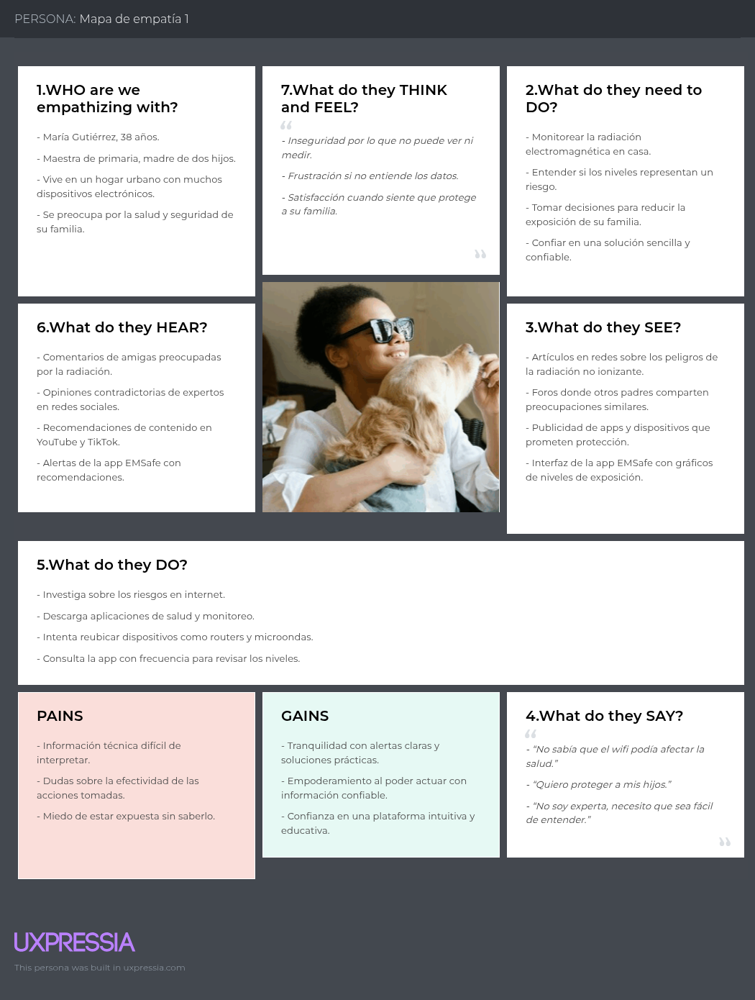

**Segmento 2: Miembros de empresas y organizaciones que operan maquinaria de emisión electromagnética**

El mapa de empatía de Ricardo Sánchez presenta a un profesional técnico altamente responsable, enfocado en garantizar la seguridad y el cumplimiento normativo en entornos industriales. Requiere herramientas precisas, integrables y automatizadas que le permitan monitorear en tiempo real, generar reportes eficientes y minimizar riesgos operativos, optimizando así la toma de decisiones en su organización.

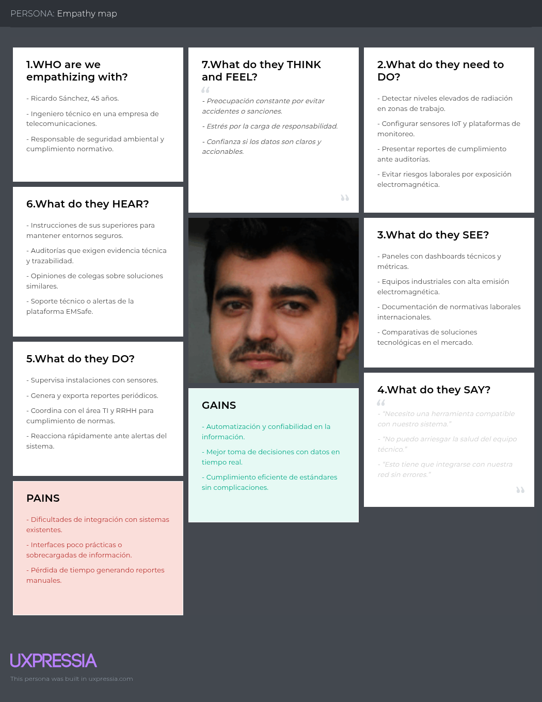


## 2.4. Big Picture Event Storming

En esta sección el equipo presenta los resultados de la sesión de Big Picture Event
Storming realizada de manera colaborativa, con el objetivo de explorar y comprender
el dominio del negocio de la solución de monitoreo de campos electromagnéticos (EMF).
Esta técnica permitió identificar los eventos de dominio más significativos, los actores
involucrados, los comandos que desencadenan acciones y las políticas que rigen el
comportamiento del sistema, ofreciendo una visión de alto nivel del landscape del negocio.

La sesión se estructuró en cinco fases principales que representan el ciclo de vida
completo de la solución:

La primera fase, **Registro y Configuración del Dispositivo**, cubre el proceso inicial
mediante el cual tanto usuarios del hogar como técnicos empresariales crean su cuenta
en la plataforma, instalan el sensor EMF físico y configuran los umbrales de alerta
personalizados. Durante esta fase se identificó un hotspot relevante: la definición de
valores de umbral seguros por defecto, que deberá resolverse con base en normativas
internacionales de exposición EMF.

La segunda fase, **Captura y Transmisión de Datos EMF**, modela el flujo de datos desde
el sensor físico (hardware GY-273) hasta el almacenamiento en base de datos, pasando
por la transmisión vía protocolo MQTT hacia el Edge API. Se identificó como hotspot la
frecuencia de muestreo óptima del sensor, aspecto que impacta directamente en el consumo
de recursos y la precisión del monitoreo.

La tercera fase, **Monitoreo en Tiempo Real**, representa la consulta del dashboard por
parte del usuario y la lógica de alerta automática: cuando una lectura supera el umbral
configurado, el sistema genera una alerta de sobreexposición y envía una notificación al
usuario. Esta política constituye el núcleo de valor de la solución.

La cuarta fase, **Análisis Histórico y Reportes**, cubre la consulta de datos históricos
y la generación de reportes en formato PDF, funcionalidad especialmente relevante para el
segmento empresarial que requiere evidencia documental para auditorías y cumplimiento
normativo. Se identificó como hotspot el período mínimo de retención de datos.

La quinta fase, **Gestión de Dispositivos**, abarca la verificación del estado del sensor,
la actualización de firmware y la política de alerta ante desconexión prolongada del
dispositivo (más de 5 minutos offline).

El proceso permitió además identificar cinco aggregates principales del sistema:
Dispositivo, LecturaEMF, Alerta, Informe y CuentaUsuario, los cuales servirán como
base para el modelado táctico en capítulos posteriores.

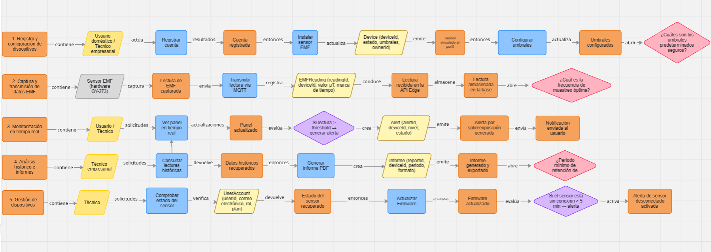

Enlace al tablero: [Big Picture Event Storming en Miro](https://miro.com/welcomeonboard/dUtIRzBmank2eDlMSzZleDl2NEV1WFJNMVE1a3pRZCt0dlhkRlI2a2lhWm1Ba2luamtHL1BlanVYV1U3a1hWWjRiU3N3VHQ0dlkvaHJpUjJEdkNxOFovWTdPWU1HbmRlNWNuZEMxR1lKNU03emJLUjBzM2dhQU9JN0FSWDkvU1dQdGo1ZEV3bUdPQWRZUHQzSGl6V2NBPT0hdjE=?share_link_id=82954980569)

### 2.5. Ubiquitous Language

El Ubiquitous Language es un principio fundamental en el diseño de sistemas y productos que busca establecer un lenguaje común, claro y consistente entre todos los participantes del proyecto, como desarrolladores, diseñadores y stakeholders. Este enfoque permite mejorar la comunicación, garantizar una comprensión compartida de los conceptos clave y disminuir errores o confusiones durante el desarrollo.

**Sensor**:
Dispositivo IoT encargado de detectar los niveles de radiación electromagnética no ionizante en un entorno determinado.

**Radiación No Ionizante**:
Tipo de radiación generada por equipos como routers, teléfonos móviles y electrodomésticos. No modifica el ADN, aunque una exposición prolongada podría afectar la salud.

**Medición en Tiempo Real**: 
Proceso continuo en el que los sensores capturan y envían datos al sistema para su visualización inmediata.

**Plataforma EMSafe**:
Aplicación web que permite a los usuarios consultar reportes, visualizar niveles de radiación y configurar alertas o zonas de monitoreo.

**Umbral de Seguridad**:
Límite de radiación definido según estándares internacionales (como ICNIRP o WHO), cuyo exceso activa una alerta en la plataforma.

**Alerta Automática**:
Notificación que se envía al usuario cuando los niveles de radiación superan el umbral establecido.

**Recomendación Personalizada**:
Sugerencias específicas basadas en las mediciones del entorno del usuario, orientadas a reducir la exposición.

**Mapa de Calor**:
Representación visual geoespacial que muestra la intensidad de radiación mediante diferentes colores.

**Zona Crítica**:
Área donde los niveles de radiación superan de forma constante el umbral de seguridad y requieren intervención.

**Usuario Individual**: 
Persona que utiliza EMSafe para monitorear y reducir su exposición o la de su entorno cercano.

**Usuario Corporativo**: 
Organización o empresa que emplea EMSafe para supervisar y minimizar la exposición de sus colaboradores.

**API REST**: 
Interfaz que permite la comunicación e integración de EMSafe con otros sistemas para el intercambio automático de datos.

**Dashboard**: 
Panel principal donde se visualizan métricas clave, estado de sensores y alertas recientes en tiempo real.

**Reporte**: 
Documento generado automáticamente que resume las mediciones de radiación en un periodo determinado, útil para análisis o auditorías.

**Integración**: 
Proceso de conexión entre EMSafe y otras plataformas o sistemas externos.

**Auditoría**: 
Evaluación del cumplimiento de normativas, donde EMSafe proporciona evidencia mediante reportes certificados.

**Configuración de Sensor**: 
Proceso mediante el cual el usuario define la ubicación, nombre y parámetros de funcionamiento de un sensor desde la plataforma.

**Salud Electromagnética**: 
Nivel de bienestar relacionado con la exposición controlada a campos electromagnéticos en el entorno cotidiano.

**Comunidad**: 
Conjunto de usuarios que comparten sus datos de medición para generar información colaborativa sobre la exposición en zonas comunes.

# Capitulo III: Requirements Specification

## 3.1. User Stories

| Epic ID   | Título de las Epics                                  |
| :-------- | :--------------------------------------------------- |
| **EPIC01** | Funcionalidad del Sistema Móvil (EMSafe) |
| **EPIC02** | Funcionalidad del Sistema Web (EMSafe) |
| **EPIC03** | Landing Page (desarrollo y experiencia del usuario) |
| **EPIC04** | Backend API (integración y gestión de API) |
| **EPIC05** | Personalización y perfil del usuario (Actualizar data) |

<br>


| Epic / Story ID | Título | Descripción | Criterios de Aceptación | Relacionado con (Epic ID) |
|-----------------|--------|-------------|-------------------------|---------------------------|
| US01 | Visualización de Niveles EM | **Como** usuario, <br> **quiero** visualizar en tiempo real los niveles de contaminación electromagnética en mi zona, <br> **para** saber si es seguro permanecer ahí. | **Escenario 1:** <br> **Dado que** el usuario tiene sensores activos vinculados a su cuenta, <br> **Cuando** accede a la sección de monitoreo en la app móvil, <br> **Entonces** el sistema muestra los niveles actuales de radiación con actualización automática e indicador visual de nivel (bajo, medio, alto). <br><br> **Escenario 2:** <br> **Dado** que el usuario no tiene sensores vinculados a su cuenta, <br> **Cuando** accede a la sección de monitoreo, <br> **Entonces** el sistema muestra un mensaje "No tienes sensores vinculados" y un botón para contactar soporte. <br><br> **Escenario 3:** <br> **Dado** que un sensor vinculado se encuentra desconectado, <br> **Cuando** el usuario visualiza el monitoreo, <br> **Entonces** el sistema muestra la última lectura registrada con una etiqueta "Última lectura: [fecha/hora]" y un indicador de sensor offline. | EPIC01 |
| US02 | Alertas Automatizadas | **Como** usuario, <br> **quiero** recibir alertas automáticas cuando los niveles EM superen los límites recomendados, <br> **para** poder actuar a tiempo. | **Escenario 1:** <br> **Dado que** los niveles de radiación superan el umbral de seguridad configurado, <br> **Cuando** el sistema detecta la lectura elevada, <br> **Entonces** envía una notificación push al usuario indicando el nivel detectado, la zona afectada y la hora del evento. <br><br> **Escenario 2:** <br> **Dado que** un usuario no tiene activadas las notificaciones, <br> **Cuando** los niveles EM superan los límites, <br> **Entonces** el sistema registra el evento en el historial sin enviar alerta push. <br><br> **Escenario 3:** <br> **Dado que** los niveles de radiación vuelven a estar dentro del rango seguro, <br> **Cuando** el sistema detecta la normalización, <br> **Entonces** envía una notificación al usuario indicando que los niveles han vuelto a la normalidad. | EPIC01 |
| US03 | Recomendaciones Personalizadas | **Como** usuario, <br> **quiero** recibir recomendaciones según mi historial de exposición, <br> **para** reducir riesgos en mi entorno. | **Escenario 1:** <br> **Dado que** el usuario tiene al menos 7 días de datos de exposición registrados, <br> **Cuando** el sistema analiza su historial, <br> **Entonces** muestra recomendaciones específicas basadas en sus patrones de exposición. <br><br> **Escenario 2:** <br> **Dado que** el usuario no tiene suficiente historial registrado, <br> **Cuando** el sistema intenta generar recomendaciones, <br> **Entonces** se muestra un mensaje indicando que no hay suficiente información disponible y ofrece recomendaciones generales. | EPIC01 |
| US04 | Control automático de dispositivos por alta radiación | **Como** usuario, <br> **quiero** que el sistema apague automáticamente los dispositivos cuando detecte un nivel alto de radiación, <br> **para** proteger los equipos y evitar daños en el sistema. | **Escenario 1:** <br> **Dado que** el sistema detecta un nivel de radiación superior al límite permitido, <br> **Cuando** se activa la alerta, <br> **Entonces** el sistema apaga automáticamente los dispositivos conectados mediante el adaptador inteligente y registra el evento. <br><br> **Escenario 2:** <br> **Dado que** se ha ejecutado el apagado automático, <br> **Cuando** el proceso finaliza, <br> **Entonces** el sistema envía una notificación al usuario indicando qué dispositivos fueron apagados y el motivo. <br><br> **Escenario 3:** <br> **Dado que** el sistema intenta apagar un dispositivo pero el adaptador inteligente no responde, <br> **Cuando** falla la comunicación, <br> **Entonces** el sistema registra el error y notifica al usuario que el apagado no pudo completarse. | EPIC01 |
| US05 | Configuración de apagado opcional | **Como** usuario, <br> **quiero** poder activar o desactivar el apagado automático de dispositivos, <br> **para** tener control sobre cómo responde el sistema ante niveles altos de radiación. | **Escenario 1:** <br> **Dado que** el usuario accede a la configuración de apagado automático, <br> **Cuando** activa la opción, <br> **Entonces** el sistema guarda la preferencia y la aplica ante futuras situaciones de radiación elevada. <br><br> **Escenario 2:** <br> **Dado que** el usuario ha desactivado el apagado automático, <br> **Cuando** se detecta una alerta de radiación elevada, <br> **Entonces** el sistema solo notifica al usuario sin apagar los dispositivos. | EPIC01 |
| US06 | Visualización de recomendaciones para cuidado de dispositivos | **Como** usuario, <br> **quiero** ver recomendaciones sobre el cuidado de mis dispositivos, <br> **para** prevenir daños causados por radiación u otros factores ambientales. | **Escenario 1:** <br> **Dado que** el usuario accede a la sección de recomendaciones de dispositivos, <br> **Cuando** ingresa al módulo, <br> **Entonces** el sistema muestra una lista de recomendaciones actualizadas sobre el cuidado y ubicación óptima de sus dispositivos. <br><br> **Escenario 2:** <br> **Dado que** existen datos de radiación registrados para los dispositivos del usuario, <br> **Cuando** el usuario revisa las recomendaciones, <br> **Entonces** el sistema muestra sugerencias adaptadas al nivel de riesgo detectado en cada zona. | EPIC01 |
| US07 | Visualización de historial de alertas y acciones realizadas | **Como** usuario, <br> **quiero** consultar un historial de alertas de radiación y acciones ejecutadas por el sistema, <br> **para** hacer seguimiento del comportamiento del sistema y el estado de mis dispositivos. | **Escenario 1:** <br> **Dado que** el usuario accede a la sección de historial en la app móvil, <br> **Cuando** ingresa al módulo, <br> **Entonces** el sistema muestra una lista cronológica de alertas con fecha, hora, nivel de radiación y acción tomada. <br><br> **Escenario 2:** <br> **Dado que** el usuario selecciona un evento del historial, <br> **Cuando** abre el detalle, <br> **Entonces** el sistema muestra información completa incluyendo dispositivos afectados, zona y acciones ejecutadas. | EPIC01 |
| US08 | Visualización de riesgos por radiación electromagnética | **Como** usuario, <br> **quiero** visualizar información sobre los riesgos de la exposición a radiación electromagnética, <br> **para** entender cómo puede afectar mi salud y tomar precauciones. | **Escenario 1:** <br> **Dado que** el usuario se encuentra en la aplicación móvil, <br> **Cuando** accede a la sección informativa de riesgos, <br> **Entonces** el sistema muestra contenido sobre riesgos asociados a la radiación electromagnética organizado por categorías. <br><br> **Escenario 2:** <br> **Dado que** el usuario visualiza la información de riesgos, <br> **Cuando** navega dentro de la sección, <br> **Entonces** el sistema presenta la información de forma clara, con íconos y texto comprensible para usuarios no técnicos. | EPIC01 |
| US09 | Recomendaciones para reducir exposición a radiación | **Como** usuario, <br> **quiero** recibir recomendaciones personalizadas para reducir mi exposición a radiación, <br> **para** prevenir problemas de salud a futuro. | **Escenario 1:** <br> **Dado que** existen niveles de radiación detectados en las zonas del usuario, <br> **Cuando** el usuario accede a las recomendaciones, <br> **Entonces** el sistema muestra sugerencias basadas en el nivel de riesgo detectado. <br><br> **Escenario 2:** <br> **Dado que** el usuario visualiza las recomendaciones, <br> **Cuando** revisa el contenido, <br> **Entonces** el sistema muestra acciones claras y realizables priorizadas por impacto en la reducción de exposición. | EPIC01 |
| US10 | Consulta de dudas mediante chatbot | **Como** usuario, <br> **quiero** hacer preguntas sobre radiación electromagnética mediante un chatbot, <br> **para** resolver mis dudas de forma rápida e interactiva. | **Escenario 1:** <br> **Dado que** el usuario accede al chatbot desde la app móvil, <br> **Cuando** escribe una pregunta, <br> **Entonces** el sistema procesa la consulta y genera una respuesta relevante en menos de 3 segundos. <br><br> **Escenario 2:** <br> **Dado que** el sistema genera una respuesta, <br> **Cuando** el usuario la recibe, <br> **Entonces** esta es clara, relevante y relacionada con la pregunta formulada. <br><br> **Escenario 3:** <br> **Dado que** el servicio de IA no está disponible, <br> **Cuando** el usuario envía una pregunta, <br> **Entonces** el sistema muestra un mensaje amigable indicando que el asistente no está disponible temporalmente. | EPIC01 |
| US11 | Recomendaciones mediante chatbot | **Como** usuario, <br> **quiero** recibir recomendaciones a través del chatbot, <br> **para** mejorar mis hábitos y reducir riesgos por radiación. | **Escenario 1:** <br> **Dado que** el usuario interactúa con el chatbot, <br> **Cuando** solicita consejos o recomendaciones, <br> **Entonces** el sistema responde con sugerencias prácticas y aplicables. <br><br> **Escenario 2:** <br> **Dado que** existen datos de radiación del usuario en el sistema, <br> **Cuando** el chatbot responde, <br> **Entonces** adapta sus recomendaciones según el contexto del usuario. | EPIC01 |
| US12 | Dashboard Personal | **Como** usuario registrado, <br> **quiero** tener un panel con mis métricas personalizadas para dar seguimiento a mi exposición, <br> **para** poder gestionar mi exposición de manera eficiente. | **Escenario 1:** <br> **Dado que** la personalización mejora la experiencia del usuario, <br> **Cuando** el usuario inicia sesión en la app móvil, <br> **Entonces** visualiza un resumen con nivel actual de exposición, tendencia de los últimos 7 días, alertas recibidas y estado de sensores. <br><br> **Escenario 2:** <br> **Dado que** el usuario es nuevo y no tiene datos registrados, <br> **Cuando** accede al dashboard, <br> **Entonces** el sistema muestra el panel con valores en cero y un mensaje guía para comenzar el monitoreo. | EPIC01 |
| US13 | Registro de exposición personal | **Como** usuario, <br> **quiero** registrar manualmente mi ubicación frecuente para hacer seguimiento personalizado, <br> **para** realizar un análisis de mi exposición en función de mis ubicaciones. | **Escenario 1:** <br> **Dado que** no siempre se cuenta con GPS activo, <br> **Cuando** el usuario ingresa manualmente una dirección o ubicación, <br> **Entonces** se vincula a su perfil para futuras mediciones y análisis. <br><br> **Escenario 2:** <br> **Dado que** el usuario ya tiene ubicaciones registradas, <br> **Cuando** agrega una nueva ubicación, <br> **Entonces** el sistema la añade a la lista y permite priorizar cuáles monitorear activamente. | EPIC01 |
| US14 | Perfil de exposición por día | **Como** usuario, <br> **quiero** ver un resumen diario de mi exposición EM para controlar mis hábitos, <br> **para** saber cómo varía mi exposición a lo largo del tiempo. | **Escenario 1:** <br> **Dado que** el control personal es importante para el usuario, <br> **Cuando** revisa su panel de exposición diaria, <br> **Entonces** encuentra un gráfico con la variación de niveles a lo largo del día, pico máximo y promedio. <br><br> **Escenario 2:** <br> **Dado que** el usuario tiene datos de múltiples días, <br> **Cuando** selecciona una fecha anterior, <br> **Entonces** el sistema muestra el resumen de ese día y permite compararlo visualmente con el día actual. | EPIC01 |
| US15 | Filtrado de Datos | **Como** usuario, <br> **quiero** filtrar por fecha, zona y tipo de fuente EM para un análisis más específico, <br> **para** obtener resultados más detallados y relevantes. | **Escenario 1:** <br> **Dado que** se manejan muchos datos en el sistema, <br> **Cuando** el usuario selecciona filtros de fecha, <br> **Entonces** el sistema muestra solo la información correspondiente al período seleccionado. <br><br> **Escenario 2:** <br> **Dado que** el usuario necesita un análisis específico, <br> **Cuando** aplica múltiples filtros simultáneamente (fecha + zona + tipo de fuente), <br> **Entonces** el sistema muestra los resultados que coinciden con todos los criterios y permite limpiar filtros individualmente. | EPIC01 |
| US16 | Mapa de Radiación | **Como** usuario, <br> **quiero** visualizar un mapa con los niveles de radiación en tiempo real, <br> **para** conocer las zonas con mayor exposición. | **Escenario 1:** <br> **Dado que** el usuario necesita tomar decisiones en función de la zona, <br> **Cuando** accede al mapa de radiación, <br> **Entonces** ve los niveles por ubicación con indicadores de color según intensidad (verde, amarillo, rojo). <br><br> **Escenario 2:** <br> **Dado que** el usuario visualiza el mapa, <br> **Cuando** toca sobre una zona específica, <br> **Entonces** el sistema muestra un popup con el nivel actual, nombre del sensor y última actualización. | EPIC01 |
| US17 | Filtrado del Mapa | **Como** usuario, <br> **quiero** aplicar filtros al mapa de radiación, <br> **para** identificar patrones según fecha, zona o nivel. | **Escenario 1:** <br> **Dado que** el usuario quiere hacer análisis más específicos, <br> **Cuando** selecciona filtros de nivel (bajo, medio, alto) en el mapa, <br> **Entonces** la visualización se actualiza mostrando únicamente las zonas que coinciden. <br><br> **Escenario 2:** <br> **Dado que** el usuario desea ver datos históricos en el mapa, <br> **Cuando** selecciona un rango de fechas, <br> **Entonces** el mapa muestra los niveles promedio de radiación correspondientes al período seleccionado. | EPIC01 |
| US18 | Compartir el Mapa | **Como** usuario, <br> **quiero** compartir el mapa de radiación con otros, <br> **para** informarles sobre los niveles actuales de exposición. | **Escenario 1:** <br> **Dado que** el usuario quiere alertar a familiares o colegas, <br> **Cuando** presiona la opción de compartir, <br> **Entonces** el sistema genera una imagen o enlace del mapa actual para enviar por WhatsApp, correo u otras apps. <br><br> **Escenario 2:** <br> **Dado que** el usuario comparte un enlace del mapa, <br> **Cuando** el destinatario lo abre, <br> **Entonces** puede visualizar el estado actual del mapa sin necesidad de tener cuenta en la plataforma. | EPIC01 |
| US19 | Visualización de reporte mensual de radiación | **Como** usuario, <br> **quiero** visualizar un reporte mensual con los niveles de radiación electromagnética, <br> **para** analizar mi exposición durante el último mes. | **Escenario 1:** <br> **Dado que** el usuario se encuentra en la aplicación móvil, <br> **Cuando** accede a la sección de reportes y selecciona "Mensual", <br> **Entonces** el sistema muestra los datos correspondientes al último mes. <br><br> **Escenario 2:** <br> **Dado que** el usuario visualiza el reporte, <br> **Cuando** revisa la información, <br> **Entonces** el sistema presenta los datos de forma clara mediante gráficos o indicadores. | EPIC01 |
| US20 | Visualización de reporte anual de radiación | **Como** usuario, <br> **quiero** visualizar un reporte anual con los niveles de radiación electromagnética, <br> **para** comprender mi exposición a largo plazo. | **Escenario 1:** <br> **Dado que** el usuario se encuentra en la aplicación móvil, <br> **Cuando** selecciona la opción "Anual", <br> **Entonces** el sistema muestra los datos del último año. <br><br> **Escenario 2:** <br> **Dado que** el usuario visualiza el reporte, <br> **Cuando** analiza la información, <br> **Entonces** el sistema presenta un resumen con métricas clave del año. | EPIC01 | 
| US21 | Identificación de picos de radiación en reportes | **Como** usuario, <br> **quiero** identificar los picos más altos de radiación dentro de los reportes, <br> **para** reconocer momentos de mayor riesgo. | **Escenario 1:** <br> **Dado que** el usuario visualiza un reporte, <br> **Cuando** existen valores altos de radiación, <br> **Entonces** el sistema resalta los picos más significativos. <br><br> **Escenario 2:** <br> **Dado que** el usuario selecciona un pico, <br> **Cuando** interactúa con él, <br> **Entonces** el sistema muestra información detallada (fecha, hora, nivel). | EPIC01 |
| US22 | Visualización de gráficos de tendencias de radiación | **Como** usuario, <br> **quiero** visualizar gráficos de tendencias de radiación, <br> **para** identificar patrones en mi exposición a lo largo del tiempo. | **Escenario 1:** <br> **Dado que** el usuario accede a un reporte, <br> **Cuando** visualiza los datos, <br> **Entonces** el sistema muestra un gráfico de tendencia. <br><br> **Escenario 2:** <br> **Dado que** el usuario observa el gráfico, <br> **Cuando** analiza la información, <br> **Entonces** puede identificar aumentos o disminuciones en la radiación. | EPIC01 |
| US23 | Visualización de mapa de radiación del domicilio | **Como** usuario, <br> **quiero** visualizar un mapa de mi domicilio con los niveles de radiación electromagnética, <br> **para** conocer cómo se distribuye la radiación en mi entorno. | **Escenario 1:** <br> **Dado que** el usuario se encuentra en la aplicación móvil, <br> **Cuando** accede a la sección de mapa, <br> **Entonces** el sistema muestra el mapa del domicilio con datos de radiación. <br><br> **Escenario 2:** <br> **Dado que** el usuario visualiza el mapa, <br> **Cuando** observa las zonas, <br> **Entonces** el sistema muestra los niveles de radiación mediante colores o indicadores. | EPIC01 |
| US24 | Identificación de zonas de alta radiación | **Como** usuario, <br> **quiero** identificar las zonas con mayor radiación en el mapa, <br> **para** evitar áreas de riesgo dentro de mi domicilio. | **Escenario 1:** <br> **Dado que** existen zonas con alta radiación, <br> **Cuando** el sistema muestra el mapa, <br> **Entonces** resalta estas zonas con colores de alerta. <br><br> **Escenario 2:** <br> **Dado que** cambian los niveles de radiación, <br> **Cuando** se actualizan los datos, <br> **Entonces** el sistema refleja los cambios en el mapa. | EPIC01 |
| US25 | Visualización de leyenda de niveles de radiación | **Como** usuario, <br> **quiero** visualizar una leyenda en el mapa, <br> **para** entender el significado de los colores y niveles de radiación. | **Escenario 1:** <br> **Dado que** el usuario accede al mapa, <br> **Cuando** se muestra la interfaz, <br> **Entonces** el sistema incluye una leyenda visible con los niveles de radiación. <br><br> **Escenario 2:** <br> **Dado que** el usuario observa la leyenda, <br> **Cuando** revisa los colores, <br> **Entonces** puede entender fácilmente qué nivel representa cada color. | EPIC01 |
| US26 | Agendamiento de instalación de dispositivos | **Como** Admin, <br> **quiero** registrar y programar una cita de instalación de sensores IoT y adaptadores inteligentes en la sede del cliente que completó su primer pago, <br> **para** coordinar con el equipo técnico el despliegue del hardware y habilitar el inicio del servicio de monitoreo. | **Escenario 1:** <br> **Dado que** el Admin accede al módulo de agendamiento y selecciona a un cliente con pago inicial confirmado, <br> **Cuando** completa el formulario indicando sede, fecha, bloque horario y técnico asignado, <br> **Entonces** el sistema registra la cita en estado "Instalación Pendiente", notifica al técnico por correo y al cliente por la app móvil. <br><br> **Escenario 2:** <br> **Dado que** el Admin está seleccionando fecha y hora para una instalación, <br> **Cuando** intenta elegir un bloque en el que el técnico ya tiene una cita asignada, <br> **Entonces** el sistema deshabilita ese bloque y muestra "Horario no disponible, seleccione otro horario o técnico". <br><br> **Escenario 3:** <br> **Dado que** el Admin busca a un cliente para agendar una instalación, <br> **Cuando** selecciona a un cliente cuyo pago inicial no ha sido verificado, <br> **Entonces** el sistema bloquea el formulario y muestra "No se puede agendar: el cliente no tiene pago inicial confirmado". <br><br> **Escenario 4:** <br> **Dado que** existe una cita en estado "Instalación Pendiente" y se solicita un cambio de fecha, <br> **Cuando** el Admin modifica la fecha u horario, <br> **Entonces** el sistema actualiza el registro, notifica al técnico y al cliente, y mantiene historial del cambio. | EPIC02 |
| US27 | Agendamiento de mantenimiento de dispositivos | **Como** Admin, <br> **quiero** registrar y programar una cita de mantenimiento preventivo o correctivo para los sensores y adaptadores IoT instalados en la sede de un cliente, <br> **para** asegurar el correcto funcionamiento del hardware y la continuidad del servicio de monitoreo. | **Escenario 1:** <br> **Dado que** el sistema ha generado una alerta de mantenimiento sobre un dispositivo, <br> **Cuando** el Admin accede a la alerta y selecciona "Agendar mantenimiento", <br> **Entonces** el sistema crea una cita vinculada al ID del dispositivo, asigna técnico disponible y notifica a ambas partes. <br><br> **Escenario 2:** <br> **Dado que** un cliente ha reportado un problema desde la app móvil, <br> **Cuando** el Admin revisa la solicitud y confirma el agendamiento con fecha, horario y técnico, <br> **Entonces** el sistema registra la cita en estado "Mantenimiento Programado" y notifica al técnico y al cliente. <br><br> **Escenario 3:** <br> **Dado que** el Admin intenta agendar un mantenimiento, <br> **Cuando** selecciona un dispositivo en estado "Retirado" o "En proceso de recolección", <br> **Entonces** el sistema bloquea la solicitud y muestra "El dispositivo no es elegible para mantenimiento debido a su estado actual". <br><br> **Escenario 4:** <br> **Dado que** el Admin asigna fecha y técnico para mantenimiento, <br> **Cuando** el técnico ya tiene una cita en ese bloque horario, <br> **Entonces** el sistema muestra un aviso de conflicto y sugiere técnicos alternativos o bloques libres. | EPIC02 |
| US28 | Agendamiento de recolección de dispositivos | **Como** Admin, <br> **quiero** programar una cita para el retiro de los sensores y adaptadores IoT instalados en la sede de un cliente que ha cancelado o finalizado su servicio, <br> **para** recuperar el hardware, desvincularlo de la cuenta del cliente y cerrar las conexiones de transmisión de datos. | **Escenario 1:** <br> **Dado que** el servicio de un cliente ha sido marcado como cancelado o finalizado, <br> **Cuando** el Admin programa fecha, horario y técnico asignado, <br> **Entonces** el sistema registra la cita, cambia los dispositivos a "En proceso de recolección" y notifica al técnico y al cliente. <br><br> **Escenario 2:** <br> **Dado que** el técnico retiró todos los dispositivos de la sede, <br> **Cuando** marca la recolección como "Completada", <br> **Entonces** el sistema cierra las conexiones MQTT, actualiza el inventario, desvincula dispositivos de la cuenta y cambia el servicio a "Finalizado". <br><br> **Escenario 3:** <br> **Dado que** el técnico no pudo retirar todos los dispositivos, <br> **Cuando** registra la recolección como parcial indicando qué dispositivos retiró, <br> **Entonces** el sistema actualiza el estado individualmente y genera una tarea pendiente para los dispositivos restantes. <br><br> **Escenario 4:** <br> **Dado que** el Admin intenta agendar una recolección, <br> **Cuando** selecciona una sede cuyo servicio está en estado "Activo", <br> **Entonces** el sistema bloquea el agendamiento y muestra "No se puede programar: el servicio aún está activo". | EPIC02 |
| US29 | Visualización del calendario de citas del equipo técnico | **Como** Admin, <br> **quiero** visualizar en un calendario todas las citas programadas (instalaciones, mantenimientos y recolecciones) organizadas por técnico y por fecha, <br> **para** tener una visión general de la carga de trabajo y evitar conflictos de agenda. | **Escenario 1:** <br> **Dado que** el Admin accede al módulo de calendario desde la plataforma web, <br> **Cuando** selecciona una vista (diaria, semanal o mensual), <br> **Entonces** el sistema muestra las citas diferenciadas por tipo con código de color, indicando técnico, cliente, sede y estado. <br><br> **Escenario 2:** <br> **Dado que** el Admin necesita ver la agenda de un técnico específico, <br> **Cuando** aplica el filtro por nombre del técnico, <br> **Entonces** el sistema muestra únicamente las citas asignadas a ese técnico. <br><br> **Escenario 3:** <br> **Dado que** el Admin visualiza el calendario, <br> **Cuando** hace clic sobre una cita específica, <br> **Entonces** el sistema despliega un resumen con datos del cliente, dirección, tipo de servicio, dispositivos y estado. | EPIC02 |
| US30 | Gestión del inventario de dispositivos | **Como** Admin, <br> **quiero** consultar y gestionar el inventario de sensores y adaptadores IoT disponibles, instalados y retirados, <br> **para** controlar el stock, planificar nuevas instalaciones y dar seguimiento al ciclo de vida de cada dispositivo. | **Escenario 1:** <br> **Dado que** el Admin accede al módulo de inventario, <br> **Cuando** visualiza la lista de dispositivos, <br> **Entonces** el sistema muestra todos los dispositivos con ID, tipo, estado actual, sede asignada y fecha de último cambio. <br><br> **Escenario 2:** <br> **Dado que** el Admin necesita ver dispositivos en un estado particular, <br> **Cuando** aplica un filtro por estado (ej: "Disponible"), <br> **Entonces** el sistema muestra únicamente los dispositivos que coinciden. <br><br> **Escenario 3:** <br> **Dado que** el Admin selecciona un dispositivo del inventario, <br> **Cuando** accede a su detalle, <br> **Entonces** el sistema muestra el historial completo: fecha de registro, instalaciones, mantenimientos, clientes vinculados y cambios de estado. <br><br> **Escenario 4:** <br> **Dado que** la cantidad de dispositivos disponibles baja del umbral configurado, <br> **Cuando** el sistema detecta esta condición, <br> **Entonces** genera una notificación en el panel del Admin indicando "Stock bajo: quedan X unidades disponibles". | EPIC02 |
| US31 | Registro y gestión de técnicos | **Como** Admin, <br> **quiero** registrar, editar y desactivar perfiles de los técnicos del equipo de campo, <br> **para** asignarlos correctamente a las citas de instalación, mantenimiento y recolección. | **Escenario 1:** <br> **Dado que** el Admin accede al módulo de gestión de técnicos, <br> **Cuando** completa el formulario con los datos del técnico y confirma, <br> **Entonces** el sistema crea el perfil en estado "Activo" y queda disponible para asignación. <br><br> **Escenario 2:** <br> **Dado que** el Admin necesita actualizar la información de un técnico, <br> **Cuando** modifica los campos y guarda los cambios, <br> **Entonces** el sistema actualiza el perfil y registra el cambio. <br><br> **Escenario 3:** <br> **Dado que** un técnico ya no forma parte del equipo, <br> **Cuando** el Admin cambia su estado a "Inactivo", <br> **Entonces** el sistema impide asignarle nuevas citas y muestra aviso si tiene citas pendientes por reasignar. | EPIC02 |
| US32 | Dashboard de Clientes | **Como** Admin, <br> **quiero** visualizar un dashboard con el estado general de todos los clientes registrados, <br> **para** tener una visión centralizada del servicio, identificar clientes activos, inactivos o con alertas pendientes, y tomar decisiones operativas rápidas. | **Escenario 1:** <br> **Dado que** el Admin accede al módulo de dashboard de clientes, <br> **Cuando** la página carga correctamente, <br> **Entonces** el sistema muestra tarjetas con métricas clave: total de clientes activos, clientes con alertas activas, clientes con citas pendientes y clientes con servicio finalizado. <br><br> **Escenario 2:** <br> **Dado que** el Admin visualiza la lista de clientes en el dashboard, <br> **Cuando** hace clic sobre un cliente específico, <br> **Entonces** el sistema redirige al perfil detallado mostrando dispositivos instalados, estado del servicio, historial de alertas y citas programadas. <br><br> **Escenario 3:** <br> **Dado que** el Admin necesita encontrar un cliente específico, <br> **Cuando** utiliza el campo de búsqueda o aplica filtros por estado, <br> **Entonces** el sistema muestra únicamente los clientes que coinciden, actualizando la vista en tiempo real. | EPIC02 |
| US33 | Historial de instalaciones | **Como** Admin, <br> **quiero** consultar el historial completo de citas de instalación realizadas, <br> **para** auditar el despliegue de dispositivos, verificar qué técnico ejecutó cada instalación y conocer el estado final de cada visita. | **Escenario 1:** <br> **Dado que** el Admin accede al módulo de historial de instalaciones, <br> **Cuando** la sección carga, <br> **Entonces** el sistema muestra una lista paginada de todas las instalaciones realizadas indicando cliente, sede, fecha, técnico, dispositivos instalados y estado final. <br><br> **Escenario 2:** <br> **Dado que** el Admin necesita revisar instalaciones de un período o técnico específico, <br> **Cuando** aplica filtros por fecha o nombre del técnico, <br> **Entonces** el sistema actualiza la lista mostrando únicamente los registros que coinciden. | EPIC02 |
| US34 | Registro de usuarios con rol de Admin o Técnico | **Como** Super Admin, <br> **quiero** registrar nuevos usuarios asignándoles el rol de Administrador o Técnico, <br> **para** controlar el acceso a la plataforma web y garantizar que cada usuario tenga solo los permisos correspondientes a su función. | **Escenario 1:** <br> **Dado que** el Super Admin accede al módulo de gestión de usuarios, <br> **Cuando** completa el formulario con nombre, correo, contraseña temporal y rol (Admin o Técnico) y confirma, <br> **Entonces** el sistema crea la cuenta, asigna permisos según el rol y envía un correo con credenciales de acceso. <br><br> **Escenario 2:** <br> **Dado que** el Super Admin intenta registrar un nuevo usuario, <br> **Cuando** ingresa un correo que ya está asociado a una cuenta existente, <br> **Entonces** el sistema bloquea el registro y muestra "El correo ingresado ya está registrado en el sistema". | EPIC02 |
| US35 | Gestión de Dispositivos | **Como** administrador, <br> **quiero** agregar, editar o eliminar dispositivos de monitoreo, <br> **para** mantener actualizado el sistema. | **Escenario 1:** <br> **Dado que** el inventario de dispositivos puede cambiar, <br> **Cuando** el Admin accede a la gestión de dispositivos, <br> **Entonces** puede realizar operaciones CRUD sobre ellos. <br><br> **Escenario 2:** <br> **Dado que** el Admin intenta eliminar un dispositivo en estado "Instalado", <br> **Cuando** selecciona la opción de eliminar, <br> **Entonces** el sistema bloquea la acción y muestra un mensaje indicando que primero debe desvincularse. | EPIC02 |
| US36 | Configuración de Dispositivos | **Como** administrador, <br> **quiero** configurar los parámetros y ubicación de cada dispositivo, <br> **para** asegurar un monitoreo correcto según el entorno. | **Escenario 1:** <br> **Dado que** cada zona puede requerir límites distintos, <br> **Cuando** el Admin edita un dispositivo, <br> **Entonces** puede establecer umbrales de alerta, frecuencia de muestreo y localización geográfica. <br><br> **Escenario 2:** <br> **Dado que** el Admin guarda la configuración, <br> **Cuando** el sistema procesa los cambios, <br> **Entonces** aplica los nuevos parámetros al dispositivo en la próxima sincronización y muestra confirmación. | EPIC02 |
| US37 | Historial de Dispositivos | **Como** usuario, <br> **quiero** revisar el historial de lecturas de cada dispositivo, <br> **para** analizar su comportamiento a lo largo del tiempo. | **Escenario 1:** <br> **Dado que** el usuario necesita verificar patrones pasados, <br> **Cuando** accede al historial de un dispositivo, <br> **Entonces** puede filtrar y visualizar lecturas anteriores en formato gráfico cronológico. <br><br> **Escenario 2:** <br> **Dado que** el usuario selecciona un punto en el gráfico, <br> **Cuando** abre el detalle, <br> **Entonces** el sistema muestra el valor exacto, fecha, hora y si se generó alguna alerta. | EPIC02 |
| US38 | Exportación de Historial | **Como** usuario, <br> **quiero** exportar el historial de lecturas de dispositivos, <br> **para** analizarlos externamente o compartirlos. | **Escenario 1:** <br> **Dado que** el usuario quiere trabajar los datos fuera del sistema, <br> **Cuando** aplica filtros y selecciona exportar en formato PDF, <br> **Entonces** obtiene un archivo con lecturas, gráficos y resumen del período. <br><br> **Escenario 2:** <br> **Dado que** el usuario necesita datos en formato tabular, <br> **Cuando** selecciona exportar en formato CSV, <br> **Entonces** obtiene un archivo con todas las lecturas incluyendo fecha, hora, valor y estado de alerta. | EPIC02 |
| US39 | Visualización de Historial de Alarmas | **Como** usuario, <br> **quiero** consultar el historial de alarmas del sistema, <br> **para** identificar eventos de riesgo anteriores. | **Escenario 1:** <br> **Dado que** las alarmas reflejan incidentes pasados, <br> **Cuando** el usuario accede al módulo de historial de alarmas, <br> **Entonces** puede filtrar por fecha, zona, nivel de gravedad y estado. <br><br> **Escenario 2:** <br> **Dado que** el usuario necesita analizar un período específico, <br> **Cuando** aplica filtros de rango de fechas, <br> **Entonces** el sistema muestra únicamente las alarmas del período seleccionado con todos sus atributos. | EPIC02 |
| US40 | Gestión de Alarmas | **Como** usuario, <br> **quiero** marcar alarmas como resueltas o en revisión, <br> **para** mantener el sistema actualizado y organizado. | **Escenario 1:** <br> **Dado que** se debe hacer seguimiento a las alarmas, <br> **Cuando** el usuario consulta una alarma activa, <br> **Entonces** puede actualizar su estado a "Resuelta" o "En revisión" y dejar comentarios. <br><br> **Escenario 2:** <br> **Dado que** el usuario marca una alarma como resuelta, <br> **Cuando** guarda el cambio, <br> **Entonces** el sistema registra la fecha de resolución, el usuario que la resolvió y la nota asociada. | EPIC02 |
| US41 | Visualización de Dashboard Web | **Como** usuario, <br> **quiero** visualizar un panel con el estado general de todos los dispositivos y alertas, <br> **para** tener una visión completa del sistema. | **Escenario 1:** <br> **Dado que** el usuario accede al dashboard de la plataforma web, <br> **Cuando** se carga la pantalla, <br> **Entonces** se muestran métricas generales como dispositivos activos, alertas recientes, citas programadas y tendencia de radiación. <br><br> **Escenario 2:** <br> **Dado que** ocurre un fallo en la carga de datos, <br> **Cuando** se accede al dashboard, <br> **Entonces** se muestra un mensaje de error indicando que no fue posible cargar la información. | EPIC02 |
| US42 | Inicio de Sesión | **Como** usuario registrado, <br> **quiero** iniciar sesión con mis credenciales, <br> **para** acceder de forma segura al sistema de monitoreo. | **Escenario 1:** <br> **Dado que** el usuario desea acceder a sus datos de monitoreo, <br> **Cuando** ingresa sus credenciales correctamente, <br> **Entonces** es redirigido al dashboard principal. <br><br> **Escenario 2:** <br> **Dado que** el usuario ingresa credenciales incorrectas, <br> **Cuando** intenta iniciar sesión, <br> **Entonces** el sistema muestra "Correo o contraseña incorrectos" sin especificar cuál dato es erróneo. <br><br> **Escenario 3:** <br> **Dado que** el usuario intenta enviar el formulario con campos vacíos, <br> **Cuando** presiona iniciar sesión, <br> **Entonces** el sistema muestra mensajes de validación indicando los campos requeridos. | EPIC05 |
| US43 | Registro de Usuario | **Como** nuevo usuario, <br> **quiero** registrarme en la plataforma, <br> **para** poder acceder al sistema de monitoreo. | **Escenario 1:** <br> **Dado que** el visitante aún no tiene una cuenta, <br> **Cuando** completa el formulario de registro con datos válidos, <br> **Entonces** su cuenta es creada y recibe un correo de verificación. <br><br> **Escenario 2:** <br> **Dado que** el visitante intenta registrarse con un correo ya existente, <br> **Cuando** envía el formulario, <br> **Entonces** el sistema muestra "Este correo ya se encuentra registrado. ¿Desea iniciar sesión?". <br><br> **Escenario 3:** <br> **Dado que** la contraseña no cumple los requisitos mínimos, <br> **Cuando** el visitante intenta completar el registro, <br> **Entonces** el sistema muestra los requisitos faltantes y no permite el registro. | EPIC05 |
| US44 | Actualizar perfil de usuario | **Como** usuario registrado, <br> **quiero** poder actualizar mis datos personales desde mi perfil, <br> **para** mantener mi información actualizada. | **Escenario 1:** <br> **Dado que** los usuarios pueden cambiar de correo, nombre o imagen con el tiempo, <br> **Cuando** acceden a la sección de perfil y editan su información, <br> **Entonces** los cambios se guardan correctamente y se muestra un mensaje de confirmación. <br><br> **Escenario 2:** <br> **Dado que** el usuario intenta guardar datos inválidos, <br> **Cuando** ingresa un correo sin formato válido o un teléfono con letras, <br> **Entonces** el sistema muestra mensajes de validación específicos y no guarda los cambios. | EPIC05 |
| US45 | Gestión de Perfiles | **Como** usuario, <br> **quiero** configurar mi perfil y preferencias para recibir información personalizada, <br> **para** ajustar mis alertas y zonas de interés según mis necesidades. | **Escenario 1:** <br> **Dado que** los usuarios tienen necesidades distintas, <br> **Cuando** editan su perfil de preferencias, <br> **Entonces** pueden ajustar tipos de alerta, frecuencia de notificaciones y zonas de interés. <br><br> **Escenario 2:** <br> **Dado que** el usuario guarda sus preferencias, <br> **Cuando** el sistema recibe los cambios, <br> **Entonces** las aplica inmediatamente en futuras notificaciones y visualizaciones del dashboard. | EPIC05 |
| US46 | Visualizar la sección Características | **Como** visitante del sitio web estático, <br> **quiero** acceder a la sección "Características", <br> **para** conocer los diferentes servicios ofrecidos por la startup. | **Escenario 1:** <br> **Dado que** los clientes buscan información sobre los servicios ofrecidos, <br> **Cuando** ingresan a la sección Características, <br> **Entonces** pueden visualizar la información de los servicios disponibles que ofrece la start-up. <br><br> **Escenario 2:** <br> **Dado que** el visitante accede desde un dispositivo móvil, <br> **Cuando** visualiza la sección de características, <br> **Entonces** el contenido se adapta al tamaño de pantalla sin perder legibilidad. | EPIC03 |
| US47 | Visualizar la sección Problemática | **Como** visitante del sitio web estático, <br> **quiero** ver información sobre la contaminación electromagnética para entender sus riesgos, <br> **para** estar informado sobre los peligros. | **Escenario 1:** <br> **Dado que** muchos usuarios no conocen sobre el tema, <br> **Cuando** acceden a la sección Problemática, <br> **Entonces** encuentran información clara y educativa sobre la contaminación electromagnética. <br><br> **Escenario 2:** <br> **Dado que** el visitante visualiza la sección, <br> **Cuando** revisa el contenido, <br> **Entonces** se presentan datos estadísticos y gráficos que refuerzan el mensaje de manera visual. | EPIC03 |
| US48 | CTA Claros | **Como** visitante, <br> **quiero** botones de acción claros para registrarme o explorar la demo fácilmente, <br> **para** tener un acceso rápido y directo. | **Escenario 1:** <br> **Dado que** un buen diseño mejora la conversión, <br> **Cuando** el visitante entra al landing page, <br> **Entonces** ve botones llamativos y funcionales en cada sección. <br><br> **Escenario 2:** <br> **Dado que** el visitante hace clic en un botón de acción, <br> **Cuando** se ejecuta la acción, <br> **Entonces** es redirigido a la página correspondiente sin errores. | EPIC03 |
| US49 | Responsive Design | **Como** usuario móvil, <br> **quiero** navegar fácilmente desde mi celular para usar la plataforma en cualquier lugar, <br> **para** acceder a la plataforma sin problemas desde cualquier dispositivo. | **Escenario 1:** <br> **Dado que** muchos usuarios acceden desde dispositivos móviles, <br> **Cuando** entran a la web desde un celular, <br> **Entonces** todos los elementos se adaptan correctamente sin desbordamiento horizontal. <br><br> **Escenario 2:** <br> **Dado que** el usuario accede desde una tablet, <br> **Cuando** navega por el sitio, <br> **Entonces** el menú, imágenes y secciones se redistribuyen fluidamente manteniendo usabilidad. | EPIC03 |
| US50 | Testimonios de Usuarios | **Como** visitante, <br> **quiero** leer experiencias de otros usuarios para confiar en la herramienta, <br> **para** sentirme seguro al usarla. | **Escenario 1:** <br> **Dado que** la validación social genera confianza, <br> **Cuando** el visitante navega hasta la sección de testimonios, <br> **Entonces** encuentra tarjetas con nombre, foto y comentario de usuarios. <br><br> **Escenario 2:** <br> **Dado que** existen más de 3 testimonios, <br> **Cuando** el visitante visualiza la sección, <br> **Entonces** puede navegar entre ellos mediante un carrusel interactivo. | EPIC03 |
| US51 | Visualizar link público de acceso al Landing Page | **Como** visitante del sitio web, <br> **quiero** acceder al Landing page, <br> **para** observar la información de la empresa desarrolladora. | **Escenario 1:** <br> **Dado que** los usuarios necesitan obtener información sobre la empresa, <br> **Cuando** ingresan la URL del landing page en su navegador, <br> **Entonces** el sitio se carga correctamente mostrando todas las secciones sin requerir autenticación. <br><br> **Escenario 2:** <br> **Dado que** el visitante accede al landing page, <br> **Cuando** el sitio termina de cargar, <br> **Entonces** todas las imágenes, estilos y scripts se muestran correctamente en menos de 3 segundos. | EPIC03 |
| US52 | Visualización de la sección de ubicación del centro de investigación | **Como** visitante del sitio web de EMSafe, <br> **quiero** visualizar una sección con la ubicación del centro de investigación en el landing page, <br> **para** que conozca la dirección exacta y cómo llegar al centro. | **Escenario 1:** <br> **Dado que** el usuario está en la página de inicio de EMSafe, <br> **Cuando** se desplaza hacia la sección "Ubicación", <br> **Entonces** ve un mapa interactivo con la dirección exacta del centro de investigación. <br><br> **Escenario 2:** <br> **Dado que** el visitante desea obtener indicaciones, <br> **Cuando** hace clic en "Cómo llegar", <br> **Entonces** se abre Google Maps en nueva pestaña con la ruta desde su ubicación actual. | EPIC03 |
| US53 | Visualizar la sección Beneficios | **Como** visitante del sitio web estático, <br> **quiero** ver información sobre los beneficios de la startup para un mejor cuidado personal, <br> **para** conocer las ventajas de usar la plataforma. | **Escenario 1:** <br> **Dado que** los usuarios buscan información sobre los beneficios, <br> **Cuando** ingresan a la sección Beneficios, <br> **Entonces** pueden visualizar las ventajas que ofrece la start-up con íconos y texto breve. <br><br> **Escenario 2:** <br> **Dado que** existen dos segmentos objetivo, <br> **Cuando** el visitante visualiza los beneficios, <br> **Entonces** se presentan beneficios diferenciados para usuarios individuales y organizaciones. | EPIC03 |
| US54 | Visualizar sección Contacto | **Como** usuario, <br> **quiero** enviar comentarios o preguntas al equipo de soporte desde la web estática, <br> **para** resolver dudas o problemas rápidamente. | **Escenario 1:** <br> **Dado que** algunos usuarios requieren ayuda, <br> **Cuando** llenan el formulario de contacto con datos válidos y presionan enviar, <br> **Entonces** reciben un mensaje de confirmación "Tu mensaje ha sido enviado". <br><br> **Escenario 2:** <br> **Dado que** el visitante intenta enviar el formulario con campos vacíos, <br> **Cuando** presiona enviar, <br> **Entonces** el sistema muestra mensajes de validación sin permitir el envío. | EPIC03 |
| US55 | Consulta de políticas de garantía de dispositivos | **Como** visitante del sitio web, <br> **quiero** acceder a la información sobre la garantía de los dispositivos, <br> **para** conocer las condiciones en caso de fallas en su funcionamiento. | **Escenario 1:** <br> **Dado que** el usuario se encuentra en el landing page, <br> **Cuando** accede a la sección "Políticas y condiciones", <br> **Entonces** el sistema muestra la información de garantía de los dispositivos. <br><br> **Escenario 2:** <br> **Dado que** el usuario visualiza la información, <br> **Cuando** revisa el contenido, <br> **Entonces** el sistema presenta de forma clara la duración, cobertura y condiciones de la garantía. | EPIC03 |
| US56 | Consulta de políticas de cobro por daños de dispositivos | **Como** visitante del sitio web, <br> **quiero** conocer las políticas de cobro por daños de los dispositivos, <br> **para** entender mis responsabilidades en caso de mal uso o deterioro. | **Escenario 1:** <br> **Dado que** el usuario accede a la sección de políticas, <br> **Cuando** revisa el contenido, <br> **Entonces** el sistema muestra las condiciones relacionadas a daños de dispositivos. <br><br> **Escenario 2:** <br> **Dado que** el usuario analiza la información, <br> **Cuando** revisa los detalles, <br> **Entonces** el sistema especifica los tipos de daños y los costos asociados. | EPIC03 |
| US57 | API de Integración | **Como** proveedor tecnológico, <br> **quiero** integrar mis sensores vía API para interoperar con la plataforma, <br> **para** que los datos se integren en tiempo real. | **Escenario 1:** <br> **Dado que** se buscan alianzas tecnológicas, <br> **Cuando** el proveedor conecta su sistema con credenciales válidas, <br> **Entonces** los datos se integran en tiempo real y el sistema retorna código 201. <br><br> **Escenario 2:** <br> **Dado que** el proveedor envía datos con formato incorrecto, <br> **Cuando** el API procesa la solicitud, <br> **Entonces** retorna un código 422 con mensaje indicando los campos inválidos. <br><br> **Escenario 3:** <br> **Dado que** se intenta acceder al API sin credenciales válidas, <br> **Cuando** el sistema recibe la solicitud, <br> **Entonces** retorna un código 401 sin exponer detalles del sistema. | EPIC04 |
| TS01 | Implementación del servicio de agendamiento con validación de disponibilidad | **Como** Developer, <br> **quiero** implementar un endpoint en el backend que registre citas de instalación, mantenimiento y recolección validando la disponibilidad del técnico y el estado del dispositivo y del cliente, <br> **para** garantizar la integridad de los datos y evitar conflictos de agenda. | **Escenario 1:** <br> **Dado que** se envía una solicitud POST con datos válidos, <br> **Cuando** el backend procesa la solicitud, <br> **Entonces** valida disponibilidad del técnico y estado del cliente, registra la cita y retorna código 201. <br><br> **Escenario 2:** <br> **Dado que** el técnico ya tiene una cita en ese bloque horario, <br> **Cuando** el backend detecta el conflicto, <br> **Entonces** retorna código 409 con bloques alternativos disponibles. <br><br> **Escenario 3:** <br> **Dado que** la solicitud no cumple precondiciones de estado, <br> **Cuando** el backend valida las reglas de negocio, <br> **Entonces** retorna código 422 con la razón del rechazo. | EPIC04 |
| TS02 | Implementación del sistema de notificaciones para eventos de agendamiento | **Como** Developer, <br> **quiero** implementar un servicio de notificaciones que envíe alertas por correo al técnico y push al cliente cada vez que se crea, modifica o cancela una cita, <br> **para** mantener informadas a todas las partes. | **Escenario 1:** <br> **Dado que** se registra una nueva cita exitosamente, <br> **Cuando** el sistema confirma la creación, <br> **Entonces** envía correo al técnico y notificación push al cliente con los detalles. <br><br> **Escenario 2:** <br> **Dado que** un Admin modifica una cita existente, <br> **Cuando** el sistema guarda los cambios, <br> **Entonces** envía notificaciones actualizadas a ambas partes. <br><br> **Escenario 3:** <br> **Dado que** el servicio de correo o push no está disponible, <br> **Cuando** el sistema intenta enviar y falla, <br> **Entonces** registra el evento en log y ejecuta hasta 3 reintentos con intervalo de 5 minutos. | EPIC04 |
| TS03 | Implementación de la desvinculación automática de dispositivos tras recolección | **Como** Developer, <br> **quiero** implementar la lógica que al confirmar una recolección cierre conexiones MQTT, rechace futuras transmisiones y actualice el inventario, <br> **para** que dispositivos retirados no ocupen recursos. | **Escenario 1:** <br> **Dado que** se marca una recolección como "Completada" para todos los dispositivos, <br> **Cuando** el sistema procesa la confirmación, <br> **Entonces** cierra conexiones MQTT, bloquea topics, actualiza estado a "Retirado" y cambia el servicio a "Finalizado". <br><br> **Escenario 2:** <br> **Dado que** la recolección es parcial, <br> **Cuando** el sistema procesa la actualización, <br> **Entonces** cierra MQTT solo de los retirados, mantiene activos los pendientes y genera tarea de recolección pendiente. <br><br> **Escenario 3:** <br> **Dado que** un dispositivo retirado intenta enviar datos vía MQTT, <br> **Cuando** el Edge API recibe el mensaje, <br> **Entonces** rechaza la transmisión y registra el intento en log de seguridad. | EPIC04 |
| TS04 | Implementación del módulo de inventario de dispositivos con tracking de ciclo de vida | **Como** Developer, <br> **quiero** implementar endpoints para consultar, filtrar y obtener el historial de cada dispositivo, <br> **para** que el Admin gestione el inventario desde la plataforma web. | **Escenario 1:** <br> **Dado que** se realiza un GET al endpoint de inventario con filtros opcionales, <br> **Cuando** el backend procesa la solicitud, <br> **Entonces** retorna lista paginada de dispositivos con ID, tipo, estado, sede y fecha de último cambio. <br><br> **Escenario 2:** <br> **Dado que** se consulta el historial de un dispositivo específico, <br> **Cuando** el backend procesa la solicitud, <br> **Entonces** retorna lista cronológica de todos los eventos asociados con fechas y actores. <br><br> **Escenario 3:** <br> **Dado que** el stock disponible baja del umbral configurado, <br> **Cuando** el sistema detecta la condición, <br> **Entonces** genera notificación persistente en el panel del Admin. | EPIC04 |
| TS05 | Implementación de endpoints para dashboard y gestión de usuarios | **Como** Developer, <br> **quiero** implementar los endpoints necesarios para obtener las métricas del dashboard de clientes y para el registro de usuarios con control de roles, <br> **para** que la plataforma web pueda consumir datos actualizados y gestionar el acceso de forma segura. | **Escenario 1: Endpoint de métricas del dashboard** <br> **Dado que** se realiza una solicitud GET al endpoint de métricas de clientes con credenciales de Admin, <br> **Cuando** el backend procesa la solicitud, <br> **Entonces** retorna un JSON con los conteos de clientes por estado y un código 200. <br><br> **Escenario 2: Endpoint de registro de usuario con rol** <br> **Dado que** el Super Admin envía una solicitud POST con nombre, correo, contraseña y rol válido, <br> **Cuando** el backend valida que el correo no existe y que el rol es válido, <br> **Entonces** crea el usuario, asigna permisos según el rol, retorna código 201 y dispara el envío del correo de bienvenida. | EPIC04 |
| TS06 | Integración de servicio de IA para chatbot | **Como** Sistema, <br> **quiero** integrar un servicio de inteligencia artificial para procesar preguntas del usuario, <br> **para** generar respuestas automáticas y coherentes. | **Escenario 1:** <br> **Dado que** el usuario envía una pregunta a través del chatbot, <br> **Cuando** el sistema la procesa, <br> **Entonces** se conecta correctamente al servicio de IA y obtiene una respuesta coherente. <br><br> **Escenario 2:** <br> **Dado que** se genera una respuesta desde el servicio de IA, <br> **Cuando** es enviada al usuario, <br> **Entonces** el tiempo de respuesta es menor a 3 segundos. <br><br> **Escenario 3:** <br> **Dado que** el servicio de IA no responde o está caído, <br> **Cuando** el usuario envía una pregunta, <br> **Entonces** el sistema muestra un mensaje amigable y registra el error en los logs. | EPIC04 |
| TS07 | Agregación de datos históricos de radiación | **Como** sistema, <br> **quiero** agrupar los datos de radiación por periodos (mensual y anual), <br> **para** permitir la generación de reportes. | **Escenario 1:** <br> **Dado que** existen datos almacenados, <br> **Cuando** el sistema procesa la información, <br> **Entonces** agrupa los datos por mes correctamente. <br><br> **Escenario 2:** <br> **Dado que** existen datos históricos, <br> **Cuando** el sistema los procesa, <br> **Entonces** agrupa los datos por año sin pérdida de información. | EPIC04 |
| TS08 | Optimización de consultas de datos históricos | **Como** sistema, <br> **quiero** optimizar las consultas a la base de datos, <br> **para** mejorar el rendimiento en la generación de reportes. | **Escenario 1:** <br> **Dado que** se consulta un gran volumen de datos, <br> **Cuando** el sistema procesa la solicitud, <br> **Entonces** responde en un tiempo aceptable. <br><br> **Escenario 2:** <br> **Dado que** múltiples usuarios solicitan reportes, <br> **Cuando** el sistema atiende las solicitudes, <br> **Entonces** mantiene un rendimiento estable. | EPIC04 |
| TS09 | Generación de mapa de calor de radiación | **Como** sistema, <br> **quiero** generar un mapa de calor basado en los niveles de radiación, <br> **para** permitir su visualización en la aplicación móvil. | **Escenario 1:** <br> **Dado que** existen datos procesados, <br> **Cuando** el sistema los transforma, <br> **Entonces** genera un mapa de calor con niveles diferenciados. <br><br> **Escenario 2:** <br> **Dado que** el mapa ha sido generado, <br> **Cuando** la aplicación lo solicita, <br> **Entonces** el sistema lo envía correctamente para su visualización. | EPIC04 |
| TS10 | Desarrollo de estructura HTML del Landing Page | **Como** developer de EMSafe, <br> **quiero** desarrollar la estructura HTML del landing page, <br> **para** establecer la base semántica y funcional sobre la cual se aplicarán estilos, interacciones y contenido. | **Escenario 1:** <br> **Dado que** el landing page debe ser adaptable a diferentes dispositivos, <br> **Cuando** se defina la estructura HTML, <br> **Entonces** el diseño debe permitir que las secciones sean responsivas manteniendo claridad y coherencia. <br><br> **Escenario 2:** <br> **Dado que** el HTML está desarrollado, <br> **Cuando** se visualiza en el navegador, <br> **Entonces** contiene todas las secciones definidas en el mock-up sin errores de estructura. | EPIC03 |
| TS11 | Desarrollo de estilos CSS del Landing Page | **Como** developer de EMSafe, <br> **quiero** aplicar estilos visuales al landing page usando CSS, <br> **para** darle un diseño atractivo y coherente con el Mock-up. | **Escenario 1:** <br> **Dado que** el diseño debe adaptarse a diferentes dispositivos, <br> **Cuando** se apliquen los estilos CSS, <br> **Entonces** el landing page debe mantener su apariencia coherente y responsive en varias resoluciones. <br><br> **Escenario 2:** <br> **Dado que** el CSS está implementado, <br> **Cuando** se revisa en Chrome, Firefox y Safari, <br> **Entonces** no se presentan conflictos de estilos ni elementos desbordados. | EPIC03 |
| TS12 | Implementación de la Sección Beneficios del Landing | **Como** developer de EMSafe, <br> **quiero** desarrollar la estructura y los estilos de la sección Beneficios, <br> **para** mostrar de manera visual y ordenada las ventajas que ofrece el sistema a sus usuarios, destacando su valor diferencial. | **Escenario 1:** <br> **Dado que** los visitantes deben entender rápidamente las ventajas del producto, <br> **Cuando** se desarrolle la sección con HTML y CSS, <br> **Entonces** los beneficios deben mostrarse de forma visualmente atractiva con textos breves y elementos gráficos. <br><br> **Escenario 2:** <br> **Dado que** la sección está implementada, <br> **Cuando** se visualiza en dispositivos móviles, <br> **Entonces** los elementos se reorganizan verticalmente manteniendo legibilidad. | EPIC03 |
| TS13 | Implementación de la Sección Problemática del Landing Page | **Como** developer de EMSafe, <br> **quiero** desarrollar la estructura y los estilos de la sección Problemática, <br> **para** comunicar de forma clara y visual la situación o necesidad que resuelve el sistema, generando conciencia e interés en los usuarios. | **Escenario 1:** <br> **Dado que** es importante captar la atención del usuario resaltando los problemas que el producto resuelve, <br> **Cuando** se implemente la sección con HTML y CSS, <br> **Entonces** debe presentarse el problema de forma clara usando textos directos y elementos visuales. <br><br> **Escenario 2:** <br> **Dado que** la sección está implementada, <br> **Cuando** se visualiza en diferentes tamaños de pantalla, <br> **Entonces** el contenido se adapta sin perder legibilidad ni estructura visual. | EPIC03 |
| TS14 | Implementación de la Sección Testimonios del Landing Page | **Como** developer de EMSafe, <br> **quiero** desarrollar la estructura y los estilos de la sección Testimonios, <br> **para** mostrar de forma atractiva y confiable las opiniones y experiencias de los usuarios, fortaleciendo la credibilidad y confianza en el sistema. | **Escenario 1:** <br> **Dado que** los testimonios ayudan a generar confianza, <br> **Cuando** se implemente la sección con HTML y CSS, <br> **Entonces** los comentarios deben mostrarse de forma atractiva con nombre, foto y experiencia del usuario. <br><br> **Escenario 2:** <br> **Dado que** existen múltiples testimonios, <br> **Cuando** el visitante interactúa con la sección, <br> **Entonces** puede navegar entre testimonios mediante un carrusel funcional. | EPIC03 |
| TS15 | Implementación de la Sección Ubicación del Landing Page | **Como** developer de EMSafe, <br> **quiero** desarrollar la estructura y los estilos de la sección Ubicación, <br> **para** mostrar de manera clara y accesible la ubicación geográfica del servicio o de las oficinas, facilitando a los usuarios encontrar el lugar adecuado. | **Escenario 1:** <br> **Dado que** los usuarios deben conocer dónde se encuentra la empresa, <br> **Cuando** se implemente la sección con HTML y CSS, <br> **Entonces** debe integrarse un mapa interactivo con la dirección visible y medios de contacto. <br><br> **Escenario 2:** <br> **Dado que** la sección está implementada, <br> **Cuando** se carga la página, <br> **Entonces** el mapa se carga correctamente sin errores de API key ni bloqueos. | EPIC03 |
| TS16 | Implementación de la Sección Contacto del Landing Page | **Como** developer de EMSafe, <br> **quiero** desarrollar la estructura y los estilos de la sección Contacto, <br> **para** proporcionar una forma fácil y clara para que los usuarios se comuniquen con el equipo de soporte o con la empresa, facilitando la interacción y resolución de dudas. | **Escenario 1:** <br> **Dado que** los usuarios necesitan una forma rápida de comunicarse, <br> **Cuando** se implemente la sección con HTML y CSS, <br> **Entonces** debe mostrarse un formulario con nombre, correo y mensaje, además de otros medios de contacto. <br><br> **Escenario 2:** <br> **Dado que** el formulario está implementado, <br> **Cuando** el visitante intenta enviar con campos vacíos o datos inválidos, <br> **Entonces** se muestran mensajes de validación claros sin recargar la página. | EPIC03 |  
| TS17 | Implementación de la Sección Iniciar Sesión del Landing Page | **Como** developer de EMSafe, <br> **quiero** desarrollar la estructura y los estilos de la sección Iniciar Sesión, <br> **para** ofrecer una experiencia de acceso intuitiva y segura, permitiendo a los usuarios ingresar fácilmente a su cuenta o plataforma. | **Escenario 1:** <br> **Dado que** los usuarios deben acceder a sus cuentas desde el Landing Page, <br> **Cuando** se implemente la sección con HTML, CSS y JavaScript, <br> **Entonces** el formulario debe permitir ingresar correo y contraseña con validación de campos. <br><br> **Escenario 2:** <br> **Dado que** el usuario ingresa credenciales válidas, <br> **Cuando** presiona iniciar sesión, <br> **Entonces** es redirigido correctamente al dashboard de la aplicación web. <br><br> **Escenario 3:** <br> **Dado que** el usuario ingresa credenciales incorrectas, <br> **Cuando** intenta iniciar sesión, <br> **Entonces** el sistema muestra un mensaje de error sin recargar la página. | EPIC03 |
| TS18 | Desarrollo de funcionalidad con Javascript | **Como** desarrollador de EMSafe, <br> **quiero** implementar funcionalidades interactivas en el sitio utilizando JavaScript, <br> **para** que se mejore la experiencia del usuario. | **Escenario 1:** <br> **Dado que** los usuarios interactúan con distintos elementos del sitio, <br> **Cuando** acceden a formularios, menús desplegables o mapas interactivos, <br> **Entonces** los elementos responden dinámicamente sin errores en consola. <br><br> **Escenario 2:** <br> **Dado que** el JavaScript está implementado, <br> **Cuando** se prueba en Chrome, Firefox y Safari, <br> **Entonces** todas las funcionalidades operan de manera consistente. | EPIC03 |
| TS19 | Redirección a la Aplicación Web | **Como** developer de EMSafe, <br> **quiero** implementar un botón que redireccione al visitante a la aplicación web, <br> **para** que se facilite el inicio de sesión. | **Escenario 1:** <br> **Dado que** el visitante está en la página de inicio de EMSafe, <br> **Cuando** hace clic en el botón de redirección, <br> **Entonces** es redirigido a la aplicación web sin recargar la página de inicio. <br><br> **Escenario 2:** <br> **Dado que** el botón está implementado, <br> **Cuando** se verifica el enlace, <br> **Entonces** apunta a la URL correcta de la aplicación web desplegada. | EPIC03 |
| TS20 | Despliegue del Landing Page en GitHub | **Como** developer de EMSafe, <br> **quiero** añadir el código del Landing Page al repositorio de Github, <br> **para** mantener un control de versiones adecuado, facilitar la colaboración en el desarrollo y garantizar la disponibilidad del código fuente. | **Escenario 1:** <br> **Dado que** el Landing Page debe estar disponible públicamente, <br> **Cuando** se realice el despliegue a través de GitHub Pages, <br> **Entonces** el sitio debe cargarse correctamente desde la URL pública mostrando todos los elementos sin errores de carga. <br><br> **Escenario 2:** <br> **Dado que** el developer realiza push al repositorio, <br> **Cuando** sube el código, <br> **Entonces** los commits siguen la convención Conventional Commits con mensajes descriptivos. | EPIC03 |
| TS21 | Eliminar datos personales de un usuario | **Como** desarrollador, <br> **quiero** eliminar los datos personales de un usuario mediante la API, <br> **para** remover información que ya no es relevante. | **Escenario 1:** <br> **Dado que** se envía una solicitud DELETE con un ID válido, <br> **Cuando** el backend procesa la solicitud, <br> **Entonces** elimina los datos y retorna código 200 registrando la acción en el log de auditoría. <br><br> **Escenario 2:** <br> **Dado que** se envía un DELETE con un ID inexistente, <br> **Cuando** el backend procesa la solicitud, <br> **Entonces** retorna código 404 con "Usuario no encontrado". <br><br> **Escenario 3:** <br> **Dado que** el usuario tiene un servicio activo con dispositivos instalados, <br> **Cuando** se intenta eliminar sus datos, <br> **Entonces** retorna código 409 indicando que primero deben desvincularse los dispositivos. | EPIC04 |
| TS22 | Desarrollo de sección Devices (Frontend Web) | **Como** developer de EMSafe, <br> **quiero** implementar la sección de dispositivos, <br> **para** visualizar todos los dispositivos registrados en la plataforma. | **Escenario 1:** <br> **Dado que** el developer implementa la sección de dispositivos, <br> **Cuando** el Admin accede, <br> **Entonces** se muestra una tabla paginada con todos los dispositivos y su información correspondiente. <br><br> **Escenario 2:** <br> **Dado que** la sección está implementada, <br> **Cuando** el Admin interactúa con los botones de agregar, editar o eliminar, <br> **Entonces** los formularios consumen correctamente los endpoints del backend. | EPIC02 |
| TS23 | Desarrollo de sección Map Radiation (Frontend Web) | **Como** developer de EMSafe, <br> **quiero** implementar la sección del mapa de radiación, <br> **para** visualizar los niveles de radiación registrados por zona geográfica. | **Escenario 1:** <br> **Dado que** el developer implementa el mapa de radiación, <br> **Cuando** el mapa se carga, <br> **Entonces** se muestran los puntos geográficos con sus niveles de radiación y colores de alerta. <br><br> **Escenario 2:** <br> **Dado que** el mapa está renderizado, <br> **Cuando** el usuario hace clic en un marcador, <br> **Entonces** se muestra un popup con información del sensor, nivel actual y última lectura. | EPIC02 |
| TS24 | Desarrollo de sección Alarms (Frontend Web) | **Como** developer de EMSafe, <br> **quiero** implementar la sección de alarmas, <br> **para** visualizar y gestionar las alertas generadas por la plataforma. | **Escenario 1:** <br> **Dado que** el developer implementa la sección de alarmas, <br> **Cuando** se active una alerta por algún evento anómalo, <br> **Entonces** se visualiza en la lista junto con su nivel de gravedad y hora de generación. <br><br> **Escenario 2:** <br> **Dado que** la sección está implementada, <br> **Cuando** el usuario cambia el estado de una alarma, <br> **Entonces** el frontend envía la actualización al backend y refleja el cambio sin recargar la página. | EPIC02 |
| TS25 | Desarrollo de sección Profile (Frontend Web) | **Como** developer de EMSafe, <br> **quiero** implementar la sección de perfil, <br> **para** que los usuarios puedan ver y editar su información personal. | **Escenario 1:** <br> **Dado que** el developer implementa la sección de perfil, <br> **Cuando** el usuario accede, <br> **Entonces** puede visualizar su información básica cargada desde el backend. <br><br> **Escenario 2:** <br> **Dado que** el usuario modifica sus datos y presiona guardar, <br> **Cuando** el frontend envía los cambios, <br> **Entonces** se muestra un mensaje de confirmación y los datos se actualizan. | EPIC02 |
| TS26 | Desarrollo de Dashboard (Frontend Web) | **Como** developer de EMSafe, <br> **quiero** implementar el dashboard principal, <br> **para** mostrar un resumen general de la plataforma y accesos rápidos. | **Escenario 1:** <br> **Dado que** el developer implementa el dashboard, <br> **Cuando** se acceda al mismo, <br> **Entonces** se muestra un resumen con métricas clave, accesos directos y alertas relevantes. <br><br> **Escenario 2:** <br> **Dado que** el usuario hace clic en una tarjeta de métrica, <br> **Cuando** se ejecuta la acción, <br> **Entonces** es redirigido a la sección correspondiente con los datos filtrados. | EPIC02 |
| TS27 | Gestión de endpoints de Devices | **Como** developer de EMSafe, <br> **quiero** implementar y consumir los endpoints del módulo de dispositivos, <br> **para** mantener actualizada y gestionable la información desde la aplicación. | **Escenario 1:** <br> **Dado que** el endpoint "/api/v1/devices" está disponible, <br> **Cuando** se realice una solicitud GET, <br> **Entonces** se retorna una lista de dispositivos con estado 200. <br><br> **Escenario 2:** <br> **Dado que** se envía una solicitud POST con datos válidos, <br> **Cuando** el backend procesa la solicitud, <br> **Entonces** se crea un nuevo dispositivo con estado 201. <br><br> **Escenario 3:** <br> **Dado que** se usa un ID inexistente en cualquier operación, <br> **Cuando** el backend procesa la solicitud, <br> **Entonces** debe retornarse un error 404 con mensaje descriptivo. | EPIC04 |
| TS28 | Gestión de endpoints de Map Radiation | **Como** developer de EMSafe, <br> **quiero** consumir los endpoints relacionados con puntos de radiación, <br> **para** visualizarlos y gestionarlos en el mapa de la aplicación. | **Escenario 1:** <br> **Dado que** el endpoint "/api/v1/map" está disponible, <br> **Cuando** se envíe una solicitud GET, <br> **Entonces** se retornan los puntos de radiación con estado 200. <br><br> **Escenario 2:** <br> **Dado que** se envía una solicitud POST con datos geográficos válidos, <br> **Cuando** el backend procesa la solicitud, <br> **Entonces** se crea un nuevo punto con estado 201. <br><br> **Escenario 3:** <br> **Dado un** ID inexistente, <br> **Cuando** el backend procesa la solicitud, <br> **Entonces** deberá retornar un estado 404. | EPIC04 |
| TS29 | Gestión de endpoints de Alarms | **Como** developer de EMSafe, <br> **quiero** consumir los endpoints de alarmas, <br> **para** mostrar, crear, actualizar y eliminar alertas del sistema. | **Escenario 1:** <br> **Dado que** el endpoint "/api/v1/alarms" está disponible, <br> **Cuando** se realice una solicitud GET, <br> **Entonces** se retorna la lista de alarmas activas con estado 200. <br><br> **Escenario 2:** <br> **Dado que** se envía una solicitud POST con datos válidos, <br> **Cuando** el backend procesa, <br> **Entonces** se registra una nueva alarma con estado 201. <br><br> **Escenario 3:** <br> **Dado un** ID inexistente,<br> **Cuando** el backend procesa la solicitud, <br> **Entonces** debe retornarse un error 404 con mensaje de alarma no encontrada. | EPIC04 |
| TS30 | Gestión de endpoints de Profile | **Como** developer de EMSafe, <br> **quiero** consumir los endpoints del perfil del usuario, <br> **para** visualizar, editar y eliminar los datos personales del usuario. | **Escenario 1:** <br> **Dado que** el endpoint "/api/v1/users/{id}/profile" está disponible, <br> **Cuando** se envíe una solicitud GET, <br> **Entonces** se retornan los datos del perfil con estado 200. <br><br> **Escenario 2:** <br> **Dado que** se envía una solicitud PUT con nuevos datos, <br> **Cuando** el backend procesa, <br> **Entonces** el perfil se actualiza con estado 200. <br><br> **Escenario 3:** <br> **Dado que** se utiliza un ID inexistente, **Cuando** el backend procesa la solicitud, <br> **Entonces** se debe recibir una respuesta 404 con mensaje de error. | EPIC04 |
| TS31 | Consulta de endpoints de Dashboard | **Como** developer de EMSafe, <br> **quiero** obtener los datos generales de la plataforma desde el dashboard, <br> **para** visualizar métricas clave y accesos rápidos. | **Escenario 1:** <br> **Dado que** el endpoint "/api/v1/dashboard" está disponible, <br> **Cuando** se realice una solicitud GET, <br> **Entonces** deben mostrarse métricas como alarmas, dispositivos y citas con estado 200. <br><br> **Escenario 2:** <br> **Dado un** error del servidor o falta de datos, <br> **Cuando** se realice la solicitud GET, <br> **Entonces** se debe recibir un estado 500 o un mensaje que indique la falla. | EPIC04 |


## 3.2. Impact Mapping

El Impact Mapping es una herramienta estratégica que será aplicada por la startup Gauss para asegurar que las funcionalidades técnicas de su producto EmSafe estén alineadas con los objetivos del proyecto. Esta metodología permitirá identificar y priorizar aquellas características que generen mayor valor, optimizando la toma de decisiones y el uso eficiente de los recursos. En este contexto, el Impact Mapping ayudará a comprender cómo las soluciones tecnológicas implementadas en EmSafe contribuyen a mejorar el monitoreo de la contaminación electromagnética, garantizando que el desarrollo de la plataforma responda tanto a las necesidades de los usuarios como a los objetivos de salud pública.

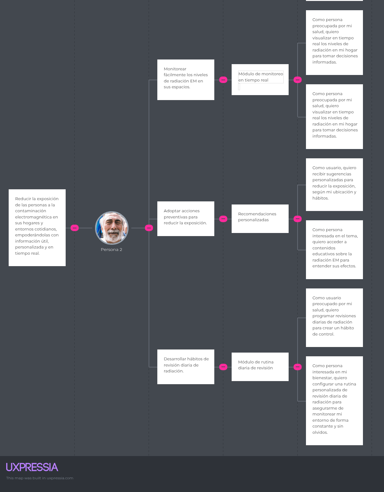 

## 3.3. Product Backlog

Una vez definidas todas las User Stories (US), es necesario establecer su nivel de prioridad. Para ello, se utiliza el Product Backlog, en el cual las historias se organizan según su importancia y el valor que aportan al proyecto. La estimación del esfuerzo de cada historia se realiza mediante Story Points, utilizando la escala de Fibonacci (1, 2, 3, 5, 8). A medida que aumenta la puntuación, se entiende que la historia implica mayor complejidad o impacto dentro de la plataforma. En consecuencia, aquellas US con mayor puntaje suelen ser priorizadas y desarrolladas en las primeras fases del proyecto.

| #Orden | User Story Id | Título | Descripción | Story Points (1 / 2 / 3 / 5 / 8) |
|--------|----|--------|-------------|--------------|
| 1 | TS10 | Desarrollo de estructura HTML del Landing Page | **Como** developer de EMSafe, <br> **quiero** desarrollar la estructura HTML del landing page, <br> **para** establecer la base semántica y funcional sobre la cual se aplicarán estilos, interacciones y contenido. | 5 |
| 2 | TS11 | Desarrollo de estilos CSS del Landing Page | **Como** developer de EMSafe, <br> **quiero** aplicar estilos visuales al landing page usando CSS, <br> **para** darle un diseño atractivo y coherente con el Mock-up. | 5 |
| 3 | US46 | Visualizar la sección Características | **Como** visitante del sitio web estático, <br> **quiero** acceder a la sección "Características", <br> **para** conocer los diferentes servicios ofrecidos por la startup. | 3 |
| 4 | US47 | Visualizar la sección Problemática | **Como** visitante del sitio web estático, <br> **quiero** ver información sobre la contaminación electromagnética para entender sus riesgos, <br> **para** estar informado sobre los peligros. | 3 |
| 5 | TS13 | Implementación de la Sección Problemática del Landing Page | **Como** developer de EMSafe, <br> **quiero** desarrollar la estructura y los estilos de la sección Problemática, <br> **para** comunicar de forma clara y visual la situación o necesidad que resuelve el sistema, generando conciencia e interés en los usuarios. | 3 |
| 6 | US53 | Visualizar la sección Beneficios | **Como** visitante del sitio web estático, <br> **quiero** ver información sobre los beneficios de la startup para un mejor cuidado personal, <br> **para** conocer las ventajas de usar la plataforma. | 2 |
| 7 | TS12 | Implementación de la Sección Beneficios del Landing |  **Como** developer de EMSafe, <br> **quiero** desarrollar la estructura y los estilos de la sección Beneficios, <br> **para** mostrar de manera visual y ordenada las ventajas que ofrece el sistema a sus usuarios, destacando su valor diferencial. | 3 |
| 8 | US50 | Testimonios de Usuarios | **Como** visitante, <br> **quiero** leer experiencias de otros usuarios para confiar en la herramienta, <br> **para** sentirme seguro al usarla. | 2 |
| 9 | TS14 | Implementación de la Sección Testimonios del Landing Page | **Como** developer de EMSafe, <br> **quiero** desarrollar la estructura y los estilos de la sección Testimonios, <br> **para** mostrar de forma atractiva y confiable las opiniones y experiencias de los usuarios, fortaleciendo la credibilidad y confianza en el sistema. | 3 |
| 10 | US52 | Visualización de la sección de ubicación del centro de investigación | **Como** visitante del sitio web de EMSafe, <br> **quiero** visualizar una sección con la ubicación del centro de investigación en el landing page, <br> **para** que conozca la dirección exacta y cómo llegar al centro. | 3 |
| 11 | TS15 | Implementación de la Sección Ubicación del Landing Page | **Como** developer de EMSafe, <br> **quiero** desarrollar la estructura y los estilos de la sección Ubicación, <br> **para** mostrar de manera clara y accesible la ubicación geográfica del servicio o de las oficinas, facilitando a los usuarios encontrar el lugar adecuado. | 1 |
| 12 | US54 | Visualizar sección Contacto | **Como** usuario, <br> **quiero** enviar comentarios o preguntas al equipo de soporte desde la web estática, <br> **para** resolver dudas o problemas rápidamente. | 2 |
| 13 | TS16 | Implementación de la Sección Contacto del Landing Page | **Como** developer de EMSafe, <br> **quiero** desarrollar la estructura y los estilos de la sección Contacto, <br> **para** proporcionar una forma fácil y clara para que los usuarios se comuniquen con el equipo de soporte o con la empresa, facilitando la interacción y resolución de dudas. | 5 |
| 14 | US55 | Consulta de políticas de garantía de dispositivos | **Como** visitante del sitio web, <br> **quiero** acceder a la información sobre la garantía de los dispositivos, <br> **para** conocer las condiciones en caso de fallas en su funcionamiento. | 3 |
| 15 | US56 | Consulta de políticas de cobro por daños de dispositivos | **Como** visitante del sitio web, <br> **quiero** conocer las políticas de cobro por daños de los dispositivos, <br> **para** entender mis responsabilidades en caso de mal uso o deterioro. | 3 |
| 16 | US48 | CTA Claros | **Como** visitante, <br> **quiero** botones de acción claros para registrarme o explorar la demo fácilmente, <br> **para** tener un acceso rápido y directo. | 2 |
| 17 | US49 | Responsive Design | **Como** usuario móvil, <br> **quiero** navegar fácilmente desde mi celular para usar la plataforma en cualquier lugar, <br> **para** acceder a la plataforma sin problemas desde cualquier dispositivo. | 3 |
| 18 | TS18 | Desarrollo de funcionalidad con Javascript | **Como** desarrollador de EMSafe, <br> **quiero** implementar funcionalidades interactivas en el sitio utilizando JavaScript, <br> **para** que se mejore la experiencia del usuario. | 3 |
| 19 | US51 | Visualizar link público de acceso al Landing Page | **Como** visitante del sitio web, <br> **quiero** acceder al Landing page, <br> **para** observar la información de la empresa desarrolladora. | 3 |
| 20 | TS17 | Implementación de la Sección Iniciar Sesión del Landing Page | **Como** developer de EMSafe, <br> **quiero** desarrollar la estructura y los estilos de la sección Iniciar Sesión, <br> **para** ofrecer una experiencia de acceso intuitiva y segura, permitiendo a los usuarios ingresar fácilmente a su cuenta o plataforma. | 8 |
| 21 | TS19 | Redirección a la Aplicación Web | **Como** developer de EMSafe, <br> **quiero** implementar un botón que redireccione al visitante a la aplicación web, <br> **para** que se facilite el inicio de sesión.  | 2 |
| 22 | TS20 | Despliegue del Landing Page en GitHub | **Como** developer de EMSafe, <br> **quiero** añadir el código del Landing Page al repositorio de Github, <br> **para** mantener un control de versiones adecuado, facilitar la colaboración en el desarrollo y garantizar la disponibilidad del código fuente. | 1 |
| 23 | US43 | Registro de Usuario | **Como** nuevo usuario, <br> **quiero** registrarme en la plataforma, <br> **para** poder acceder al sistema de monitoreo. | 5 |
| 24 | US42 | Inicio de Sesión | **Como** usuario registrado, <br> **quiero** iniciar sesión con mis credenciales, <br> **para** acceder de forma segura al sistema de monitoreo. | 5 |
| 25 | US34 | Registro de usuarios con rol de Admin o Técnico | **Como** Super Admin, <br> **quiero** registrar nuevos usuarios asignándoles el rol de Administrador o Técnico, <br> **para** controlar el acceso a la plataforma web y garantizar que cada usuario tenga solo los permisos correspondientes a su función.| 5 |
| 26 | US57 | API de Integración | **Como** proveedor tecnológico, <br> **quiero** integrar mis sensores vía API para interoperar con la plataforma, <br> **para** que los datos se integren en tiempo real. | 8 |
| 27 | TS27 | Gestión de endpoints de Devices | **Como** developer de EMSafe, <br> **quiero** implementar y consumir los endpoints del módulo de dispositivos, <br> **para** mantener actualizada y gestionable la información desde la aplicación. | 8 |
| 28 | TS29 | Gestión de endpoints de Alarms | **Como** developer de EMSafe, <br> **quiero** consumir los endpoints de alarmas, <br> **para** mostrar, crear, actualizar y eliminar alertas del sistema. | 8 |
| 29 | TS28 | Gestión de endpoints de Map Radiation | **Como** developer de EMSafe, <br> **quiero** consumir los endpoints relacionados con puntos de radiación, <br> **para** visualizar la información de radiación en el mapa. | 8 |
| 30 | TS30 | Gestión de endpoints de Profile | **Como** developer de EMSafe, <br> **quiero** consumir los endpoints del perfil del usuario, <br> **para** visualizar, editar y eliminar los datos personales del usuario. | 8 |
| 31 | TS31 | Consulta de endpoints de Dashboard | **Como** developer de EMSafe, <br> **quiero** obtener los datos generales de la plataforma desde el dashboard, <br> **para** visualizar métricas clave y accesos rápidos. | 8 |
| 32 | TS01 | Implementación del servicio de agendamiento con validación de disponibilidad | **Como** Developer, <br> **quiero** implementar un endpoint en el backend que registre citas de instalación, mantenimiento y recolección validando la disponibilidad del técnico y el estado del dispositivo y del cliente, <br> **para** garantizar la integridad de los datos y evitar conflictos de agenda. | 8 |
| 33 | TS02 | Implementación del sistema de notificaciones para eventos de agendamiento | **Como** Developer, <br> **quiero** implementar un servicio de notificaciones que envíe alertas por correo al técnico y push al cliente cada vez que se crea, modifica o cancela una cita, <br> **para** mantener informadas a todas las partes. | 8 |
| 34 | TS03 | Implementación de la desvinculación automática de dispositivos tras recolección | **Como** Developer, <br> **quiero** implementar la lógica que al confirmar una recolección cierre conexiones MQTT, rechace futuras transmisiones y actualice el inventario, <br> **para** que dispositivos retirados no ocupen recursos. | 8 |
| 35 | TS04 | Implementación del módulo de inventario de dispositivos con tracking de ciclo de vida | **Como** Developer, <br> **quiero** implementar endpoints para consultar, filtrar y obtener el historial de cada dispositivo, <br> **para** que el Admin gestione el inventario desde la plataforma web. | 8 |
| 36 | TS05 | Implementación de endpoints para dashboard y gestión de usuarios | **Como** Developer, <br> **quiero** implementar los endpoints necesarios para obtener las métricas del dashboard de clientes y para el registro de usuarios con control de roles, <br> **para** que la plataforma web pueda consumir datos actualizados y gestionar el acceso de forma segura. | 8 |
| 37 | TS07 | Agregación de datos históricos de radiación | **Como** sistema, <br> **quiero** agrupar los datos de radiación por periodos (mensual y anual), <br> **para** permitir la generación de reportes. | 5 |
| 38 | TS08 | Optimización de consultas de datos históricos | **Como** sistema, <br> **quiero** optimizar las consultas a la base de datos, <br> **para** mejorar el rendimiento en la generación de reportes. | 5 |
| 39 | TS09 | Generación de mapa de calor de radiación | **Como** sistema, <br> **quiero** generar un mapa de calor basado en los niveles de radiación, <br> **para** permitir su visualización en la aplicación móvil. | 5 |
| 40 | TS21 | Eliminar datos personales de un usuario | **Como** desarrollador, <br> **quiero** eliminar los datos personales de un usuario mediante la API, <br> **para** remover información que ya no es relevante. | 3 |
| 41 | US26 | Agendamiento de instalación de dispositivos | **Como** Admin, <br> **quiero** registrar y programar una cita de instalación de sensores IoT y adaptadores inteligentes en la sede del cliente que completó su primer pago, <br> **para** coordinar con el equipo técnico el despliegue del hardware y habilitar el inicio del servicio de monitoreo.   | 8 |
| 42 | US27 | Agendamiento de mantenimiento de dispositivos | **Como** Admin, <br> **quiero** registrar y programar una cita de mantenimiento preventivo o correctivo para los sensores y adaptadores IoT instalados en la sede de un cliente, <br> **para** asegurar el correcto funcionamiento del hardware y la continuidad del servicio de monitoreo. | 8 |
| 43 | US28 | Agendamiento de recolección de dispositivos | **Como** Admin, <br> **quiero** programar una cita para el retiro de los sensores y adaptadores IoT instalados en la sede de un cliente que ha cancelado o finalizado su servicio, <br> **para** recuperar el hardware, desvincularlo de la cuenta del cliente y cerrar las conexiones de transmisión de datos. | 8 |
| 44 | US29 | Visualización del calendario de citas del equipo técnico | **Como** Admin, <br> **quiero** visualizar en un calendario todas las citas programadas (instalaciones, mantenimientos y recolecciones) organizadas por técnico y por fecha, <br> **para** tener una visión general de la carga de trabajo y evitar conflictos de agenda. | 5 |
| 45 | US31 | Registro y gestión de técnicos | **Como** Admin, <br> **quiero** registrar, editar y desactivar perfiles de los técnicos del equipo de campo, <br> **para** asignarlos correctamente a las citas de instalación, mantenimiento y recolección. | 5 |
| 46 | US30 | Gestión del inventario de dispositivos | **Como** Admin, <br> **quiero** consultar y gestionar el inventario de sensores y adaptadores IoT disponibles, instalados y retirados, <br> **para** controlar el stock, planificar nuevas instalaciones y dar seguimiento al ciclo de vida de cada dispositivo. | 5 |
| 47 | US32 | Dashboard de Clientes | **Como** Admin, <br> **quiero** visualizar un dashboard con el estado general de todos los clientes registrados, <br> **para** tener una visión centralizada del servicio, identificar clientes activos, inactivos o con alertas pendientes, y tomar decisiones operativas rápidas. | 5 |
| 48 | US33 | Historial de instalaciones | **Como** Admin, <br> **quiero** consultar el historial completo de citas de instalación realizadas, <br> **para** auditar el despliegue de dispositivos, verificar qué técnico ejecutó cada instalación y conocer el estado final de cada visita. | 5 |
| 49 | US35 | Gestión de Dispositivos | **Como** administrador, <br> **quiero** agregar, editar o eliminar dispositivos de monitoreo, <br> **para** mantener actualizado el sistema. | 5 |
| 50 | US36 | Configuración de Dispositivos | **Como** administrador, <br> **quiero** configurar los parámetros y ubicación de cada dispositivo, <br> **para** asegurar un monitoreo correcto según el entorno. | 5 |
| 51 | TS22 | Desarrollo de sección Devices (Frontend Web) | **Como** developer de EMSafe, <br> **quiero** implementar la sección de dispositivos, <br> **para** visualizar todos los dispositivos registrados en la plataforma. | 8 |
| 52 | US41 | Visualización de Dashboard Web | **Como** usuario, <br> **quiero** visualizar un panel con el estado general de todos los dispositivos y alertas, <br> **para** tener una visión completa del sistema. | 5 |
| 53 | TS26 | Desarrollo de Dashboard (Frontend Web) | **Como** developer de EMSafe, <br> **quiero** implementar el dashboard principal, <br> **para** mostrar un resumen general de la plataforma y accesos rápidos. | 8 |
| 54 | US39 | Visualización de Historial de Alarmas | **Como** usuario, <br> **quiero** consultar el historial de alarmas del sistema, <br> **para** identificar eventos de riesgo anteriores. | 5 |
| 55 | US40 | Gestión de Alarmas | **Como** usuario, <br> **quiero** marcar alarmas como resueltas o en revisión, <br> **para** mantener el sistema actualizado y organizado. | 5 |
| 56 | TS24 | Desarrollo de sección Alarms (Frontend Web) | **Como** developer de EMSafe, <br> **quiero** implementar la sección de alarmas, <br> **para** visualizar y gestionar las alertas generadas por la plataforma. | 8 |
| 57 | US37 | Historial de Dispositivos | **Como** usuario, <br> **quiero** revisar el historial de lecturas de cada dispositivo, <br> **para** analizar su comportamiento a lo largo del tiempo. | 5 |
| 58 | US38 | Exportación de Historial | **Como** usuario, <br> **quiero** exportar el historial de lecturas de dispositivos, <br> **para** analizarlos externamente o compartirlos. | 5 |
| 59 | TS23 | Desarrollo de sección Map Radiation (Frontend Web) | **Como** developer de EMSafe, <br> **quiero** implementar la sección del mapa de radiación, <br> **para** visualizar los niveles de radiación registrados por zona geográfica. | 8 |
| 60 | US01 | Visualización de Niveles EM | **Como** usuario, <br> **quiero** visualizar en tiempo real los niveles de contaminación electromagnética en mi zona, <br> **para** saber si es seguro permanecer ahí | 8 |
| 61 | US02 | Alertas Automatizadas | **Como** usuario, <br> **quiero** recibir alertas automáticas cuando los niveles EM superen los límites recomendados, <br> **para** tomar medidas preventivas y reducir mi exposición. | 5 |
| 62 | US03 | Recomendaciones Personalizadas | **Como** usuario, <br> **quiero** recibir recomendaciones según mi historial de exposición, <br> **para** reducir riesgos en mi entorno. | 5 |
| 63 | US04 | Control automático de dispositivos por alta radiación | **Como** usuario, <br> **quiero** que el sistema apague automáticamente los dispositivos cuando detecte un nivel alto de radiación, <br> **para** proteger los equipos y evitar daños en el sistema. | 5 |
| 64 | US05 | Configuración de apagado opcional | **Como** usuario, <br> **quiero** poder activar o desactivar el apagado automático de dispositivos, <br> **para** tener control sobre cómo responde el sistema ante niveles altos de radiación.   | 3 |
| 65 | US12 | Dashboard Personal | **Como** usuario registrado, <br> **quiero** tener un panel con mis métricas personalizadas para dar seguimiento a mi exposición, <br> **para** poder gestionar mi exposición de manera eficiente. | 5 |
| 66 | US16 | Mapa de Radiación | **Como** usuario, <br> **quiero** visualizar un mapa con los niveles de radiación en tiempo real, <br> **para** conocer las zonas con mayor exposición. | 5 |
| 67 | US17 | Filtrado del Mapa | **Como** usuario, <br> **quiero** aplicar filtros al mapa de radiación, <br> **para** identificar patrones según fecha, zona o nivel. | 5 |
| 68 | US23 | Visualización de mapa de radiación del domicilio | **Como** usuario, <br> **quiero** visualizar un mapa de mi domicilio con los niveles de radiación electromagnética, <br> **para** conocer cómo se distribuye la radiación en mi entorno. | 5 |
| 69 | US24 | Identificación de zonas de alta radiación | **Como** usuario, <br> **quiero** identificar las zonas con mayor radiación en el mapa, <br> **para** evitar áreas de riesgo dentro de mi domicilio. | 3 |
| 70 | US25 | Visualización de leyenda de niveles de radiación | **Como** usuario, <br> **quiero** visualizar una leyenda en el mapa, <br> **para** entender el significado de los colores y niveles de radiación. | 2 |
| 71 | US19 | Visualización de reporte mensual de radiación | **Como** usuario, <br> **quiero** visualizar un reporte mensual con los niveles de radiación electromagnética, <br> **para** analizar mi exposición durante el último mes. | 5 |
| 72 | US20 | Visualización de reporte anual de radiación | **Como** usuario, <br> **quiero** visualizar un reporte anual con los niveles de radiación electromagnética, <br> **para** comprender mi exposición a largo plazo. | 5 |
| 73 | US21 | Identificación de picos de radiación en reportes | **Como** usuario, <br> **quiero** identificar los picos más altos de radiación dentro de los reportes, <br> **para** reconocer momentos de mayor riesgo. | 3 |
| 74 | US22 | Visualización de gráficos de tendencias de radiación | **Como** usuario, <br> **quiero** visualizar gráficos de tendencias de radiación, <br> **para** identificar patrones en mi exposición a lo largo del tiempo. | 3 |
| 75 | US07 | Visualización de historial de alertas y acciones realizadas | **Como** usuario, <br> **quiero** consultar un historial de alertas de radiación y acciones ejecutadas por el sistema, <br> **para** hacer seguimiento del comportamiento del sistema y el estado de mis dispositivos. | 3 |
| 76 | US06 | Visualización de recomendaciones para cuidado de dispositivos | **Como** usuario, <br> **quiero** ver recomendaciones sobre el cuidado de mis dispositivos, <br> **para** prevenir daños causados por radiación u otros factores ambientales. | 3 |
| 77 | US09 | Recomendaciones para reducir exposición a radiación | **Como** usuario, <br> **quiero** recibir recomendaciones personalizadas para reducir mi exposición a radiación, <br> **para** prevenir problemas de salud a futuro. | 3 |
| 78 | US15 | Filtrado de Datos | **Como** usuario, <br> **quiero** filtrar por fecha, zona y tipo de fuente EM para un análisis más específico, <br> **para** obtener resultados más detallados y relevantes. | 3 |
| 79 | US13 | Registro de exposición personal | **Como** usuario, <br> **quiero** registrar manualmente mi ubicación frecuente para hacer seguimiento personalizado, <br> **para** realizar un análisis de mi exposición en función de mis ubicaciones. | 3 |
| 80 | US14 | Perfil de exposición por día | **Como** usuario, <br> **quiero** ver un resumen diario de mi exposición EM para controlar mis hábitos, <br> **para** saber cómo varía mi exposición a lo largo del tiempo. | 3 |
| 81 | US08 | Visualización de riesgos por radiación electromagnética | **Como** usuario, <br> **quiero** visualizar información sobre los riesgos de la exposición a radiación electromagnética, <br> **para** entender cómo puede afectar mi salud y tomar precauciones. | 2 |
| 82 | US18 | Compartir el Mapa | **Como** usuario, <br> **quiero** compartir el mapa de radiación con otros, <br> **para** informarles sobre los niveles actuales de exposición. | 3 |
| 83 | US10 | Consulta de dudas mediante chatbot | **Como** usuario, <br> **quiero** hacer preguntas sobre radiación electromagnética mediante un chatbot, <br> **para** resolver mis dudas de forma rápida e interactiva. | 5 |
| 84 | US11 | Recomendaciones mediante chatbot | **Como** usuario, <br> **quiero** recibir recomendaciones a través del chatbot, <br> **para** mejorar mis hábitos y reducir riesgos por radiación. | 3 |
| 85 | TS06 | Integración de servicio de IA para chatbot | **Como** Sistema, <br> **quiero** integrar un servicio de inteligencia artificial para procesar preguntas del usuario, <br> **para** generar respuestas automáticas y coherentes. | 5 |
| 86 | US44 | Actualizar perfil de usuario | **Como** usuario registrado, <br> **quiero** poder actualizar mis datos personales desde mi perfil, <br> **para** mantener mi información actualizada. | 3 |
| 87 | US45 | Gestión de Perfiles | **Como** usuario, <br> **quiero** configurar mi perfil y preferencias para recibir información personalizada, <br> **para** ajustar mis alertas y zonas de interés según mis necesidades. | 3 |
| 88 | TS25 | Desarrollo de sección Profile (Frontend Web) | **Como** developer de EMSafe, <br> **quiero** implementar la sección de perfil, <br> **para** que los usuarios puedan ver y editar su información personal. | 8 |

# Capítulo IV: Solution Software Design

## 4.1. Strategic-Level Domain-Driven Design

### 4.1.1. Design-Level EventStorming

#### 4.1.1.1. Candidate Context Discovery

En base al conocimiento actual del equipo sobre el dominio se ha realizado la técnica Eventstorming. A través de la cual se ha podido identificar los contextos del dominio.

En pro de la documentación del proyecto se hara un resumen de lo la técnica utilizada y el proceso que ejecuto el equipo de desarrollo.

Para la identificación de los bounded context se ha utilizado la técnica start-with-simple, identificando los procesos secuencialmente de manera sencilla y pausada.

**PASO 1: IDENTIFICAR EVENTOS**


<br>Como primer paso en la técnica de Eventstorming, el equipo identificó en conjunto todos los eventos posibles, considerando el conocimiento que se tiene sobre el dominio en cuestión. Los eventos se representan con post-its naranjas y siguen el formato **SUSTANTIVO + VERBO EN PASADO**.

**PASO 2: ORDENAR EVENTOS**


<br>Después de identificar los eventos, se procede a organizarlos siguiendo las secuencias lógicas determinadas por el equipo. En la parte superior de la imagen se muestra cómo se disponen los eventos necesarios para cubrir todo el ciclo de vida de una orden.

**PASO 3: DETERMINAR PIVOTAL POINTS**


<br>Para lograr una organización más clara y precisa de los eventos identificados, se establecen los puntos clave (pivotal points) dentro del dominio. Estas divisiones representan cambios significativos que marcan un antes y un después. Por ejemplo, cuando varios productos pasan a conformar una orden, o cuando se marca una orden como entregada, lo que genera un evento de ingreso monetario para la bodega. Los puntos clave se señalan con una barra negra vertical.

**PASO 4: IDENTIFICAR COMANDOS**


<br>Una vez que se han identificado y organizado tanto los eventos como los puntos clave del dominio, es fundamental reconocer los comandos que los originan. Esto permite determinar qué acciones provocan la aparición de los eventos en el dominio. Los comandos se representan con post-its de color azul claro y siguen el formato VERBO EN PRESENTE + SUSTANTIVO.

**PASO 5: IDENTIFICAR POLITICAS**


<br>Trabajar dentro de un dominio requiere atender reglas de negocio específicas; en este caso, se han identificado cuatro reglas clave, todas vinculadas al registro de los clientes y sus dispositivos, alertas y monitoreo, y por último las analíticas. Reconocer estas políticas del dominio nos permitirá, más adelante, definir los distintos contextos del dominio. Las políticas se representan con post-its de color morado.

**PASO 6: IDENTIFICAR VISTAS**


<br>Los eventos y comandos ocurren en diferentes partes del sistema; por ello, para evitar confusiones y facilitar la definición del diseño de la aplicación, se identifican de manera general las “pantallas” donde tienen lugar. Estas vistas se representan mediante post-its de color verde.

**PASO 7: IDENTIFICAR ACTORES**


<br>La mayoría de los comandos identificados son ejecutados mediante la intervención de usuarios dentro del sistema EMSafe. En este contexto, una gran parte de los comandos se encuentran asociados a sus respectivos actores, tales como el Admin, el Técnico y el Cliente (usuario de la aplicación móvil). 

Asimismo, se observa que ciertos comandos no están directamente vinculados a un actor humano, ya que son ejecutados de manera automática por el sistema, como parte de procesos internos. Estos casos serán detallados con mayor profundidad en secciones posteriores.

Los actores se representan mediante post-its de color amarillo, ubicados en la esquina inferior izquierda de los comandos correspondientes.

**PASO 8: IDENTIFICAR AGREGADOS**


<br> 


<br>Posterior a la identificación de eventos, comandos, vistas, políticas y actores, se han definido los agregados del dominio que garantizan la integridad de las reglas de negocio. En este sistema se identifican los siguientes 4 agregados:

- **Client** Encargado de gestionar la identidad y el perfil del usuario, actuando como la entidad raíz para la vinculación de servicios y la recepción de notificaciones de seguridad.

- **IoT Device**. Representa el hardware de monitoreo; gestiona su registro único, su estado operativo (activo/terminado) y la ejecución de comandos críticos como el apagado remoto.

- **Work Order**. Representa la gestión operativa y logística del sistema; se encarga de coordinar la asignación de técnicos y la programación de instalaciones, mantenimientos o recolecciones de equipo.

- **Radiation Monitor**. Constituye el núcleo del dominio; procesa las lecturas de telemetría de los sensores para identificar niveles de riesgo, disparar alertas de emergencia y asegurar la trazabilidad de las notificaciones enviadas al usuario.

**PASO 9: DEFINIR CONTEXTOS**


<br>


<br>Finalmente, con los agregados estructurados y las políticas parametrizadas, se han definido los contextos del dominio. El equipo de desarrollo determinó 5 contextos basados en las funcionalidades identificadas, utilizando la técnica de start-with-simple:

- **IAM Context:** Se encarga de la gestión de identidad y acceso, centrando su responsabilidad en la administración del perfil del cliente y sus datos personales.

- **Admin & Operations Management Context:** Gestiona el ciclo de vida operativo de los equipos, incluyendo el registro de dispositivos, la asignación de técnicos y la programación de tareas de instalación, mantenimiento y recolección.

- **Radiation Monitoring & Analytics Context:** Representa el núcleo del sistema, encargado del monitoreo en tiempo real de los sensores, la generación de reportes periódicos y la visualización de datos geográficos a través de mapas de radiación.

- **Alert & Automation Context:** Gestiona la lógica de respuesta ante eventos críticos, encargándose de identificar niveles de riesgo, emitir notificaciones al usuario y registrar las interacciones con el chatbot de asistencia.

- **Device Management Context:** Se encarga exclusivamente del control técnico del hardware, permitiendo la ejecución de comandos remotos y el apagado de emergencia de los dispositivos ante situaciones de peligro.

Los contextos son representados a través de las figuras que agrupan a los eventos, comandos, agregados y políticas en el tablero. Se observa que la comunicación entre estos contextos se realiza de manera reactiva a través de las Políticas, asegurando un desacoplamiento efectivo entre las distintas áreas del sistema.

#### 4.1.1.2. Domain Message Flows Modeling

##### Escenario 1: Respuesta ante alerta de alta radiación

**Objetivo:**  
El cliente busca proteger su salud ante un pico de radiación detectado por el sensor.


**Flujo:**

1. El IoT Device detecta un nivel crítico y envía una señal al Sistema.  
2. El Sistema dispara una notificación push a la Mobile Application.  
3. El Cliente visualiza la alerta y el mapa de radiación domiciliaria para identificar el foco.  
4. El Cliente, a través de la aplicación, envía el comando de apagado remoto al dispositivo para mitigar el riesgo.  
5. El Cliente consulta al AI Chatbot sobre recomendaciones de salud inmediatas.  

**Descripción:**  
Se observa cómo el sensor interactúa con el sistema para alertar al usuario. El cliente toma el control apagando el equipo desde su celular y se informa con la IA para evitar efectos nocivos en su salud.

##### Escenario 2: Gestión de ciclo de vida del dispositivo (Onboarding)

**Objetivo:**  
Un administrador coordina la puesta en marcha del servicio para un nuevo cliente.


**Flujo:**

1. El Admin registra al nuevo usuario en el Admin Dashboard (Web).  
2. El Admin utiliza la funcionalidad de agendamiento para asignar una instalación.  
3. El Sistema notifica al Técnico sobre su nueva tarea asignada.  
4. El Técnico realiza la instalación física y marca la tarea como "Completada" en su vista.  
5. El Admin Dashboard actualiza el estado del dispositivo a "Activo" y el Cliente ya puede ver sus datos en la aplicación.  

**Descripción:**  
El administrador centraliza la logística de los equipos. Una vez agendada la instalación, el técnico asegura la operatividad del sensor, permitiendo que el flujo de datos comience a nutrir la aplicación del cliente.

##### Escenario 3: Análisis y mantenimiento preventivo

**Objetivo:**  
El administrador utiliza datos históricos para garantizar el buen estado de la red de sensores.


**Flujo:**

1. El Cliente visualiza su reporte mensual de picos de radiación y nota anomalías en el sensor.  
2. El Cliente solicita soporte o el Sistema detecta la necesidad de calibración.  
3. El Admin revisa el dashboard de clientes y el historial de instalaciones para validar la garantía.  
4. El Admin agenda un mantenimiento de dispositivo mediante la plataforma web.  
5. El Técnico recibe la orden de trabajo para revisar el sensor en el domicilio.  

**Descripción:**  
A través del análisis de reportes y el monitoreo del dashboard, el administrador puede proactivamente programar visitas técnicas, asegurando que el hardware siempre entregue mediciones precisas para la seguridad del usuario.

#### 4.1.1.3. Bounded Context Canvases

Con el objetivo de documentar el propósito y la relación entre los contextos identificados, se utilizó la herramienta Bounded Context Canvas en cada uno de ellos.

Este proceso permitió al equipo de desarrollo comprender mejor el dominio y la finalidad de cada contexto.

##### IAM (Identity & Access Management) Context

Este contexto es responsable de la gestión de la identidad de los usuarios y el control de accesos dentro del sistema EMSafe. Se encarga del registro, autenticación y asignación de roles, tales como Admin, Técnico y Cliente, asegurando que cada usuario acceda únicamente a las funcionalidades que le corresponden.

Se comunica principalmente con los demás contextos del sistema a través del backend API, proporcionando los mecanismos de validación y autorización necesarios para garantizar la seguridad. Asimismo, interactúa con las aplicaciones web y móvil para gestionar sesiones de usuario y proteger el acceso a los recursos del sistema.


##### Device Management Context

Este contexto es responsable de la gestión del ciclo de vida de los dispositivos IoT, desde su registro hasta su retiro del servicio. Incluye funcionalidades como el agendamiento de instalaciones, mantenimientos y recolecciones, así como la asignación de técnicos y la actualización del estado de los dispositivos.

Se comunica principalmente con el contexto de Radiation Monitoring & Analytics para habilitar la transmisión de datos desde los dispositivos activos, y con el contexto de Alert & Automation para permitir acciones sobre los dispositivos, como el control remoto. Además, interactúa con el front-end web a través del API para la gestión operativa por parte del administrador.


##### Radiation Monitoring & Analytics Context

Este contexto tiene como propósito la recolección, procesamiento y análisis de los datos de radiación capturados por los dispositivos IoT. Se encarga de transformar los datos crudos en información útil, como reportes periódicos y visualizaciones en mapas de radiación a nivel global y domiciliario.

Se comunica principalmente con el contexto de Device Management para recibir datos de los dispositivos activos, y con el contexto de Alert & Automation para informar sobre condiciones críticas detectadas. Asimismo, provee información al front-end móvil para que el usuario pueda visualizar niveles de radiación, reportes históricos y mapas interactivos.


##### Alert & Automation Context

Este contexto es responsable de la gestión de alertas y la ejecución de acciones automáticas ante eventos críticos, como niveles elevados de radiación. Incluye la generación de notificaciones, el envío de alertas al usuario y la ejecución de comandos sobre los dispositivos, como el apagado remoto.

Se comunica principalmente con el contexto de Radiation Monitoring & Analytics, del cual recibe información sobre condiciones de riesgo, y con Device Management para ejecutar acciones sobre los dispositivos. Además, interactúa con la aplicación móvil para notificar al usuario y permitir su intervención, así como con servicios adicionales como el chatbot para brindar recomendaciones.


##### Admin & Operations Management Context

Este contexto es responsable de la gestión operativa del sistema EMSafe desde la perspectiva administrativa. Incluye funcionalidades como la visualización del dashboard de clientes, el historial de instalaciones y la supervisión general de las operaciones relacionadas con dispositivos y usuarios.

Su propósito es centralizar la toma de decisiones y el monitoreo del estado del sistema, permitiendo al Super Admin tener una visión integral del funcionamiento del servicio y del comportamiento de los clientes.

Se comunica principalmente con el contexto de Device Management para obtener información sobre el estado y ciclo de vida de los dispositivos, y con el contexto de IAM para la gestión de usuarios y roles. Asimismo, interactúa con el front-end web a través del API, proporcionando la información necesaria para la visualización y control de las operaciones del sistema.


### 4.1.2. Context Mapping

Se presenta a continuación el proceso en que se evalúa propuestas de context maps para la solución de software **EmSafe**. Se consideran los *capabilities* del negocio así como las características del producto de software en cuestión.

#### Análisis de Alternativas y Decisiones de Diseño

**¿Qué pasa si dejamos que Alert & Automation se encargue también de gestionar los dispositivos y sus umbrales?**

En este mapping se observa que el contexto de **Alert & Automation** terminaría asumiendo responsabilidades que no le corresponden: administrar el ciclo de vida de los dispositivos IoT, sus configuraciones y su inventario. El propósito de Alert & Automation es únicamente reaccionar ante lecturas que superan umbrales y ejecutar acciones automáticas (notificaciones push y comandos a smart plugs). 

Si además gestionara los dispositivos en sí, se contaminaría con lógica de registro, configuración y mantenimiento de hardware que pertenece al dominio operativo, no al dominio de alertas. Por tanto, es necesario mantener **Device Management** como un *bounded context* separado que provee la información de dispositivos y umbrales a Alert & Automation.

> 


**¿Qué pasa si unificamos Radiation Monitoring & Analytics con Alert & Automation en un solo contexto de "Monitoreo"?**

En este mapping se puede observar que al unificar ambos contextos, el *bounded context* resultante tendría dos responsabilidades muy distintas:
1. Procesar y agregar datos históricos para generar reportes y tendencias (análisis).
2. Detectar umbrales superados en tiempo real y ejecutar acciones inmediatas (reacción).

Estas dos preocupaciones tienen requisitos técnicos opuestos: el análisis necesita consultas optimizadas sobre grandes volúmenes de datos históricos, mientras que las alertas necesitan latencia mínima y procesamiento en tiempo real. Además, el acoplamiento resultante haría que cualquier cambio en la lógica de reportes pudiera afectar la detección de alertas, poniendo en riesgo la seguridad del sistema. Por tanto, se mantienen como *bounded contexts* separados.

> 


**¿Qué pasa si separamos la gestión de técnicos y la gestión de clientes del contexto Admin & Operations en bounded contexts independientes?**

Se evalúa separar **Admin & Operations Management** en tres contextos: uno para agendamiento de citas, otro para gestión de técnicos y otro para dashboard de clientes. Sin embargo, en el análisis se identifica que esta separación no aporta valor porque:

* La gestión de técnicos no maneja un modelo propio complejo: solo registra perfiles y verifica disponibilidad.
* El dashboard de clientes es una vista agregada que consulta datos de citas, dispositivos y alertas — no tiene lógica de negocio propia.
* Separarlos incrementaría el acoplamiento entre tres contextos que siempre operan juntos en el mismo flujo operativo (*agendar → asignar técnico → verificar cliente*).

Por tanto, se determina mantener Admin & Operations Management como un único *bounded context* que orquesta toda la gestión operativa.

> 


---

#### MODELO FINAL

En consecuencia, se determina que el modelo final de **EmSafe** consta de los siguientes *bounded contexts*:

1.  **IAM (Identity & Access Management):** Autenticación, autorización y perfiles.
2.  **Device Management:** Ciclo de vida de sensores y smart plugs.
3.  **Radiation Monitoring & Analytics:** Procesamiento, análisis y visualización de datos de radiación.
4.  **Alert & Automation:** Alertas en tiempo real y control de adaptadores inteligentes.
5.  **Admin & Operations Management:** Gestión operativa (citas, técnicos, clientes e inventario).

> 


### 4.1.3. Software Architecture

#### 4.1.3.1. Software Architecture System Landscape Diagram

El diagrama de System Landscape muestra una vista de alto nivel de todo el ecosistema EmSafe, incluyendo los tres tipos de usuarios (Usuario Final, Administrador y Técnico de Campo), el sistema principal EmSafe Platform y los sistemas externos con los que interactúa: la red de sensores IoT GY-273, los adaptadores inteligentes (smart plugs), Firebase Cloud Messaging y el servicio de email SMTP.

#### 4.1.3.2. Software Architecture Context Level Diagrams
El diagrama de contexto (C4 nivel 1) presenta el sistema EmSafe Platform como una caja negra, mostrando sus interacciones directas con los usuarios y sistemas externos. Se detallan los protocolos de comunicación utilizados: HTTPS/JSON para las aplicaciones cliente, MQTT vía WiFi para la comunicación con sensores y adaptadores inteligentes, y SMTP para el envío de correos electrónicos.

#### 4.1.3.3. Software Architecture Container Level Diagrams
El diagrama de contenedores (C4 nivel 2) muestra la estructura interna del sistema EmSafe Platform: la aplicación móvil (Angular/Ionic), la plataforma web administrativa (Angular), la API REST backend (Spring Boot con Java), el broker MQTT (Mosquitto en EC2) y la base de datos (MySQL en Amazon RDS). Se visualizan las conexiones entre cada contenedor y los sistemas externos.

#### 4.1.3.4. Software Architecture Deployment Diagrams
El diagrama de despliegue muestra la distribución de la infraestructura en producción: Amazon EC2 para el backend con Jenkins CI/CD en contenedor Docker, una instancia EC2 separada para el broker Mosquitto MQTT, Amazon RDS para la base de datos MySQL, Firebase Hosting para la plataforma web, el dispositivo móvil del usuario final y la sede del cliente donde se instalan los sensores GY-273 y los adaptadores inteligentes.

## 4.2. Tactical-Level Domain-Driven Design

### 4.2.1. Bounded Context: IAM (Identity & Access Management)

Este bounded context gestiona la identidad de los usuarios, la autenticación, la autorización basada en roles y la administración del perfil dentro de la plataforma EMSafe. Abarca los flujos de registro, inicio de sesión, asignación de roles (Admin, Técnico, Cliente) y eliminación de datos personales.

Historias relacionadas: US43, US42, US34, US44, US45, TS21, TS30

#### 4.2.1.1. Domain Layer

| Archivo / Carpeta | Propósito | Tipo de recurso |
|:---|:---|:---|
| `model/aggregates/User.java` | Agregado raíz del bounded context. Encapsula identidad, credenciales, rol y estado del usuario. | Aggregate |
| `model/entities/UserProfile.java` | Entidad asociada al agregado User. Almacena datos personales y preferencias del usuario. | Entity |
| `model/valueobjects/Email.java` | Encapsula la validación de formato de correo electrónico. | Value Object |
| `model/valueobjects/PasswordHash.java` | Encapsula el hash seguro de la contraseña. Método: `matches(rawPassword)`. | Value Object |
| `model/valueobjects/Role.java` | Enumeración de roles posibles: `CLIENT`, `ADMIN`, `TECHNICIAN`, `SUPER_ADMIN`. | Value Object |
| `model/valueobjects/UserStatus.java` | Enumeración de estados: `ACTIVE`, `INACTIVE`, `PENDING_VERIFICATION`. | Value Object |
| `model/commands/RegisterUserCommand.java` | Record para registrar un nuevo usuario cliente. | Command |
| `model/commands/AuthenticateUserCommand.java` | Record para autenticar un usuario con email y contraseña. | Command |
| `model/commands/CreateAdminOrTechnicianCommand.java` | Record para crear un usuario con rol Admin o Técnico (solo Super Admin). | Command |
| `model/commands/UpdateUserProfileCommand.java` | Record para actualizar datos personales y preferencias del perfil. | Command |
| `model/commands/DeleteUserCommand.java` | Record para eliminar los datos personales de un usuario del sistema. | Command |
| `model/queries/GetUserProfileQuery.java` | Record para consultar el perfil de un usuario por su ID. | Query |
| `services/AuthenticationService.java` | Valida credenciales y genera tokens de acceso JWT. Métodos: `authenticate()`, `validateToken()`. | Domain Service |
| `services/PasswordPolicyService.java` | Verifica que una contraseña cumple los requisitos mínimos de seguridad. | Domain Service |
| `services/IUserRepository.java` | Interfaz de repositorio: `findById()`, `findByEmail()`, `save()`, `delete()`, `existsByEmail()`. | Repository Interface |
| `services/IUserProfileRepository.java` | Interfaz de repositorio: `findByUserId()`, `save()`, `deleteByUserId()`. | Repository Interface |

#### 4.2.1.2. Interface Layer

| Archivo / Carpeta | Propósito | Tipo de recurso |
|:---|:---|:---|
| `rest/controllers/AuthController.java` | Expone endpoints de autenticación: `POST /api/v1/auth/register`, `POST /api/v1/auth/login`, `POST /api/v1/auth/logout`. | REST Controller |
| `rest/controllers/UserController.java` | Expone endpoints de gestión de usuarios: registro de Admin/Técnico, consulta, actualización y eliminación de perfil. | REST Controller |
| `rest/resources/RegisterUserResource.java` | Resource de entrada para registrar un nuevo usuario cliente. | Resource (Input) |
| `rest/resources/AuthenticateUserResource.java` | Resource de entrada para inicio de sesión (email, contraseña). | Resource (Input) |
| `rest/resources/CreateAdminOrTechnicianResource.java` | Resource de entrada para crear Admin o Técnico (nombre, correo, contraseña temporal, rol). | Resource (Input) |
| `rest/resources/UpdateUserProfileResource.java` | Resource de entrada para actualizar datos personales y preferencias. | Resource (Input) |
| `rest/resources/UserProfileResource.java` | Resource de salida con el perfil completo del usuario. | Resource (Output) |
| `rest/resources/AuthTokenResource.java` | Resource de salida con el JWT generado tras autenticación exitosa. | Resource (Output) |
| `rest/assemblers/RegisterUserCommandFromResourceAssembler.java` | Convierte un `RegisterUserResource` en `RegisterUserCommand`. | Resource → Command Assembler |
| `rest/assemblers/UserProfileResourceFromEntityAssembler.java` | Convierte un `UserProfile` en `UserProfileResource`. | Entity → Resource Assembler |

#### 4.2.1.3. Application Layer

| Archivo / Carpeta | Propósito | Tipo de recurso |
|:---|:---|:---|
| `internal/commandservices/UserCommandServiceImpl.java` | Orquesta RegisterUser, CreateAdminOrTechnician, UpdateUserProfile y DeleteUser. Valida reglas de negocio y persiste. | Command Service Impl |
| `internal/commandservices/AuthCommandServiceImpl.java` | Orquesta AuthenticateUser. Valida credenciales con `AuthenticationService` y retorna JWT. | Command Service Impl |
| `internal/queryservices/UserQueryServiceImpl.java` | Ejecuta consultas de perfil de usuario por ID. | Query Service Impl |
| `internal/outboundservices/acl/EmailNotificationService.java` | Envía correo de verificación al registrar un cliente y correo con credenciales al crear Admin/Técnico. | ACL Service |
| `internal/outboundservices/acl/DeviceContextService.java` | Consulta el Bounded Context de Device Management para verificar si el usuario tiene dispositivos activos antes de eliminar su cuenta. | ACL Service |

#### 4.2.1.4. Infrastructure Layer

| Archivo / Carpeta | Propósito | Tipo de recurso |
|:---|:---|:---|
| `persistence/jpa/repositories/UserRepositoryImpl.java` | Implementación JPA de `IUserRepository` sobre PostgreSQL. | Repository Impl |
| `persistence/jpa/repositories/UserProfileRepositoryImpl.java` | Implementación JPA de `IUserProfileRepository` sobre PostgreSQL. | Repository Impl |
| `security/JwtTokenProvider.java` | Genera y valida JSON Web Tokens. Configura expiración y firma mediante clave secreta. | Security Component |
| `security/SecurityFilterChain.java` | Define rutas públicas (`/auth/**`) y rutas protegidas por JWT, junto con el filtro de autenticación por token. | Security Component |
| `external/BcryptPasswordEncoder.java` | Implementa hashing y verificación de contraseñas usando BCrypt. | External Adapter |
| `external/SmtpEmailAdapter.java` | Implementa el envío de correos de verificación y credenciales usando un proveedor SMTP. | External Adapter |

#### 4.2.1.5. Bounded Context Software Architecture Component Level Diagrams

El bounded context IAM se estructura internamente en cuatro componentes principales dentro del container Backend API (Java / Spring Boot): el componente **Auth**, que gestiona el registro e inicio de sesión a través de `AuthController` apoyándose en `AuthenticationService` y `PasswordPolicyService`; el componente **User Management**, expuesto vía `UserController`, que permite la gestión de perfiles y roles con restricción por permisos; el componente **Token**, responsable de la generación y validación de JWT mediante `JwtTokenProvider`; y el componente **Persistence**, que accede a la base de datos PostgreSQL a través de los repositorios JPA `UserRepositoryImpl` y `UserProfileRepositoryImpl`.


#### 4.2.1.6. Bounded Context Software Architecture Code Level Diagrams

##### 4.2.1.6.1. Bounded Context Domain Layer Class Diagrams

El diagrama de clases del Bounded Context IAM muestra el agregado `User` como raíz, junto con la entidad `UserProfile`. Se incluyen los value objects `Email`, `PasswordHash`, `Role` y `UserStatus`, así como las interfaces de repositorio y los servicios de dominio `AuthenticationService` y `PasswordPolicyService`.


##### 4.2.1.6.2. Bounded Context Database Design Diagram

La base de datos del Bounded Context IAM persiste los usuarios con sus credenciales y rol, junto con sus perfiles de preferencias y datos personales.


### 4.2.2. Bounded Context: Device Management

#### 4.2.2.1. Domain Layer

| Archivo / Carpeta | Propósito | Tipo de recurso |
|------------------|----------|-----------------|
| `model/aggregates/Device.java` | Agregado raíz del bounded context. Encapsula identidad, tipo, estado y configuración del sensor IoT. | Aggregate |
| `model/aggregates/InventoryRecord.java` | Agregado secundario. Gestiona el stock de dispositivos disponibles y dispara alertas de bajo inventario. | Aggregate |
| `model/entities/LifecycleEvent.java` | Entidad que registra cada evento del ciclo de vida de un dispositivo (registro, instalación, retiro, etc.). | Entity |
| `model/valueobjects/DeviceId.java` | Identificador único del dispositivo. | Value Object |
| `model/valueobjects/DeviceConfig.java` | Agrupa los parámetros de configuración del dispositivo: frecuencia de muestreo, umbral de alerta y coordenadas. | Value Object |
| `model/valueobjects/DeviceStatus.java` | Registra los estados del dispositivo: AVAILABLE, INSTALLED, MAINTENANCE, RETIRED. | Value Object |
| `model/valueobjects/DeviceType.java` | Registra el tipo de dispositivo IoT: SENSOR_IOT, ADAPTER_IOT. | Value Object |
| `model/valueobjects/GeoCoordinates.java` | Encapsula la ubicación geográfica (latitud y longitud) del dispositivo. | Value Object |
| `model/valueobjects/LifecycleEventType.java` | Categoriza los tipos de evento del ciclo de vida: REGISTERED, INSTALLED, CONFIG_UPDATED, MAINTENANCE, RETIRED. | Value Object |
| `model/commands/RegisterDeviceCommand.java` | Record para registrar un nuevo dispositivo IoT. | Command |
| `model/commands/UpdateDeviceConfigCommand.java` | Record para actualizar la configuración de un dispositivo. | Command |
| `model/commands/DeleteDeviceCommand.java` | Record para eliminar un dispositivo del sistema. | Command |
| `model/commands/RetireDeviceCommand.java` | Record para confirmar el retiro y desvinculación de un dispositivo. | Command |
| `model/queries/GetDeviceListQuery.java` | Record para consultar la lista paginada de dispositivos con filtros opcionales. | Query |
| `model/queries/GetDeviceHistoryQuery.java` | Record para consultar el historial cronológico de lecturas de un dispositivo. | Query |
| `model/queries/GetInventoryQuery.java` | Record para consultar el inventario de dispositivos con filtros por estado. | Query |
| `services/DeviceCommandService.java` | Expone operaciones CUD sobre dispositivos. | Command Service |
| `services/DeviceQueryService.java` | Expone operaciones de lectura sobre dispositivos. | Query Service |
| `services/InventoryQueryService.java` | Expone operaciones de lectura sobre el inventario de dispositivos. | Query Service |
| `services/DeviceLifecycleService.java` | Orquesta las transiciones de estado del dispositivo, validando reglas de negocio. | Domain Service |
| `services/MqttDisconnectionService.java` | Coordina el cierre de conexiones MQTT y bloqueo de topics al retirar dispositivos. | Domain Service |
| `services/InventoryAlertService.java` | Evalúa el stock disponible y genera alertas cuando cae por debajo del umbral configurado. | Domain Service |

#### 4.2.2.2. Interface Layer

| Carpeta / Archivo | Propósito | Tipo de recurso |
|------------------|----------|-----------------|
| `acl/DeviceManagementContextFacade.java` | Interface para exponer capacidades del bounded context a otros bounded contexts. | ACL Facade |
| `rest/controllers/DeviceController.java` | Interface para exponer capacidades de gestión de dispositivos mediante endpoints REST. | REST Controller |
| `rest/controllers/InventoryController.java` | Interface para exponer capacidades de consulta y filtrado del inventario mediante endpoints REST. | REST Controller |
| `rest/controllers/ExportController.java` | Interface para exponer el endpoint de exportación de historial en PDF o CSV mediante REST. | REST Controller |
| `rest/controllers/IntegrationController.java` | Interface para exponer el endpoint de integración de sensores de proveedores externos mediante REST. | REST Controller |
| `rest/assemblers/RegisterDeviceCommandFromResourceAssembler.java` | Convierte un RegisterDeviceResource en un RegisterDeviceCommand. | Resource → Command Assembler |
| `rest/assemblers/UpdateDeviceConfigCommandFromResourceAssembler.java` | Convierte un UpdateDeviceConfigResource en un UpdateDeviceConfigCommand. | Resource → Command Assembler |
| `rest/assemblers/DeviceFromEntityAssembler.java` | Convierte un Device en un DeviceResource. | Entity → Resource Assembler |
| `rest/assemblers/InventoryRecordFromEntityAssembler.java` | Convierte un InventoryRecord en un InventoryRecordResource. | Entity → Resource Assembler |
| `rest/assemblers/GetDeviceHistoryQueryFromResourceAssembler.java` | Convierte un DeviceHistoryResource en un GetDeviceHistoryQuery. | Resource → Query Assembler |

#### 4.2.2.3. Application Layer

| Archivo / Carpeta | Propósito | Tipo de recurso |
|------------------|----------|-----------------|
| `internal/commandservices/DeviceCommandServiceImpl.java` | Implementación concreta de DeviceCommandService. Orquesta RegisterDevice, UpdateConfig, DeleteDevice y RetireDevice. | Command Service Impl |
| `internal/queryservices/DeviceQueryServiceImpl.java` | Implementación concreta de DeviceQueryService. Orquesta consultas de dispositivos e historial de lecturas. | Query Service Impl |
| `internal/queryservices/InventoryQueryServiceImpl.java` | Implementación concreta de InventoryQueryService. Orquesta consultas de inventario y evaluación de stock bajo. | Query Service Impl |
| `internal/acl/DeviceManagementContextFacadeImpl.java` | Implementación concreta de la interface expuesta a otros bounded contexts para acceder a la lógica de dispositivos. | ACL Facade |
| `internal/outboundservices/acl/ExternalAlertingService.java` | Adaptador para publicar Domain Events hacia el bounded context de Alerting. | ACL Service |
| `internal/outboundservices/acl/ExternalAnalyticsService.java` | Adaptador para enviar datos de lecturas al bounded context de Analytics. | ACL Service |

#### 4.2.2.4. Infrastructure Layer

| Archivo / Carpeta | Propósito | Tipo de recurso |
|------------------|----------|-----------------|
| `persistence/jpa/repositories/DeviceRepository.java` | Implementación JPA de DeviceRepository (agregado). Persiste y recupera Devices e InventoryRecords. | Repository Impl |
| `persistence/jpa/repositories/LifecycleEventRepository.java` | Implementación JPA para el historial de eventos del ciclo de vida de cada dispositivo. | Repository Impl |
| `persistence/timescale/repositories/ReadingRepository.java` | Implementación TimescaleDB para series de tiempo de lecturas electromagnéticas. | Repository Impl |
| `messaging/mqtt/MqttBrokerAdapter.java` | Gestiona conexiones y topics MQTT con los sensores IoT. Cierra y bloquea topics al retirar dispositivos. | Messaging Adapter |
| `messaging/events/EventPublisherAdapter.java` | Publica Domain Events (DeviceRegistered, DeviceRetired, LowStockDetected) hacia el bus de eventos (RabbitMQ). | Event Publisher |
| `export/ReportExporterAdapter.java` | Genera archivos PDF y CSV del historial de lecturas mediante iText y Apache POI. | Export Adapter |
| `notifications/NotificationAdapter.java` | Envía notificaciones push de stock bajo al panel del administrador mediante FCM. | Notification Adapter |
| `persistence/jpa/mapping/DeviceMapper.java` | Mapea entre el Aggregate Device y su entidad JPA correspondiente. | ORM Mapper |
| `persistence/jpa/mapping/InventoryRecordMapper.java` | Mapea entre el Aggregate InventoryRecord y su entidad JPA correspondiente. | ORM Mapper |

### 4.2.2.5. Bounded Context Software Architecture Component Level Diagrams


### 4.2.2.6. Bounded Context Software Architecture Code Level Diagrams

#### 4.2.2.6.1. Bounded Context Domain Layer Class Diagrams

Se presenta el diagrama de clases del contexto de gestión de dispositivos, teniendo como clases principales a Device e InventoryRecord, además de contar con un enum DeviceStatus que ayuda a gestionar el ciclo de vida del dispositivo a través de sus estados: Available, Installed, Maintenance y Retired.


#### 4.2.2.6.2. Bounded Context Database Design Diagram

La base de datos persiste los dispositivos IoT junto con su configuración y estado actual, registrando cada cambio a través del historial de eventos del ciclo de vida. Además, se persisten las lecturas electromagnéticas capturadas por cada dispositivo y los registros de inventario necesarios para controlar el stock y planificar nuevas instalaciones.


### 4.2.3. Bounded Context: Radiation Monitoring & Analytics

Este Bounded Context se encarga de gestionar el procesamiento y análisis de datos recolectados por sensores IoT de EmSafe. Su función es transformar datos crudos en métricas, tendencias y perfiles de exposición personalizados mediante dashboards y reportes históricos (diarios, mensuales y anuales). Al optimizar la gestión de datos, permite identificar picos de radiación y facilita la toma de decisiones informadas para el bienestar del usuario.

#### 4.2.3.1. Domain Layer

| Archivo / Carpeta | Propósito | Tipo de recurso |
|-------------------|-----------|-----------------|
| model/aggregates/RadiationAnalysis | Agregado raíz que gestiona el análisis de radiación | Aggregate |
| model/entities/RadiationReading| Representa una medición individual de radiación EM | Entity |
| model/entities/UserExposureProfile | Perfil de exposición del usuario | Entity |
| model/valueobjects/RadiationLevel | Nivel de radiación (bajo, medio, alto) | Value Object |
| model/valueobjects/TimeRange | Rango de tiempo para análisis | Value Object |
| model/valueobjects/Location | Ubicación asociada a mediciones | Value Object |
| model/valueobjects/ReportType | Tipo de reporte (diario, mensual, anual) | Value Object |
| model/valueobjects/RadiationReadingId | Identificador de medición | Value Object |
| model/valueobjects/ReportId | Identificador de reporte | Value Object |
| model/commands/GenerateReportCommand | Comando para generar reportes | Command |
| model/commands/FilterRadiationDataCommand | Comando para filtrar datos | Command |
| model/queries/GetRadiationLevelsQuery | Query para obtener datos en tiempo real | Query |
| model/queries/GetDashboardDataQuery | Query para dashboard | Query |
| model/queries/GetRadiationTrendsQuery | Query para tendencias | Query |
| services/RadiationAnalysisService | Lógica de análisis de datos EM | Domain Service |
| services/PeakDetectionService | Detecta picos de radiación | Domain Service |
| services/ReportGenerationService | Genera reportes analíticos | Domain Service |
| services/RadiationRepository | Interface para acceso a datos | Repository |

#### 4.2.3.2. Interface Layer

| Carpeta / Archivo                               | Propósito                                  | Tipo de recurso    |
| ----------------------------------------------- | ------------------------------------------ | ------------------ |
| acl/RadiationContextFacade                 | Expone capacidades del contexto a otros BC | ACL Facade         |
| rest/controllers/RadiationController       | Endpoints para monitoreo en tiempo real    | REST Controller    |
| rest/controllers/ReportController          | Endpoints para reportes                    | REST Controller    |
| rest/controllers/DashboardController       | Endpoint para dashboard                    | REST Controller    |
| rest/assemblers/RadiationResourceAssembler | Convierte Entity → Resource                | Resource Assembler |
| rest/assemblers/ReportResourceAssembler    | Convierte reportes a formato UI            | Resource Assembler |
| rest/assemblers/DashboardResourceAssembler | Convierte datos a vista dashboard          | Resource Assembler |

#### 4.2.3.3. Application Layer

| Archivo / Carpeta                                         | Propósito                                | Tipo de recurso      |
| --------------------------------------------------------- | ---------------------------------------- | -------------------- |
| internal/commandservices/RadiationCommandServiceImpl | Implementa comandos (filtrado, reportes) | Command Service Impl |
| internal/queryservices/RadiationQueryServiceImpl     | Implementa consultas de datos            | Query Service Impl   |
| internal/queryservices/DashboardQueryServiceImpl     | Maneja lógica del dashboard              | Query Service Impl   |
| internal/commandservices/ReportCommandServiceImpl    | Generación de reportes                   | Command Service Impl |
| internal/acl/RadiationContextFacadeImpl              | Implementación del facade                | ACL Facade           |
| internal/outboundservices/acl/ExternalSensorService  | Conecta con sensores IoT                 | ACL Service          |
| internal/outboundservices/acl/ExternalUserService    | Obtiene datos de usuario                 | ACL Service          |

#### 4.2.3.4. Infrastructure Layer

| Archivo / Carpeta                                         | Propósito                           | Tipo de recurso |
| --------------------------------------------------------- | ----------------------------------- | --------------- |
| persistence/jpa/repositories/RadiationRepositoryImpl | Implementación JPA del repositorio  | Repository Impl |
| persistence/jpa/repositories/ReportRepositoryImpl    | Persistencia de reportes            | Repository Impl |
| persistence/database/DatabaseConnection              | Conexión a base de datos            | Infrastructure  |
| services/DataAggregationService                      | Agrega datos históricos       | Service         |
| services/QueryOptimizationService                    | Optimiza consultas            | Service         |
| api/DashboardAPI                                     | Endpoint   | REST API        |

#### 4.2.3.5. Bounded Context Software Architecture Component Level Diagrams

Describe la estructura interna del backend a nivel de componentes, organizados en capas siguiendo principios de Domain-Driven Design. Este diagrama muestra cómo los controladores gestionan las solicitudes entrantes, los servicios de aplicación coordinan la lógica del sistema, el dominio encapsula las reglas de negocio relacionadas al análisis de radiación electromagnética, y la infraestructura se encarga del acceso a datos y la integración con sensores IoT. De esta manera, se evidencia una arquitectura desacoplada, mantenible y alineada con las necesidades de procesamiento, análisis y visualización de datos del sistema EmSafe.


#### 4.2.3.6. Bounded Context Software Architecture Code Level Diagrams

##### 4.2.3.6.1. Bounded Context Domain Layer Class Diagrams

Representa los elementos centrales del modelo de dominio, incluyendo agregados, entidades, objetos de valor, servicios de dominio y repositorios. En este nivel se define la lógica de negocio relacionada con el análisis de la radiación electromagnética, destacando el agregado RadiationAnalysis, que gestiona las mediciones y permite calcular métricas y detectar picos. Asimismo, las entidades como RadiationReading y UserExposureProfile modelan la información clave del sistema, mientras que los objetos de valor encapsulan conceptos como niveles de radiación, rangos de tiempo y tipos de reporte. Los servicios de dominio se encargan de operaciones complejas como el análisis de datos y la generación de reportes, manteniendo una separación clara de responsabilidades y alineándose con los principios de Domain-Driven Design.


##### 4.2.3.6.2. Bounded Context Database Design Diagram

Define las tablas necesarias para almacenar las mediciones de radiación, su análisis y los reportes generados. Incluye entidades como Radiation_Reading, Radiation_Analysis, Report y User_Exposure_Profile, además de Sensor y Location para el origen de los datos.

Las relaciones permiten gestionar el monitoreo en tiempo real, analizar tendencias, detectar picos y generar alertas dentro de la plataforma EmSafe.


### 4.2.4. Bounded Context: Alert & Automation

Este Bounded Context gestiona la generación de alertas ante niveles altos de radiación electromagnética detectados por los sensores IoT, la ejecución de acciones automáticas o configurables como notificaciones push y el control de adaptadores inteligentes (smart plugs) para cortar o permitir el paso de corriente a dispositivos conectados. Además, administra el historial de alertas y permite al usuario y al administrador dar seguimiento, reconocer y resolver eventos de riesgo.
 
Historias relacionadas: US02, US04, US05, US07, US39, US40, TS02, TS29.
 
#### 4.2.4.1. Domain Layer
 
| Archivo / Carpeta | Propósito | Tipo de recurso |
|:---|:---|:---|
| `model/aggregates/Alert.java` | Agregado raíz que representa una alerta generada cuando una lectura de sensor supera el umbral de seguridad configurado. Contiene el ciclo de vida completo: creación, reconocimiento y resolución. | Aggregate |
| `model/entities/AlertAction.java` | Entidad que registra cada acción ejecutada en respuesta a una alerta (notificación push enviada, dispositivo apagado vía adaptador inteligente, acción manual del usuario). | Entity |
| `model/entities/AutomationRule.java` | Entidad que representa una regla de automatización configurada por el usuario, como activar o desactivar el apagado automático de un adaptador inteligente ante alerta de radiación elevada. | Entity |
| `model/entities/SmartPlugCommand.java` | Entidad que registra un comando enviado a un adaptador inteligente (encender/apagar), incluyendo el estado de entrega y respuesta del dispositivo. | Entity |
| `model/valueobjects/AlertId.java` | Identificador único de la alerta. | Value Object |
| `model/valueobjects/DeviceId.java` | Identificador del sensor IoT que originó la lectura. | Value Object |
| `model/valueobjects/SmartPlugId.java` | Identificador del adaptador inteligente asociado. | Value Object |
| `model/valueobjects/ThresholdLevel.java` | Value object que encapsula el valor del umbral, la unidad de medida (μSv/h, °C, kPa) y el nivel de severidad (warning, critical). | Value Object |
| `model/valueobjects/ReadingSnapshot.java` | Snapshot de la lectura del sensor al momento de dispararse la alerta (valor, unidad, timestamp). | Value Object |
| `model/valueobjects/UserId.java` | Identificador del usuario propietario del entorno monitoreado. | Value Object |
| `model/commands/CreateAlertCommand.java` | Record para crear una nueva alerta a partir de una lectura que superó el umbral. | Command |
| `model/commands/AcknowledgeAlertCommand.java` | Record para marcar una alerta como reconocida por un usuario o administrador. | Command |
| `model/commands/ResolveAlertCommand.java` | Record para marcar una alerta como resuelta, incluyendo notas de resolución. | Command |
| `model/commands/ConfigureAutomationRuleCommand.java` | Record para crear o actualizar una regla de automatización (activar/desactivar apagado automático de un adaptador inteligente). | Command |
| `model/commands/SendSmartPlugCommandCommand.java` | Record para enviar un comando de encendido o apagado a un adaptador inteligente. | Command |
| `model/queries/GetAlertsByUserQuery.java` | Record para consultar todas las alertas de un usuario, con filtros opcionales por fecha, nivel y estado. | Query |
| `model/queries/GetAlertByIdQuery.java` | Record para consultar el detalle de una alerta específica, incluyendo las acciones ejecutadas. | Query |
| `model/queries/GetAlertHistoryQuery.java` | Record para consultar el historial de alertas con filtros por rango de fecha, zona, nivel de gravedad y estado. | Query |
| `model/queries/GetAutomationRulesByUserQuery.java` | Record para consultar las reglas de automatización configuradas por un usuario. | Query |
| `services/AlertCommandService.java` | Interfaz que expone operaciones de escritura: crear alertas, reconocer, resolver, configurar reglas de automatización y enviar comandos a adaptadores inteligentes. | Command Service |
| `services/AlertQueryService.java` | Interfaz que expone operaciones de lectura: consultar alertas, historial, detalle y reglas de automatización. | Query Service |
 
#### 4.2.4.2. Interface Layer
 
| Archivo / Carpeta | Propósito | Tipo de recurso |
|:---|:---|:---|
| `rest/controllers/AlertController.java` | Controlador REST que expone los endpoints para gestión de alertas: listar, filtrar por estado/fecha/nivel, obtener detalle, reconocer y resolver. | REST Controller |
| `rest/controllers/AutomationController.java` | Controlador REST que expone los endpoints para configurar reglas de automatización y enviar comandos manuales a adaptadores inteligentes. | REST Controller |
| `rest/resources/CreateAlertResource.java` | Resource de entrada con los datos necesarios para registrar una nueva alerta (deviceId, reading, threshold, unit, type). | Resource (Input) |
| `rest/resources/AcknowledgeAlertResource.java` | Resource de entrada para reconocer una alerta (acknowledgedBy). | Resource (Input) |
| `rest/resources/ResolveAlertResource.java` | Resource de entrada para resolver una alerta (notes de resolución). | Resource (Input) |
| `rest/resources/AlertResource.java` | Resource de salida que representa una alerta con su estado completo, datos del sensor, acciones ejecutadas y timestamps. | Resource (Output) |
| `rest/resources/AlertHistoryResource.java` | Resource de salida que representa un registro del historial de alertas con fecha, nivel, dispositivo y acción tomada. | Resource (Output) |
| `rest/resources/ConfigureAutomationRuleResource.java` | Resource de entrada para activar o desactivar el apagado automático de un adaptador inteligente. | Resource (Input) |
| `rest/resources/AutomationRuleResource.java` | Resource de salida que representa una regla de automatización configurada. | Resource (Output) |
| `rest/resources/SmartPlugCommandResource.java` | Resource de entrada para enviar manualmente un comando a un adaptador inteligente (ON/OFF). | Resource (Input) |
| `rest/assemblers/CreateAlertCommandFromResourceAssembler.java` | Convierte un `CreateAlertResource` en un `CreateAlertCommand`. | Resource → Command Assembler |
| `rest/assemblers/AlertResourceFromEntityAssembler.java` | Convierte un `Alert` (aggregate) en `AlertResource`. | Entity → Resource Assembler |
| `rest/assemblers/AlertHistoryResourceFromEntityAssembler.java` | Convierte un `Alert` en `AlertHistoryResource` para la vista de historial. | Entity → Resource Assembler |
| `rest/assemblers/AutomationRuleResourceFromEntityAssembler.java` | Convierte un `AutomationRule` en `AutomationRuleResource`. | Entity → Resource Assembler |
 
#### 4.2.4.3. Application Layer
 
| Archivo / Carpeta | Propósito | Tipo de recurso |
|:---|:---|:---|
| `internal/commandservices/AlertCommandServiceImpl.java` | Implementación concreta de `AlertCommandService`. Orquesta la creación de alertas, el reconocimiento, la resolución y la ejecución de acciones automáticas (notificaciones y comandos a adaptadores inteligentes). | Command Service Impl |
| `internal/queryservices/AlertQueryServiceImpl.java` | Implementación concreta de `AlertQueryService`. Ejecuta consultas de alertas, historial con filtros y reglas de automatización. | Query Service Impl |
| `internal/outboundservices/acl/DeviceContextService.java` | Servicio ACL que consulta información del sensor IoT desde el Bounded Context de Device Management (nombre, ubicación, estado). | ACL Service |
| `internal/outboundservices/acl/NotificationService.java` | Servicio ACL que se comunica con el servicio de notificaciones push para enviar alertas al usuario cuando se detecta sobreexposición. | ACL Service |
| `internal/outboundservices/acl/SmartPlugGatewayService.java` | Servicio ACL que se comunica con el broker MQTT para enviar comandos de encendido/apagado a los adaptadores inteligentes. | ACL Service |
 
#### 4.2.4.4. Infrastructure Layer
 
| Archivo / Carpeta | Propósito | Tipo de recurso |
|:---|:---|:---|
| `persistence/jpa/repositories/AlertRepository.java` | Repositorio JPA para el agregado `Alert`. Incluye queries personalizadas para filtrar por userId, rango de fechas, nivel de severidad y estado (acknowledged, resolved). | Repository Impl |
| `persistence/jpa/repositories/AlertActionRepository.java` | Repositorio JPA para la entidad `AlertAction`. | Repository Impl |
| `persistence/jpa/repositories/AutomationRuleRepository.java` | Repositorio JPA para la entidad `AutomationRule`. Incluye query para buscar reglas activas por userId y smartPlugId. | Repository Impl |
| `persistence/jpa/repositories/SmartPlugCommandRepository.java` | Repositorio JPA para la entidad `SmartPlugCommand`. Registra el historial de comandos enviados a adaptadores inteligentes. | Repository Impl |
| `messaging/mqtt/AlertMqttListener.java` | Listener MQTT que recibe las lecturas de los sensores IoT en tiempo real, evalúa si superan el umbral configurado y dispara la creación de alertas. | MQTT Listener |
| `messaging/mqtt/SmartPlugMqttPublisher.java` | Publisher MQTT que envía comandos de encendido/apagado a los adaptadores inteligentes a través del broker. | MQTT Publisher |

#### 4.2.4.5. Bounded Context Software Architecture Component Level Diagrams


#### 4.2.4.6. Bounded Context Software Architecture Code Level Diagrams
 
##### 4.2.4.6.1. Bounded Context Domain Layer Class Diagrams
 
El diagrama de clases del Bounded Context Alert & Automation muestra el agregado `Alert` como raíz, junto con las entidades `AlertAction`, `AutomationRule` y `SmartPlugCommand`. Se incluyen los value objects que encapsulan identificadores y datos de lectura, así como los enums que controlan el ciclo de vida de las alertas y los estados de los comandos.
 

```mermaid
classDiagram
    direction TB
 
    class Alert {
        -Long id
        -DeviceId deviceId
        -UserId userId
        -String type
        -AlertSeverity severity
        -ReadingSnapshot reading
        -ThresholdLevel threshold
        -AlertStatus status
        -String acknowledgedBy
        -Instant acknowledgedAt
        -Instant resolvedAt
        -String resolutionNotes
        -Instant createdAt
        +acknowledge(String acknowledgedBy) void
        +resolve(String resolutionNotes) void
        +isActive() boolean
        +addAction(AlertAction action) void
    }
 
    class AlertAction {
        -Long id
        -ActionType actionType
        -String description
        -Boolean success
        -String errorMessage
        -Instant executedAt
    }
 
    class AutomationRule {
        -Long id
        -UserId userId
        -SmartPlugId smartPlugId
        -DeviceId triggerDeviceId
        -Boolean autoShutdownEnabled
        -Double thresholdValue
        -String thresholdUnit
        -Instant createdAt
        -Instant updatedAt
        +enable() void
        +disable() void
        +isActive() boolean
    }
 
    class SmartPlugCommand {
        -Long id
        -SmartPlugId smartPlugId
        -PlugCommandType commandType
        -CommandStatus deliveryStatus
        -Instant sentAt
        -Instant confirmedAt
        -String errorMessage
    }
 
    class AlertSeverity {
        <<enumeration>>
        WARNING
        CRITICAL
    }
 
    class AlertStatus {
        <<enumeration>>
        ACTIVE
        ACKNOWLEDGED
        RESOLVED
    }
 
    class ActionType {
        <<enumeration>>
        PUSH_NOTIFICATION_SENT
        SMART_PLUG_OFF
        SMART_PLUG_ON
        MANUAL_ACTION
    }
 
    class PlugCommandType {
        <<enumeration>>
        TURN_ON
        TURN_OFF
    }
 
    class CommandStatus {
        <<enumeration>>
        PENDING
        DELIVERED
        CONFIRMED
        FAILED
    }
 
    class DeviceId {
        <<value object>>
        -Long value
    }
 
    class UserId {
        <<value object>>
        -Long value
    }
 
    class SmartPlugId {
        <<value object>>
        -Long value
    }
 
    class AlertId {
        <<value object>>
        -Long value
    }
 
    class ReadingSnapshot {
        <<value object>>
        -Double value
        -String unit
        -Instant timestamp
    }
 
    class ThresholdLevel {
        <<value object>>
        -Double value
        -String unit
        -AlertSeverity severity
    }
 
    class AlertCommandService {
        <<interface>>
        +createAlert(CreateAlertCommand command) Alert
        +acknowledgeAlert(AcknowledgeAlertCommand command) Alert
        +resolveAlert(ResolveAlertCommand command) Alert
        +configureAutomationRule(ConfigureAutomationRuleCommand command) AutomationRule
        +sendSmartPlugCommand(SendSmartPlugCommandCommand command) SmartPlugCommand
    }
 
    class AlertQueryService {
        <<interface>>
        +getAlertsByUser(GetAlertsByUserQuery query) List~Alert~
        +getAlertById(GetAlertByIdQuery query) Alert
        +getAlertHistory(GetAlertHistoryQuery query) List~Alert~
        +getAutomationRulesByUser(GetAutomationRulesByUserQuery query) List~AutomationRule~
    }
 
    Alert "1" *-- "0..*" AlertAction : actions
    Alert --> AlertSeverity
    Alert --> AlertStatus
    Alert --> ReadingSnapshot
    Alert --> ThresholdLevel
    Alert --> DeviceId
    Alert --> UserId
 
    AlertAction --> ActionType
 
    AutomationRule --> UserId
    AutomationRule --> SmartPlugId
    AutomationRule --> DeviceId
 
    SmartPlugCommand --> SmartPlugId
    SmartPlugCommand --> PlugCommandType
    SmartPlugCommand --> CommandStatus
 
    AlertCommandService ..> Alert : manages
    AlertCommandService ..> AutomationRule : manages
    AlertCommandService ..> SmartPlugCommand : manages
    AlertQueryService ..> Alert : queries
    AlertQueryService ..> AutomationRule : queries
```
 
##### 4.2.4.6.2. Bounded Context Database Design Diagram
 
El diseño de base de datos del Bounded Context Alert & Automation persiste las alertas generadas por lecturas de sensores que superan umbrales, las acciones ejecutadas en respuesta, las reglas de automatización configuradas por cada usuario y el historial de comandos enviados a los adaptadores inteligentes.
 
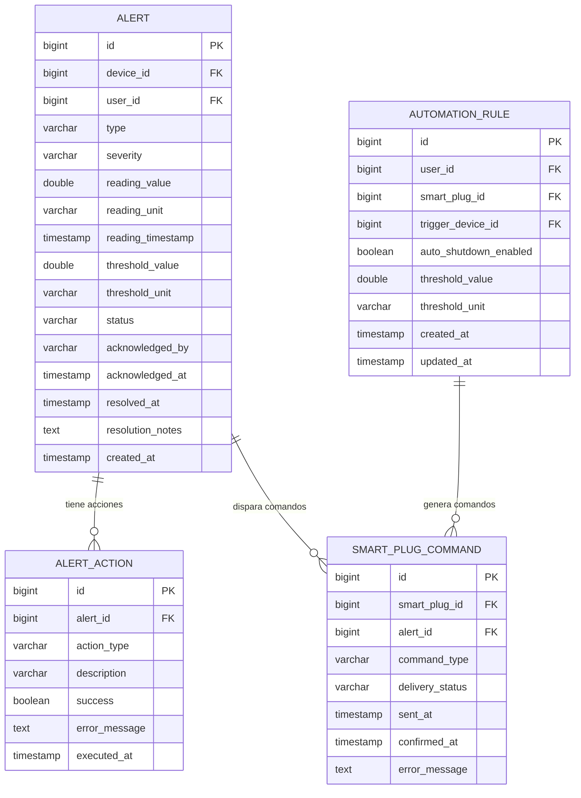
```mermaid
erDiagram
    ALERT {
        bigint id PK
        bigint device_id FK
        bigint user_id FK
        varchar type
        varchar severity
        double reading_value
        varchar reading_unit
        timestamp reading_timestamp
        double threshold_value
        varchar threshold_unit
        varchar status
        varchar acknowledged_by
        timestamp acknowledged_at
        timestamp resolved_at
        text resolution_notes
        timestamp created_at
    }
 
    ALERT_ACTION {
        bigint id PK
        bigint alert_id FK
        varchar action_type
        varchar description
        boolean success
        text error_message
        timestamp executed_at
    }
 
    AUTOMATION_RULE {
        bigint id PK
        bigint user_id FK
        bigint smart_plug_id FK
        bigint trigger_device_id FK
        boolean auto_shutdown_enabled
        double threshold_value
        varchar threshold_unit
        timestamp created_at
        timestamp updated_at
    }
 
    SMART_PLUG_COMMAND {
        bigint id PK
        bigint smart_plug_id FK
        bigint alert_id FK
        varchar command_type
        varchar delivery_status
        timestamp sent_at
        timestamp confirmed_at
        text error_message
    }
 
    ALERT ||--o{ ALERT_ACTION : "tiene acciones"
    ALERT ||--o{ SMART_PLUG_COMMAND : "dispara comandos"
    AUTOMATION_RULE ||--o{ SMART_PLUG_COMMAND : "genera comandos"
```
 
---


### 4.2.5. Bounded Context: Admin & Operations Management
 
Este Bounded Context soporta la gestión operativa del sistema EmSafe desde la plataforma web administrativa. Abarca el ciclo de vida completo del servicio: desde que un cliente contrata el monitoreo y se le agenda una instalación de sensores y adaptadores inteligentes, pasando por el mantenimiento preventivo y correctivo, hasta la recolección del hardware al finalizar el servicio. Incluye la administración de técnicos de campo, el control de inventario de dispositivos, el dashboard centralizado de clientes y la visualización del calendario de citas del equipo técnico.
 
El acceso a este BC es diferenciado por rol: el **Admin** (equipo Gauss) puede crear, editar y eliminar registros; el **Técnico** solo puede visualizar sus citas asignadas y marcarlas como culminadas.
 
Historias relacionadas: US26, US27, US28, US29, US31, US32, US33, US41, TS01, TS05, TS31.
 
#### 4.2.5.1. Domain Layer
 
| Archivo / Carpeta | Propósito | Tipo de recurso |
|:---|:---|:---|
| `model/aggregates/ServiceAppointment.java` | Agregado raíz que representa una cita de servicio (instalación, mantenimiento o recolección). Contiene el ciclo de vida completo: programación, ejecución y finalización. Es el concepto central del agendamiento. | Aggregate |
| `model/entities/AppointmentDevice.java` | Entidad que registra cada dispositivo (sensor o adaptador inteligente) involucrado en una cita, junto con su estado individual dentro de la visita (instalado, retirado, pendiente). | Entity |
| `model/aggregates/Technician.java` | Agregado raíz que representa un técnico de campo del equipo. Contiene sus datos de perfil, estado (activo/inactivo) y su disponibilidad para asignación de citas. | Aggregate |
| `model/aggregates/ClientRecord.java` | Agregado raíz que representa el registro de un cliente dentro del sistema operativo. Almacena el estado del servicio contratado, datos de la sede y la relación con su cuenta de usuario final. | Aggregate |
| `model/aggregates/DeviceInventoryItem.java` | Agregado raíz que representa un ítem del inventario de dispositivos (sensor o adaptador inteligente). Registra su ciclo de vida completo: disponible, instalado, en mantenimiento, retirado. | Aggregate |
| `model/valueobjects/AppointmentId.java` | Identificador único de la cita de servicio. | Value Object |
| `model/valueobjects/TechnicianId.java` | Identificador único del técnico. | Value Object |
| `model/valueobjects/ClientId.java` | Identificador único del registro de cliente. | Value Object |
| `model/valueobjects/InventoryItemId.java` | Identificador único del ítem de inventario. | Value Object |
| `model/valueobjects/TimeSlot.java` | Value object que encapsula la fecha, hora de inicio y hora de fin de un bloque horario para una cita. | Value Object |
| `model/valueobjects/Address.java` | Value object que encapsula la dirección de la sede del cliente (calle, distrito, ciudad, referencia). | Value Object |
| `model/commands/ScheduleInstallationCommand.java` | Record para programar una cita de instalación de sensores y adaptadores inteligentes en la sede de un cliente con pago confirmado. | Command |
| `model/commands/ScheduleMaintenanceCommand.java` | Record para programar una cita de mantenimiento preventivo o correctivo de dispositivos instalados. | Command |
| `model/commands/ScheduleCollectionCommand.java` | Record para programar una cita de recolección de dispositivos al finalizar o cancelar el servicio. | Command |
| `model/commands/RescheduleAppointmentCommand.java` | Record para modificar la fecha, horario o técnico asignado de una cita existente. | Command |
| `model/commands/CompleteAppointmentCommand.java` | Record para que el técnico marque una cita como completada, indicando los dispositivos procesados. | Command |
| `model/commands/RegisterTechnicianCommand.java` | Record para registrar un nuevo técnico en el sistema. | Command |
| `model/commands/UpdateTechnicianCommand.java` | Record para actualizar los datos de un técnico existente. | Command |
| `model/commands/DeactivateTechnicianCommand.java` | Record para desactivar un técnico que ya no forma parte del equipo. | Command |
| `model/commands/RegisterClientCommand.java` | Record para registrar un nuevo cliente con su sede y datos de servicio. | Command |
| `model/commands/UpdateInventoryItemStatusCommand.java` | Record para actualizar el estado de un ítem del inventario (disponible, instalado, en mantenimiento, retirado). | Command |
| `model/queries/GetAppointmentsByDateRangeQuery.java` | Record para consultar citas dentro de un rango de fechas, con filtro opcional por técnico. | Query |
| `model/queries/GetAppointmentsByTechnicianQuery.java` | Record para consultar las citas asignadas a un técnico específico. | Query |
| `model/queries/GetInstallationHistoryQuery.java` | Record para consultar el historial de instalaciones realizadas, con filtros por fecha y técnico. | Query |
| `model/queries/GetAllTechniciansQuery.java` | Record para consultar todos los técnicos registrados en el sistema. | Query |
| `model/queries/GetClientDashboardQuery.java` | Record para obtener las métricas del dashboard de clientes: totales por estado, alertas activas, citas pendientes. | Query |
| `model/queries/GetClientDetailQuery.java` | Record para obtener el perfil detallado de un cliente con sus dispositivos, citas e historial. | Query |
| `model/queries/GetInventoryQuery.java` | Record para consultar el inventario de dispositivos, con filtro opcional por estado. | Query |
| `model/queries/GetInventoryItemDetailQuery.java` | Record para consultar el historial completo de un ítem de inventario. | Query |
| `model/queries/GetDashboardMetricsQuery.java` | Record para obtener las métricas generales del dashboard web: dispositivos activos, alertas recientes, citas programadas. | Query |
| `services/OperationsCommandService.java` | Interfaz que expone operaciones de escritura: agendamiento de citas, gestión de técnicos, registro de clientes y actualización de inventario. | Command Service |
| `services/OperationsQueryService.java` | Interfaz que expone operaciones de lectura: consultas de calendario, historial de instalaciones, dashboard de clientes, inventario y métricas. | Query Service |
 
#### 4.2.5.2. Interface Layer
 
| Archivo / Carpeta | Propósito | Tipo de recurso |
|:---|:---|:---|
| `rest/controllers/AppointmentController.java` | Controlador REST que expone endpoints para agendar, reprogramar y completar citas de instalación, mantenimiento y recolección. Diferencia permisos por rol (Admin: CRUD, Técnico: solo lectura y marcar completado). | REST Controller |
| `rest/controllers/TechnicianController.java` | Controlador REST que expone endpoints para registrar, editar, desactivar y consultar técnicos. Solo accesible por Admin. | REST Controller |
| `rest/controllers/ClientManagementController.java` | Controlador REST que expone endpoints para el dashboard de clientes, registro de clientes, detalle y búsqueda. Solo accesible por Admin. | REST Controller |
| `rest/controllers/InventoryController.java` | Controlador REST que expone endpoints para consultar y gestionar el inventario de dispositivos. Solo accesible por Admin. | REST Controller |
| `rest/controllers/AdminDashboardController.java` | Controlador REST que expone el endpoint del dashboard general con métricas operativas. Solo accesible por Admin. | REST Controller |
| `rest/resources/ScheduleInstallationResource.java` | Resource de entrada para programar una cita de instalación (clientId, fecha, bloque horario, technicianId, dispositivos). | Resource (Input) |
| `rest/resources/ScheduleMaintenanceResource.java` | Resource de entrada para programar una cita de mantenimiento (deviceIds, fecha, bloque horario, technicianId). | Resource (Input) |
| `rest/resources/ScheduleCollectionResource.java` | Resource de entrada para programar una cita de recolección (clientId, fecha, bloque horario, technicianId). | Resource (Input) |
| `rest/resources/RescheduleAppointmentResource.java` | Resource de entrada para reprogramar una cita existente (nueva fecha, nuevo bloque, nuevo técnico). | Resource (Input) |
| `rest/resources/CompleteAppointmentResource.java` | Resource de entrada para que el técnico marque la cita como completada (lista de dispositivos procesados, estado de cada uno). | Resource (Input) |
| `rest/resources/AppointmentResource.java` | Resource de salida que representa una cita con todos sus datos: tipo, cliente, técnico, dispositivos, estado y timestamps. | Resource (Output) |
| `rest/resources/RegisterTechnicianResource.java` | Resource de entrada para registrar un técnico (nombre, correo, teléfono, especialidad). | Resource (Input) |
| `rest/resources/TechnicianResource.java` | Resource de salida que representa un técnico con su perfil, estado y cantidad de citas asignadas. | Resource (Output) |
| `rest/resources/RegisterClientResource.java` | Resource de entrada para registrar un nuevo cliente (nombre, empresa, dirección sede, correo, teléfono). | Resource (Input) |
| `rest/resources/ClientSummaryResource.java` | Resource de salida resumida para el dashboard de clientes (nombre, estado del servicio, alertas activas, citas pendientes). | Resource (Output) |
| `rest/resources/ClientDetailResource.java` | Resource de salida detallada de un cliente (perfil completo, dispositivos instalados, historial de citas e historial de alertas). | Resource (Output) |
| `rest/resources/InventoryItemResource.java` | Resource de salida que representa un ítem de inventario (ID, tipo, estado, sede asignada, historial de cambios). | Resource (Output) |
| `rest/resources/DashboardMetricsResource.java` | Resource de salida con las métricas del dashboard web (dispositivos activos, alertas recientes, citas del día, tendencia de radiación). | Resource (Output) |
| `rest/resources/ClientDashboardMetricsResource.java` | Resource de salida con métricas agregadas de clientes (total activos, con alertas, con citas pendientes, finalizados). | Resource (Output) |
| `rest/assemblers/ScheduleInstallationCommandFromResourceAssembler.java` | Convierte un `ScheduleInstallationResource` en `ScheduleInstallationCommand`. | Resource → Command Assembler |
| `rest/assemblers/AppointmentResourceFromEntityAssembler.java` | Convierte un `ServiceAppointment` (aggregate) en `AppointmentResource`. | Entity → Resource Assembler |
| `rest/assemblers/TechnicianResourceFromEntityAssembler.java` | Convierte un `Technician` (aggregate) en `TechnicianResource`. | Entity → Resource Assembler |
| `rest/assemblers/ClientSummaryResourceFromEntityAssembler.java` | Convierte un `ClientRecord` en `ClientSummaryResource`. | Entity → Resource Assembler |
| `rest/assemblers/ClientDetailResourceFromEntityAssembler.java` | Convierte un `ClientRecord` con relaciones cargadas en `ClientDetailResource`. | Entity → Resource Assembler |
| `rest/assemblers/InventoryItemResourceFromEntityAssembler.java` | Convierte un `DeviceInventoryItem` en `InventoryItemResource`. | Entity → Resource Assembler |
 
#### 4.2.5.3. Application Layer
 
| Archivo / Carpeta | Propósito | Tipo de recurso |
|:---|:---|:---|
| `internal/commandservices/OperationsCommandServiceImpl.java` | Implementación concreta de `OperationsCommandService`. Orquesta el agendamiento de citas validando disponibilidad del técnico y estado del cliente, gestiona técnicos, registra clientes y actualiza inventario. | Command Service Impl |
| `internal/queryservices/OperationsQueryServiceImpl.java` | Implementación concreta de `OperationsQueryService`. Ejecuta consultas de calendario, historial de instalaciones, dashboard de clientes con métricas agregadas, inventario y métricas generales. | Query Service Impl |
| `internal/outboundservices/acl/AlertContextService.java` | Servicio ACL que consulta el Bounded Context de Alert & Automation para obtener el conteo de alertas activas por cliente. | ACL Service |
| `internal/outboundservices/acl/UserAccountService.java` | Servicio ACL que consulta el módulo de autenticación (IAM) para vincular el registro de cliente con su cuenta de usuario final. | ACL Service |
| `internal/outboundservices/acl/EmailNotificationService.java` | Servicio ACL que envía correos electrónicos al técnico cuando se le asigna, modifica o cancela una cita. | ACL Service |
 
#### 4.2.5.4. Infrastructure Layer
 
| Archivo / Carpeta | Propósito | Tipo de recurso |
|:---|:---|:---|
| `persistence/jpa/repositories/ServiceAppointmentRepository.java` | Repositorio JPA para el agregado `ServiceAppointment`. Incluye queries para buscar por rango de fechas, por técnico, por cliente y por tipo de servicio. Valida conflictos de agenda. | Repository Impl |
| `persistence/jpa/repositories/AppointmentDeviceRepository.java` | Repositorio JPA para la entidad `AppointmentDevice`. | Repository Impl |
| `persistence/jpa/repositories/TechnicianRepository.java` | Repositorio JPA para el agregado `Technician`. Incluye query para buscar técnicos activos y verificar disponibilidad en un bloque horario. | Repository Impl |
| `persistence/jpa/repositories/ClientRecordRepository.java` | Repositorio JPA para el agregado `ClientRecord`. Incluye queries para buscar por estado del servicio y para obtener métricas agregadas del dashboard. | Repository Impl |
| `persistence/jpa/repositories/DeviceInventoryItemRepository.java` | Repositorio JPA para el agregado `DeviceInventoryItem`. Incluye queries para filtrar por estado y para detectar stock bajo. | Repository Impl |
 
#### 4.2.5.5. Bounded Context Software Architecture Component Level Diagrams


#### 4.2.5.6. Bounded Context Software Architecture Code Level Diagrams
 
##### 4.2.5.6.1. Bounded Context Domain Layer Class Diagrams
 
El diagrama de clases del Bounded Context Admin & Operations Management muestra los cuatro agregados principales: `ServiceAppointment` como eje central del agendamiento, `Technician` para la gestión del equipo de campo, `ClientRecord` para el seguimiento de clientes y `DeviceInventoryItem` para el control de inventario. Se incluyen los value objects, entidades y enums que modelan el ciclo de vida completo de las operaciones.
 

```mermaid
classDiagram
    direction TB
 
    class ServiceAppointment {
        -Long id
        -ClientId clientId
        -TechnicianId technicianId
        -AppointmentType type
        -AppointmentStatus status
        -TimeSlot scheduledSlot
        -String notes
        -Instant createdAt
        -Instant updatedAt
        -Instant completedAt
        +reschedule(TimeSlot newSlot, TechnicianId newTechnician) void
        +markCompleted(String completionNotes) void
        +cancel(String reason) void
        +addDevice(AppointmentDevice device) void
        +isConflicting(TimeSlot otherSlot) boolean
    }
 
    class AppointmentDevice {
        -Long id
        -InventoryItemId inventoryItemId
        -String deviceName
        -String deviceType
        -AppointmentDeviceStatus status
    }
 
    class Technician {
        -Long id
        -String firstName
        -String lastName
        -String email
        -String phone
        -String specialty
        -TechnicianStatus status
        -Instant createdAt
        +deactivate() void
        +activate() void
        +getFullName() String
    }
 
    class ClientRecord {
        -Long id
        -Long userId
        -String companyName
        -String contactName
        -String contactEmail
        -String contactPhone
        -Address siteAddress
        -ServiceStatus serviceStatus
        -Boolean paymentConfirmed
        -Instant createdAt
        -Instant updatedAt
        +activateService() void
        +finalizeService() void
        +cancelService() void
        +confirmPayment() void
    }
 
    class DeviceInventoryItem {
        -Long id
        -String serialNumber
        -InventoryDeviceType deviceType
        -InventoryStatus status
        -Long assignedClientId
        -String assignedLocation
        -Instant registeredAt
        -Instant lastStatusChange
        +install(Long clientId, String location) void
        +markForMaintenance() void
        +retire() void
        +returnToStock() void
    }
 
    class AppointmentType {
        <<enumeration>>
        INSTALLATION
        MAINTENANCE
        COLLECTION
    }
 
    class AppointmentStatus {
        <<enumeration>>
        SCHEDULED
        IN_PROGRESS
        COMPLETED
        CANCELLED
        PARTIALLY_COMPLETED
    }
 
    class AppointmentDeviceStatus {
        <<enumeration>>
        PENDING
        INSTALLED
        MAINTAINED
        COLLECTED
        FAILED
    }
 
    class TechnicianStatus {
        <<enumeration>>
        ACTIVE
        INACTIVE
    }
 
    class ServiceStatus {
        <<enumeration>>
        PENDING_INSTALLATION
        ACTIVE
        SUSPENDED
        FINALIZED
        CANCELLED
    }
 
    class InventoryDeviceType {
        <<enumeration>>
        EMF_SENSOR
        SMART_PLUG
    }
 
    class InventoryStatus {
        <<enumeration>>
        AVAILABLE
        INSTALLED
        IN_MAINTENANCE
        IN_COLLECTION
        RETIRED
    }
 
    class TimeSlot {
        <<value object>>
        -LocalDate date
        -LocalTime startTime
        -LocalTime endTime
    }
 
    class Address {
        <<value object>>
        -String street
        -String district
        -String city
        -String reference
    }
 
    class AppointmentId {
        <<value object>>
        -Long value
    }
 
    class TechnicianId {
        <<value object>>
        -Long value
    }
 
    class ClientId {
        <<value object>>
        -Long value
    }
 
    class InventoryItemId {
        <<value object>>
        -Long value
    }
 
    class OperationsCommandService {
        <<interface>>
        +scheduleInstallation(ScheduleInstallationCommand cmd) ServiceAppointment
        +scheduleMaintenance(ScheduleMaintenanceCommand cmd) ServiceAppointment
        +scheduleCollection(ScheduleCollectionCommand cmd) ServiceAppointment
        +rescheduleAppointment(RescheduleAppointmentCommand cmd) ServiceAppointment
        +completeAppointment(CompleteAppointmentCommand cmd) ServiceAppointment
        +registerTechnician(RegisterTechnicianCommand cmd) Technician
        +updateTechnician(UpdateTechnicianCommand cmd) Technician
        +deactivateTechnician(DeactivateTechnicianCommand cmd) Technician
        +registerClient(RegisterClientCommand cmd) ClientRecord
        +updateInventoryStatus(UpdateInventoryItemStatusCommand cmd) DeviceInventoryItem
    }
 
    class OperationsQueryService {
        <<interface>>
        +getAppointmentsByDateRange(GetAppointmentsByDateRangeQuery q) List~ServiceAppointment~
        +getAppointmentsByTechnician(GetAppointmentsByTechnicianQuery q) List~ServiceAppointment~
        +getInstallationHistory(GetInstallationHistoryQuery q) List~ServiceAppointment~
        +getAllTechnicians(GetAllTechniciansQuery q) List~Technician~
        +getClientDashboard(GetClientDashboardQuery q) ClientDashboardMetrics
        +getClientDetail(GetClientDetailQuery q) ClientRecord
        +getInventory(GetInventoryQuery q) List~DeviceInventoryItem~
        +getInventoryItemDetail(GetInventoryItemDetailQuery q) DeviceInventoryItem
        +getDashboardMetrics(GetDashboardMetricsQuery q) DashboardMetrics
    }
 
    ServiceAppointment "1" *-- "0..*" AppointmentDevice : devices
    ServiceAppointment --> AppointmentType
    ServiceAppointment --> AppointmentStatus
    ServiceAppointment --> TimeSlot
    ServiceAppointment --> ClientId
    ServiceAppointment --> TechnicianId
 
    AppointmentDevice --> AppointmentDeviceStatus
    AppointmentDevice --> InventoryItemId
 
    Technician --> TechnicianStatus
 
    ClientRecord --> ServiceStatus
    ClientRecord --> Address
 
    DeviceInventoryItem --> InventoryDeviceType
    DeviceInventoryItem --> InventoryStatus
 
    OperationsCommandService ..> ServiceAppointment : manages
    OperationsCommandService ..> Technician : manages
    OperationsCommandService ..> ClientRecord : manages
    OperationsCommandService ..> DeviceInventoryItem : manages
    OperationsQueryService ..> ServiceAppointment : queries
    OperationsQueryService ..> Technician : queries
    OperationsQueryService ..> ClientRecord : queries
    OperationsQueryService ..> DeviceInventoryItem : queries
```
 
##### 4.2.5.6.2. Bounded Context Database Design Diagram
 
El diseño de base de datos del Bounded Context Admin & Operations Management persiste toda la información operativa del servicio: citas de instalación, mantenimiento y recolección con sus dispositivos asociados, el equipo de técnicos de campo, los registros de clientes con el estado de su servicio y el inventario completo de sensores y adaptadores inteligentes con su ciclo de vida.
 
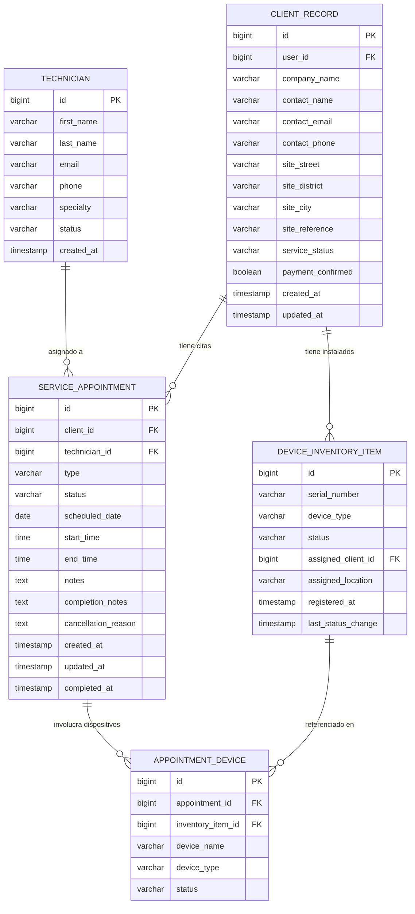
```mermaid
erDiagram
    SERVICE_APPOINTMENT {
        bigint id PK
        bigint client_id FK
        bigint technician_id FK
        varchar type
        varchar status
        date scheduled_date
        time start_time
        time end_time
        text notes
        text completion_notes
        text cancellation_reason
        timestamp created_at
        timestamp updated_at
        timestamp completed_at
    }
 
    APPOINTMENT_DEVICE {
        bigint id PK
        bigint appointment_id FK
        bigint inventory_item_id FK
        varchar device_name
        varchar device_type
        varchar status
    }
 
    TECHNICIAN {
        bigint id PK
        varchar first_name
        varchar last_name
        varchar email
        varchar phone
        varchar specialty
        varchar status
        timestamp created_at
    }
 
    CLIENT_RECORD {
        bigint id PK
        bigint user_id FK
        varchar company_name
        varchar contact_name
        varchar contact_email
        varchar contact_phone
        varchar site_street
        varchar site_district
        varchar site_city
        varchar site_reference
        varchar service_status
        boolean payment_confirmed
        timestamp created_at
        timestamp updated_at
    }
 
    DEVICE_INVENTORY_ITEM {
        bigint id PK
        varchar serial_number
        varchar device_type
        varchar status
        bigint assigned_client_id FK
        varchar assigned_location
        timestamp registered_at
        timestamp last_status_change
    }
 
    CLIENT_RECORD ||--o{ SERVICE_APPOINTMENT : "tiene citas"
    TECHNICIAN ||--o{ SERVICE_APPOINTMENT : "asignado a"
    SERVICE_APPOINTMENT ||--o{ APPOINTMENT_DEVICE : "involucra dispositivos"
    DEVICE_INVENTORY_ITEM ||--o{ APPOINTMENT_DEVICE : "referenciado en"
    CLIENT_RECORD ||--o{ DEVICE_INVENTORY_ITEM : "tiene instalados"
``` 

# Capítulo V: Solution UI/UX Design

## 5.1. Style Guidelines

### 5.1.1. General Style Guidelines

Las General Style Guidelines de EMSafe definen los fundamentos visuales y comunicativos que garantizan coherencia en todos los canales de la solución: landing page, aplicación web y aplicación móvil. Estas decisiones de diseño reflejan los valores de la marca: **precisión técnica, confianza y accesibilidad**.

---

**Brand Overview**

EMSafe es una plataforma de monitoreo de radiación electromagnética no ionizante. Su identidad visual transmite **seguridad, claridad y tecnología responsable**. El diseño evita el alarmismo visual; en su lugar, prioriza la legibilidad de datos críticos y la toma de decisiones informada.

**Colores**

La paleta de EMSafe combina tonos oscuros tecnológicos con acentos de alerta estandarizados internacionalmente. Se definen los siguientes tokens de color:

| Token | Nombre | Valor HEX | Uso principal |
|---|---|---|---|
| `--color-primary` | Azul EMSafe | `#1A6EFF` | Botones primarios, enlaces, CTA |
| `--color-primary-dark` | Azul oscuro | `#0D4DB3` | Hover de botones, énfasis |
| `--color-background` | Fondo oscuro | `#0D1117` | Fondo principal de la plataforma |
| `--color-surface` | Superficie | `#161B22` | Tarjetas, paneles, modales |
| `--color-surface-alt` | Superficie alternativa | `#21262D` | Bordes de tarjetas, separadores |
| `--color-text-primary` | Texto principal | `#E6EDF3` | Encabezados, cuerpo de texto |
| `--color-text-secondary` | Texto secundario | `#8B949E` | Subtítulos, metadata, labels |
| `--color-success` | Verde seguro | `#2EA043` | Nivel de radiación bajo (safe) |
| `--color-warning` | Amarillo alerta | `#D29922` | Nivel de radiación medio (warning) |
| `--color-danger` | Rojo crítico | `#F85149` | Nivel de radiación alto (critical) |
| `--color-accent` | Cian IoT | `#39D5FF` | Indicadores de sensor activo, gráficos |

Los niveles de radiación se representan **siempre** con el sistema de semáforo (`success` → `warning` → `danger`) para garantizar una lectura inmediata e intuitiva en cualquier interfaz.
 
---

**Tipografía**

EMSafe utiliza una jerarquía tipográfica de tres familias con roles diferenciados:

| Familia | Uso | Importación |
|---|---|---|
| **Sora** | Encabezados, títulos, métricas clave | Google Fonts |
| **IBM Plex Mono** | Valores numéricos de sensores, código, timestamps | Google Fonts |
| **Inter** | Cuerpo de texto, formularios, párrafos | Google Fonts |

---

**Escala tipográfica:**

| Nivel | Tamaño | Peso | Familia | Uso |
|---|---|---|---|---|
| Display | 48px | 700 | Sora | Hero de landing, valor principal del dashboard |
| H1 | 32px | 700 | Sora | Títulos de sección |
| H2 | 24px | 600 | Sora | Subtítulos |
| H3 | 20px | 600 | Sora | Encabezados de tarjeta |
| Body L | 16px | 400 | Inter | Párrafos, descripciones |
| Body S | 14px | 400 | Inter | Labels, metadata |
| Caption | 12px | 400 | Inter | Timestamps, notas auxiliares |
| Metric | 36px | 700 | IBM Plex Mono | Lecturas de sensor en tiempo real |
| Code | 13px | 400 | IBM Plex Mono | Valores técnicos, IDs de dispositivo |
 
---

**Espaciado y Grid**

El sistema de espaciado sigue una base de **8px**. Los valores permitidos son múltiplos: 4, 8, 16, 24, 32, 48, 64, 80px.

- **Grid web:** 12 columnas, gutter de 24px, margen lateral de 48px (desktop) y 16px (mobile).
- **Grid móvil:** 4 columnas, gutter de 16px.
- **Border radius:** Badges y chips: 4px. Tarjetas y paneles: 8px. Modales y bottom sheets: 12px. Botones: 6px.
---

**Iconografía**

Se utiliza la librería **Phosphor Icons** en su variante `Regular` para interfaz general y `Bold` para estados de alerta crítica. Los iconos se renderizan a tamaños estandarizados: 16px (inline), 20px (botones), 24px (navegación), 32px (cards de métricas). Los iconos de nivel de radiación siempre van acompañados de su color semáforo correspondiente.
 
---

**Tono de comunicación**

EMSafe comunica con un tono **técnico pero accesible**: preciso en los datos, claro en las recomendaciones y nunca alarmista. Las alertas usan lenguaje directo y orientado a la acción:

- **Correcto:** "Nivel de radiación elevado detectado en Sala Principal. Se recomienda alejar el router al menos 2 metros."
- **Incorrecto:** "¡PELIGRO! ¡Radiación peligrosa detectada!"
  Los textos del sistema evitan tecnicismos innecesarios en la interfaz de usuario final (segmento hogar), y pueden incluir terminología técnica en la plataforma web administrativa (segmento empresarial/admin).

---

**Estados de componentes**

Todos los componentes interactivos deben implementar los siguientes estados:

| Estado | Comportamiento visual |
|---|---|
| Default | Color base del componente |
| Hover | Ligero aumento de brillo o color `primary-dark` |
| Active / Pressed | Reducción de escala `scale(0.97)` |
| Focused | Outline de 2px en `--color-primary` |
| Disabled | Opacidad `0.4`, cursor `not-allowed` |
| Loading | Skeleton shimmer o spinner en `--color-accent` |
| Error | Borde en `--color-danger`, icono de advertencia |
| Success | Borde en `--color-success`, icono de verificación |
 
---

### 5.1.2. Web, Mobile and IoT Style Guidelines

Esta sección especifica las adaptaciones de las General Style Guidelines para cada plataforma de la solución EMSafe: plataforma web administrativa, aplicación móvil y dispositivo IoT.
 
---

**Web Application Style Guidelines**

La plataforma web de EMSafe está dirigida a **Administradores y Técnicos de campo**. Su diseño prioriza la densidad de información, la gestión de múltiples dispositivos y la generación de reportes.

*Layout y estructura:*

- Sidebar de navegación fija de 240px con colapso a 64px en modo compacto.
- Header de 64px con breadcrumb, buscador global y notificaciones.
- Área de contenido con máximo ancho de 1280px centrado.
- Dashboard principal en grid de 3 columnas para métricas y 2 columnas para gráficos.
  *Componentes específicos web:*

| Componente | Especificación |
|---|---|
| Data Table | Paginación de 20 ítems, columnas ordenables, filtros inline |
| Chart | Librería Recharts; colores del sistema semáforo para niveles EMF |
| Calendar | Vista mensual/semanal/diaria; eventos con código de color por tipo de cita |
| Badge de estado | Pills de 6px radius; colores según `DeviceStatus` |
| Mapa de radiación | Integración con Leaflet.js; heatmap con paleta `success→warning→danger` |
| Modal | Overlay 60% opacidad; ancho máximo 640px; animación slide-up 200ms |
| Toast | Posición inferior derecha; duración 4s; íconos Phosphor |

*Responsividad web:*

| Breakpoint | Ancho | Comportamiento |
|---|---|---|
| Desktop L | ≥ 1440px | Layout completo, sidebar expandido |
| Desktop | ≥ 1024px | Layout completo, sidebar colapsable |
| Tablet | ≥ 768px | Sidebar colapsado por defecto, grid 2 columnas |
| Mobile web | < 768px | Sidebar como drawer, grid 1 columna |
 
---

**Mobile Application Style Guidelines**

La aplicación móvil de EMSafe está dirigida al **usuario final** (segmento hogar y personal de empresa). Su diseño prioriza la lectura rápida del nivel de radiación actual, las alertas y el acceso al chatbot ASTRA.

*Dimensiones y áreas seguras:*

- Diseño base para pantalla de 390px × 844px (iPhone 14 Pro como referencia).
- Safe area insets respetados: top 44px, bottom 34px.
- Bottom navigation bar de 56px de alto.
- Botón de acción flotante (FAB) de 56px × 56px, posicionado 80px desde el fondo.
  *Navegación móvil — Bottom Tab Bar:*

| Tab | Ícono Phosphor | Label |
|---|---|---|
| Inicio | `House` | Inicio |
| Monitoreo | `Waves` | Monitoreo |
| Alertas | `Bell` | Alertas |
| Perfil | `User` | Perfil |

El badge en "Alertas" se muestra en `--color-danger` cuando hay alertas activas no leídas.

*Componentes específicos móvil:*

| Componente | Especificación |
|---|---|
| Gauge de radiación | Componente circular; arco de 270°; colores semáforo; valor central en IBM Plex Mono 36px bold |
| Sensor card | 100% ancho, padding 16px, radius 8px; indicador online/offline en `--color-accent` |
| Alert card | Swipe-to-dismiss; franja lateral de color según severidad |
| Bottom sheet | Altura variable; drag indicator 36px × 4px; radius superior 16px |
| Chatbot ASTRA | Pantalla full; burbujas de chat; input sticky en fondo; botón enviar en `--color-primary` |
| Mapa domicilio | Integración Mapbox; marcadores de sensor con color semáforo; zoom 17 por defecto |

*Gestos e interacciones:*

- **Pull to refresh** en pantallas de monitoreo y alertas.
- **Swipe left** en alert cards para marcar como leída o descartar.
- **Long press** en sensor card para acceder a opciones rápidas (apagado remoto, historial).
- **Haptic feedback** en alertas críticas (patrón de vibración `[100ms, 50ms, 100ms]`).
---

**IoT Device Style Guidelines**

El dispositivo sensor de EMSafe (ESP32 con sensor GY-273) comunica su estado al usuario mediante **indicadores LED RGB** físicos. Se definen los siguientes patrones:

| Estado del dispositivo | Color LED | Patrón |
|---|---|---|
| Encendido / Iniciando | Blanco | Pulso lento (1s on / 1s off) |
| Conectado a WiFi | Azul | Encendido fijo |
| Transmitiendo datos | Cian (`#39D5FF`) | Parpadeo rápido (200ms) |
| Nivel de radiación bajo | Verde (`#2EA043`) | Encendido fijo |
| Nivel de radiación medio | Amarillo (`#D29922`) | Parpadeo lento (1s) |
| Nivel de radiación alto | Rojo (`#F85149`) | Parpadeo rápido (300ms) |
| Sin conexión WiFi | Naranja | Parpadeo lento (2s) |
| Error / Falla | Rojo | 3 destellos rápidos y pausa |
| Firmware actualizando | Azul | Pulso continuo |
| Apagado por comando remoto | Morado | 2 destellos y apagado |

Los colores del LED físico se alinean intencionalmente con el sistema semáforo de la plataforma digital, creando **coherencia perceptual** entre el hardware y las interfaces digitales.

*Etiquetado físico del dispositivo:*

El dispositivo incluye una etiqueta adhesiva con logotipo EMSafe, QR code de vinculación único, ID de dispositivo en `IBM Plex Mono` 10px, e icono de señal WiFi con escala EMF de referencia rápida (tres franjas: verde / amarillo / rojo).

## 5.2. Information Architecture

### 5.2.1. Organization Systems

Esta sección describe los sistemas de organización implementados tanto en la Landing Page actual como en futuras versiones de la plataforma EMSafe. Se definen los esquemas jerárquicos, secuenciales y temáticos utilizados para estructurar la información de manera clara, eficiente y alineada con los objetivos del proyecto. Esto garantiza una navegación fluida y una experiencia coherente para los distintos tipos de usuarios.

## Landing Page

### Grupo de Usuarios 1: Personas interesadas en su salud

#### Organización jerárquica
La estructura de la Landing Page está pensada para captar rápidamente la atención de este perfil de usuario, seguida de las características principales del sistema, sus beneficios a nivel personal, la problemática global, testimonios de usuarios reales y finalmente el contacto. Esta jerarquía permite al visitante comprender de forma progresiva cómo EMSafe puede ayudarle directamente en su vida diaria.

### Grupo de Usuarios 2: Empresas que operan maquinaria de emisión electromagnética

#### Organización jerárquica
Este tipo de usuario encuentra primero información orientada al valor organizacional del sistema: monitoreo en tiempo real, prevención de riesgos laborales y cumplimiento normativo. Luego, se presenta evidencia del impacto positivo (testimonios de empresas) y un formulario de contacto para solicitar una demo adaptada a sus necesidades.

--------

## Aplicación Móvil

### Grupo de Usuarios 1: Personas interesadas en su salud

#### Organización jerárquica
La aplicación móvil está estructurada para que el usuario acceda primero a su estado actual de exposición electromagnética mediante el Home Dashboard, que muestra el nivel de radiación en tiempo real. Desde allí se puede navegar hacia el monitoreo detallado, reportes históricos, recomendaciones de salud. Esta jerarquía garantiza que la información más crítica (el nivel de radiación actual) esté siempre accesible desde el inicio.

### Grupo de Usuarios 2: Empresas que operan maquinaria de emisión electromagnética

#### Organización matricial:
En el contexto empresarial, la aplicación móvil permitirá a los responsables de seguridad visualizar una vista matricial con el estado de múltiples sensores IoT distribuidos en diferentes áreas o plantas de la organización, mostrando simultáneamente los niveles de exposición de cada zona y permitiendo identificar puntos críticos de forma inmediata.

### 5.2.2. Labeling Systems

A continuación, se presenta el sistema de etiquetado utilizado tanto en la Landing Page como en la Aplicación Móvil de EMSafe, el cual busca representar de forma clara, concisa y accesible los distintos grupos de información. Las etiquetas seleccionadas tienen un lenguaje simple y directo para facilitar la navegación y evitar confusión en los usuarios.

## Aplicación Web

Actualmente, la Landing Page cuenta con secciones identificadas con headings claros y minimalistas, orientados a explicar el funcionamiento y propósito de la plataforma.

| Sección | Etiqueta Utilizada | Descripción |
|---|---|---|
| Inicio / Hero | Inicio | Presentación del nombre, descripción del sistema y llamado a la acción principal (CTA). |
| Características | Características | Funciones clave como monitoreo, análisis y alertas, explicadas de forma visual mediante tarjetas. |
| Beneficios | Beneficios | Ventajas del sistema para usuarios individuales y empresas, mostradas en tarjetas comparativas. |
| Problemática | Problemática | Contexto sobre los riesgos de la radiación electromagnética y la necesidad de EMSafe. |
| Testimonios | Testimonios | Experiencias breves de distintos usuarios, etiquetados por rol y nombre completo. |
| Ubicación | Ubicación | Mapa que muestra la localización del equipo desarrollador del proyecto. |
| Contacto | Contacto | Formulario corto con campos básicos para recibir información o solicitar demo. |

---

## Aplicación Móvil

La aplicación móvil utiliza etiquetas cortas e iconográficas en la barra de navegación inferior, complementadas por títulos de pantalla en cada vista. Las etiquetas están diseñadas para ser reconocibles de forma inmediata, reduciendo la carga cognitiva del usuario.

| Pantalla / Sección | Etiqueta Utilizada | Descripción |
|---|---|---|
| Splash Screen | EMSafe | Pantalla de carga inicial con logo e identidad visual de la marca. |
| Bienvenida | Bienvenido a EMSafe | Introducción al sistema con opción de registro o inicio de sesión. |
| Verificación OTP | Verificación | Confirmación de identidad mediante código de un solo uso enviado por correo. |
| Autenticación Biométrica | Acceso Biométrico | Autenticación mediante huella dactilar o reconocimiento facial para mayor seguridad. |
| Vinculación de Sensor | Vincular Sensor | Proceso guiado para emparejar el dispositivo IoT con la cuenta del usuario. |
| Home Dashboard | Inicio | Panel principal con nivel de radiación actual, estado del sensor y accesos rápidos. |
| Monitoreo en Tiempo Real | Monitoreo | Lectura continua de campos electromagnéticos con indicadores visuales de nivel. |
| Mapa de Radiación (Hogar) | Mi Entorno | Visualización del nivel de radiación distribuida en el espacio del usuario. |
| Mapa de Radiación (Ciudad) | Mapa Ciudad | Mapa con niveles de radiación electromagnética registrados en distintas zonas urbanas. |
| Centro de Alertas | Alertas | Listado de alertas activas e historial de notificaciones por niveles de exposición. |
| Protocolo de Emergencia | Emergencia | Guía paso a paso ante detección de niveles críticos de radiación. |
| Insights de Salud | Salud | Análisis personalizados del impacto de la radiación en la salud del usuario. |
| Recomendaciones de Salud | Recomendaciones | Acciones específicas para reducir la exposición electromagnética del usuario. |
| Exportar Reporte Médico | Exportar Reporte | Generación y descarga de informe de exposición para compartir con profesionales de salud. |
| Reproducción Histórica | Historial | Revisión cronológica de los niveles de radiación registrados en el pasado. |
| Reporte Semanal | Reporte Semanal | Resumen visual de la exposición electromagnética acumulada durante la semana. |
| Control de Dispositivos | Dispositivos | Gestión de aparatos conectados con posibilidad de activación/desactivación remota. |
| Motor de Automatización | Automatización | Configuración de reglas automáticas para controlar dispositivos según umbrales de radiación. |
| Asistente ASTRA | ASTRA | Asistente de inteligencia artificial para consultas sobre radiación y recomendaciones personalizadas. |

### 5.2.3. SEO Tags and Meta Tags

Los SEO Tags y Meta Tags son esenciales para mejorar el posicionamiento del web y mobile application de EMSafe en los motores de búsqueda y facilitar que los usuarios encuentren la plataforma al buscar soluciones relacionadas con salud, tecnología y monitoreo ambiental.

### Web Application

**Title:** EMsafe App – Panel de Monitoreo Electromagnético  

**Description:**  
Accede a tu panel de control EMsafe para visualizar niveles de radiación en tiempo real, gestionar sensores IoT y recibir alertas personalizadas.

**Keywords:**  
panel de control EMF, gestión de sensores IoT, monitoreo electromagnético, alertas de radiación, plataforma de bienestar, radiación en el trabajo.

**Author:**  
EMSafe Team

---

### Mobile Application

**Title:** EMsafe – Monitor de Radiación Electromagnética  

**Description:**  
Monitorea en tiempo real la radiación electromagnética de tu entorno, recibe alertas personalizadas y accede a recomendaciones de salud desde tu dispositivo móvil.

**Keywords:**  
monitoreo EMF móvil, radiación electromagnética, sensores IoT, alertas de salud, campos electromagnéticos, protección radiación, bienestar, ASTRA asistente IA.

**Author:**  
EMSafe Team

### 5.2.4. Searching Systems

### 5.2.5. Navigation Systems

## 5.3. Landing Page UI Design

Las landing pages cumplen un papel clave en la transformación de visitantes en posibles usuarios, ya que utilizan mensajes persuasivos, presentan información relevante del producto y ofrecen un diseño fácil de usar. Considerando su importancia, se ha planteado una propuesta inicial de diseño que se adapta tanto a dispositivos móviles como a computadoras de escritorio.

En el caso de la versión para escritorio, se ha diseñado una interfaz estructurada en secciones visuales claras, con opciones de navegación bien definidas y descripciones breves de las principales funcionalidades del sitio. El propósito es lograr que el usuario comprenda rápidamente el contenido y reducir al mínimo cualquier obstáculo en su experiencia. Además, se ha incorporado una barra de navegación fija, lo que permite acceder a ella en todo momento y favorece un recorrido más fluido por la landing page.

### 5.3.1. Landing Page Wireframe

En esta sección se presentarán los wireframes de la versión de la versión con menos exactitud del Landing Page.

* **Sección Inicio**

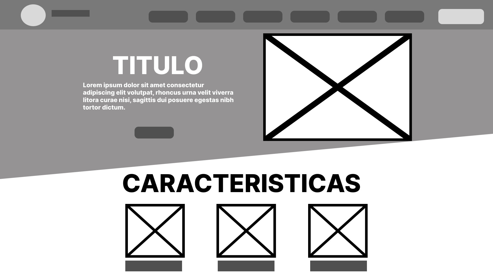<br>

* **Sección Beneficios**

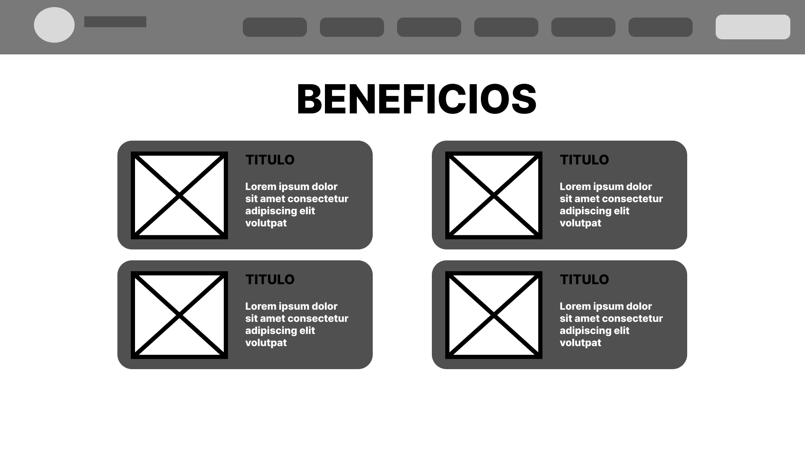<br>

* **Sección Problema**

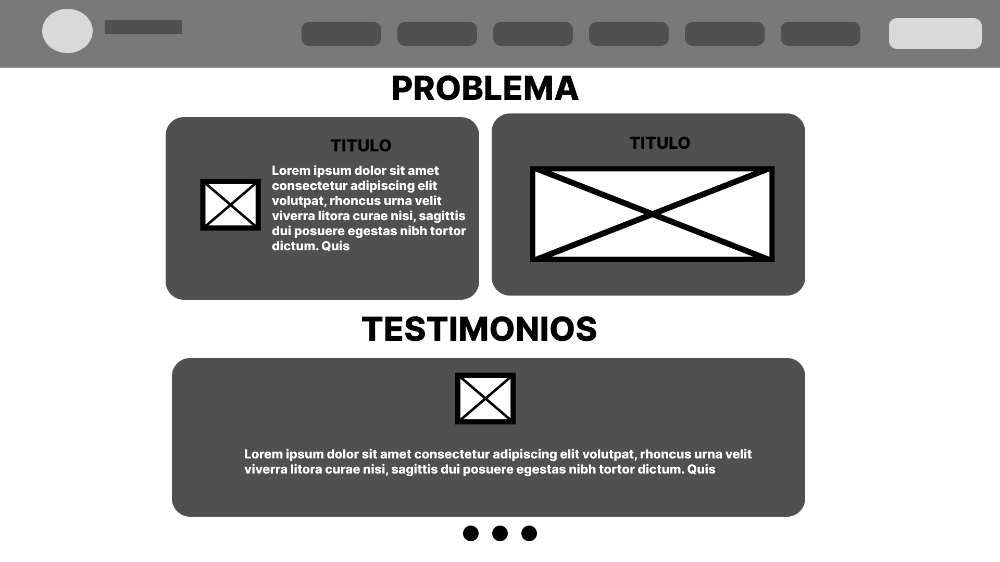<br>

* **Sección Ubicacion**

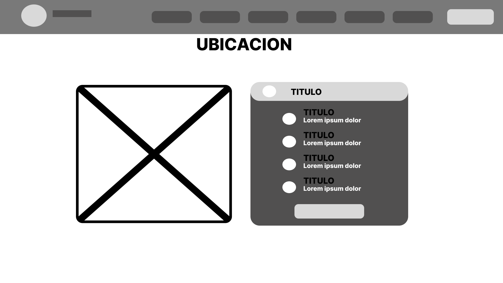<br>

* **Sección Contacto**

<br>

Figma: [https://www.figma.com/design/CyInNfsN7X5ZOszkfSkloU/UI-Design-Gauss?node-id=14-9&t=m71F7tjyaI4ySMIN-1](https://www.figma.com/design/CyInNfsN7X5ZOszkfSkloU/UI-Design-Gauss?node-id=14-9&t=m71F7tjyaI4ySMIN-1)

### 5.3.2. Landing Page Mock-up
En esta sección se muestra el mockup de la landing page desarrollada para la plataforma EMSafe. A diferencia del wireframe, este diseño presenta una aproximación más realista al producto final, integrando elementos visuales como colores, tipografías, gráficos y la organización del contenido, alineados con la identidad de la marca. El propósito de esta propuesta es evidenciar cómo se transmitirán los beneficios principales del sistema, el problema que busca solucionar, su localización, y cómo se facilitará el contacto con posibles usuarios.

* **Sección Inicio**

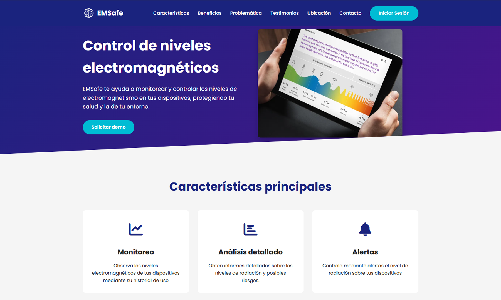<br>

* **Sección Beneficios**

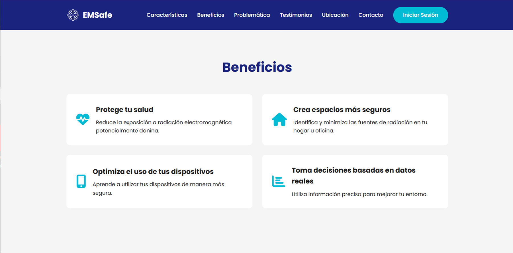<br>

* **Sección Problema**

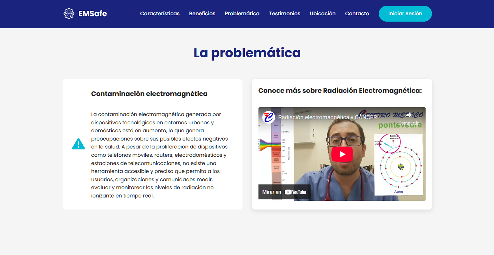<br>

* **Sección Testimonio**

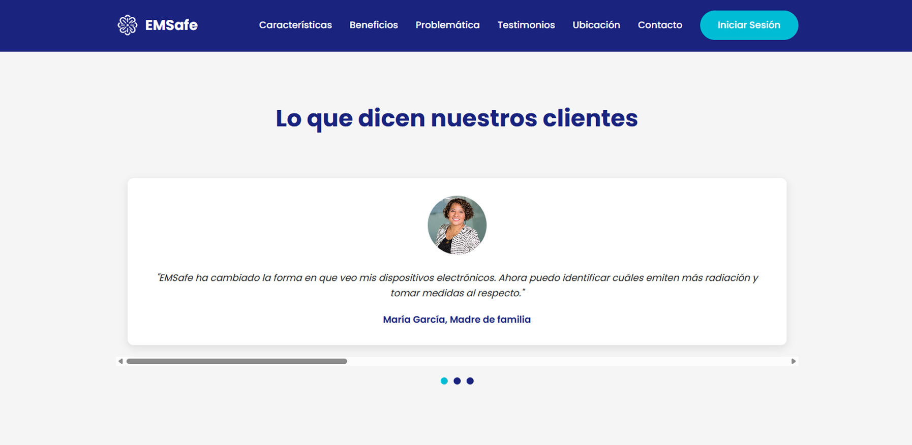<br>

* **Sección Ubicacion**

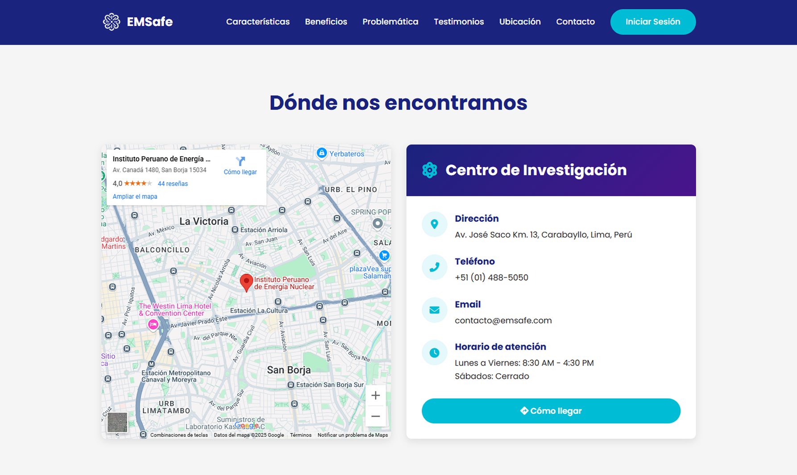<br>

* **Sección Contacto**

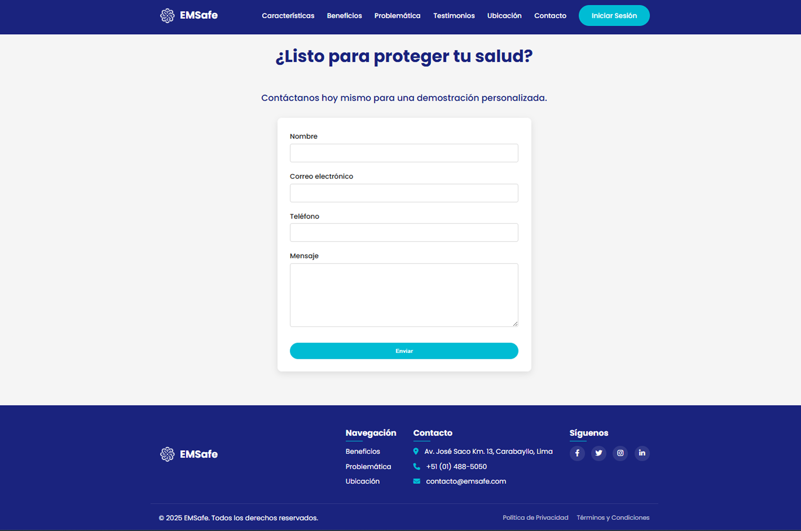<br>

Figma: [https://www.figma.com/design/CyInNfsN7X5ZOszkfSkloU/UI-Design-Gauss?node-id=14-9&t=m71F7tjyaI4ySMIN-1](https://www.figma.com/design/CyInNfsN7X5ZOszkfSkloU/UI-Design-Gauss?node-id=14-9&t=m71F7tjyaI4ySMIN-1)

## 5.4. Applications UX/UI Design

### 5.4.1. Applications Wireframes

### 5.4.2. Applications Wireflow Diagrams

### 5.4.3. Applications Mock-ups

### 5.4.4. Applications User Flow Diagrams

## 5.5. Applications Prototyping

## 5.6. IoT Device Design

# Capítulo VI: Product Implementation, Validation & Deployment

## 6.1. Software Configuration Management

En esta sección el equipo establece las decisiones y convenciones que permitirán mantener la consistencia durante el ciclo de vida del producto. Se incluyen secciones para la configuración del entorno de desarrollo, la gestión del código fuente, las convenciones de estilo y la configuración de despliegue.

### 6.1.1. Software Development Environment Configuration

A continuación se especifican las herramientas de software utilizadas por el equipo para el desarrollo de la solución EMSafe, organizadas por tipo de actividad:

**Project Management**

| Producto | Propósito | Referencia |
|---|---|---|
| GitHub | Plataforma para el alojamiento de repositorios y gestión de versiones del código fuente. | https://github.com |
| Trello | Gestión de tareas y seguimiento del progreso del equipo mediante tableros Kanban. | https://trello.com |

**Requirements Management**

| Producto | Propósito | Referencia |
|---|---|---|
| Miro | Elaboración de Event Storming (Big Picture y Design-Level), mapas de contexto y diagramas colaborativos. | https://miro.com |
| UXPressia | Creación de User Personas, User Journey Maps y Empathy Maps. | https://uxpressia.com |

**Product UX/UI Design**

| Producto | Propósito | Referencia |
|---|---|---|
| Figma | Diseño de wireframes, mockups y prototipos interactivos de la aplicación web y móvil. | https://figma.com |

**Software Development**

| Producto | Propósito | Referencia |
|---|---|---|
| Visual Studio Code | Editor de código principal para el desarrollo del Frontend Web y Landing Page. | https://code.visualstudio.com |
| IntelliJ IDEA | IDE para el desarrollo del Backend con Spring Boot (Java). | https://www.jetbrains.com/idea |
| Angular CLI | Framework para el desarrollo del Frontend Web Application con TypeScript. | https://angular.io/cli |
| Spring Boot | Framework para el desarrollo del Backend RESTful Web Service. | https://spring.io/projects/spring-boot |
| Wokwi | Simulador en línea para el desarrollo y prueba del Embedded Application en ESP32. | https://wokwi.com |
| Arduino Framework (C++) | Framework para la programación del dispositivo IoT (ESP32). | https://www.arduino.cc |

**Software Testing**

| Producto | Propósito | Referencia |
|---|---|---|
| Postman | Pruebas manuales de los endpoints del RESTful Web Service. | https://www.postman.com |

**Software Deployment**

| Producto | Propósito | Referencia |
|---|---|---|
| GitHub Pages | Despliegue del Landing Page directamente desde el repositorio de GitHub. | https://pages.github.com |
| Vercel | Despliegue del Frontend Web Application. | https://vercel.com |
| Railway | Despliegue del Backend RESTful Web Service. | https://railway.app |

**Software Documentation**

| Producto | Propósito | Referencia |
|---|---|---|
| Markdown | Formato de escritura utilizado para la documentación del informe en GitHub. | https://www.markdownguide.org |
| Structurizr | Elaboración de diagramas de arquitectura de software bajo el modelo C4. | https://structurizr.com |
| LucidChart | Elaboración de diagramas complementarios de arquitectura y flujos. | https://lucidchart.com |
 
---

### 6.1.2. Source Code Management

El equipo utiliza **GitHub** como plataforma de control de versiones y colaboración. A continuación se listan los repositorios correspondientes a cada producto digital de la solución EMSafe:

| Producto | Repositorio |
|---|---|
| Informe | https://github.com/Desarrollo-de-soluciones-IOT-UPC/Informe |
| Landing Page | https://github.com/Desarrollo-de-soluciones-IOT-UPC/landing-page |
| Frontend Web Application | https://github.com/Desarrollo-de-soluciones-IOT-UPC/Front-End |
| Backend Web Services | https://github.com/Desarrollo-de-soluciones-IOT-UPC/Back-End |
| Embedded Application | |

**GitFlow como Workflow de control de versiones**

El equipo implementa **GitFlow** como modelo de branching. Las ramas definidas son:

- `main`: rama principal que contiene el código en producción. Solo recibe merges desde `release` o `hotfix`.
- `develop`: rama de integración continua donde se consolidan los cambios de los feature branches antes de un release.
- `feature/<nombre>`: ramas para el desarrollo de nuevas funcionalidades. Se crean desde `develop` y se fusionan de vuelta a `develop` al completarse. Ejemplo: `feature/emf-alert-module`.

**Conventional Commits**

Para los mensajes de commits se aplica la convención **Conventional Commits**, con el formato:

```
<type>(<scope>): <description>
```

Los tipos permitidos son:

| Tipo | Uso |
|---|---|
| `feat` | Nueva funcionalidad |
| `fix` | Corrección de errores |
| `docs` | Cambios en documentación |
| `style` | Cambios de formato sin afectar lógica |
| `refactor` | Refactorización de código |
| `test` | Adición o corrección de pruebas |
| `chore` | Tareas de mantenimiento o configuración |

Ejemplo: `feat(sensor): add threshold-based EMF alert trigger`

---

### 6.1.3. Source Code Style Guide & Conventions

El equipo adopta las siguientes guías de estilo para cada lenguaje o tecnología utilizada en la solución. Todo el código fuente se escribe en **inglés**.

**HTML**
- Guía adoptada: [Google HTML/CSS Style Guide](https://google.github.io/styleguide/htmlcssguide.html)
- Usar indentación de 2 espacios.
- Todos los atributos deben estar en minúsculas y entre comillas dobles.
- Incluir el atributo `alt` en todas las imágenes.
  **CSS / SCSS**
- Guía adoptada: [Google HTML/CSS Style Guide](https://google.github.io/styleguide/htmlcssguide.html)
- Usar notación en `kebab-case` para nombres de clases.
- Evitar el uso de `!important`.
- Organizar las propiedades en orden alfabético.
  **TypeScript / Angular**
- Guía adoptada: [Google TypeScript Style Guide](https://google.github.io/styleguide/tsguide.html) y [Angular Coding Style Guide](https://angular.io/guide/styleguide)
- Usar `camelCase` para variables y funciones; `PascalCase` para clases y componentes.
- Tipar explícitamente todas las variables y parámetros de funciones.
- Un componente por archivo; nomenclatura: `feature-name.component.ts`.
  **Java / Spring Boot**
- Guía adoptada: [Google Java Style Guide](https://google.github.io/styleguide/javaguide.html)
- Usar `camelCase` para métodos y variables; `PascalCase` para clases.
- Seguir el patrón de capas: Controller → Service → Repository.
- Documentar con Javadoc los métodos públicos relevantes.
  **C++ (Arduino / ESP32)**
- Usar `camelCase` para variables y funciones; `UPPER_SNAKE_CASE` para constantes.
- Preferir `millis()` sobre `delay()` para temporización no bloqueante.
- Cada función debe tener una única responsabilidad.
- Comentar en inglés las secciones críticas del código.
  **Gherkin (.feature)**
- Guía adoptada: [Gherkin Conventions for Readable Specifications](https://cucumber.io/docs/gherkin/)
- Usar el formato `Given / When / Then` en inglés.
- Nombrar los archivos en `kebab-case`: `emf-alert.feature`.
- Cada escenario debe ser independiente y cubrir un único caso de prueba.
---

# Conclusiones

## Conclusiones y recomendaciones

- La contaminación electromagnética en entornos domésticos e industriales representa un riesgo real y creciente, agravado por la ausencia de herramientas accesibles para medirla. EmSafe surge como respuesta directa a esta brecha mediante una solución IoT integrada.

- Las entrevistas a ambos segmentos confirmaron preocupación genuina por la exposición electromagnética, aunque con falta de información y herramientas concretas para actuar. El segmento empresarial mostró especial interés en alertas automáticas y reportes exportables para auditorías.

- Las User Stories y el Product Backlog cubren de forma completa los flujos de la app móvil, plataforma web y backend, priorizando funcionalidades de alto valor como el monitoreo en tiempo real, las alertas automáticas y la integración vía API REST.

- La adopción de Domain-Driven Design permitió delimitar cinco bounded contexts con responsabilidades claras y bajo acoplamiento, evitando conflictos técnicos que habrían surgido de unificar contextos como Alert & Automation con Radiation Monitoring.

- La distribución de bounded contexts entre los integrantes facilitó un desarrollo paralelo y organizado, mientras que el uso de Miro y GitHub fortaleció la comunicación técnica y la trazabilidad del avance del equipo.


# Bibliografía

* Parrales H. Y. (2021). Análisis de ondas electromagnéticas no ionizantes y sus efectos en el medio ambiente. [Tesis de grado]. Universidad Estatal del Sur de Manabí. [Análisis de ondas electromagnéticas no ionizantes y sus efectos en el medio ambiente](https://repositorio.unesum.edu.ec/handle/53000/2832) 

* Sujay, L. (2024). Number of IoT connections worldwide 2022-2033. Statista. [Number of IoT connections worldwide 2022-2033](https://www.statista.com/statistics/1183457/iot-connected-devices-worldwide/) 

# Anexo


